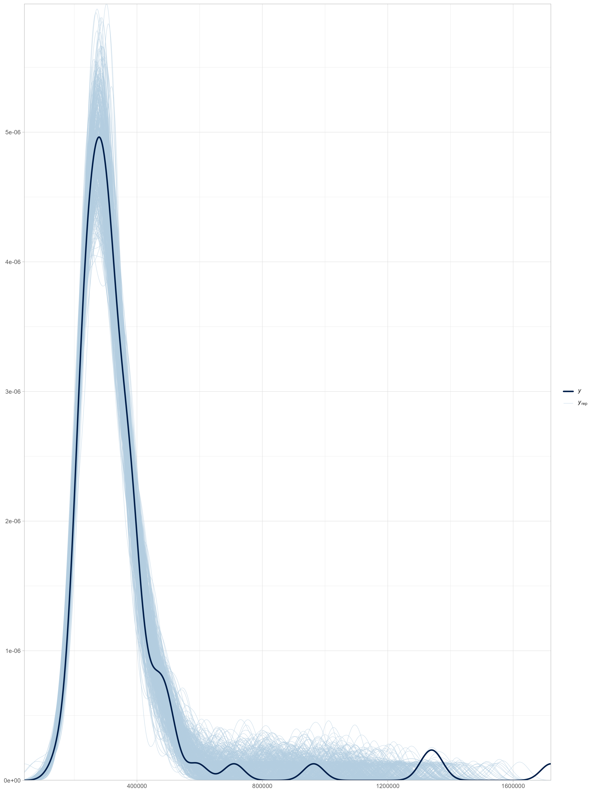
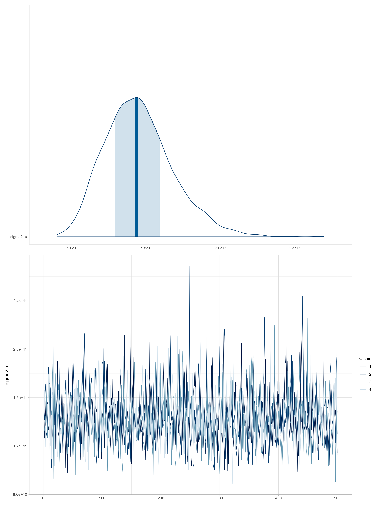
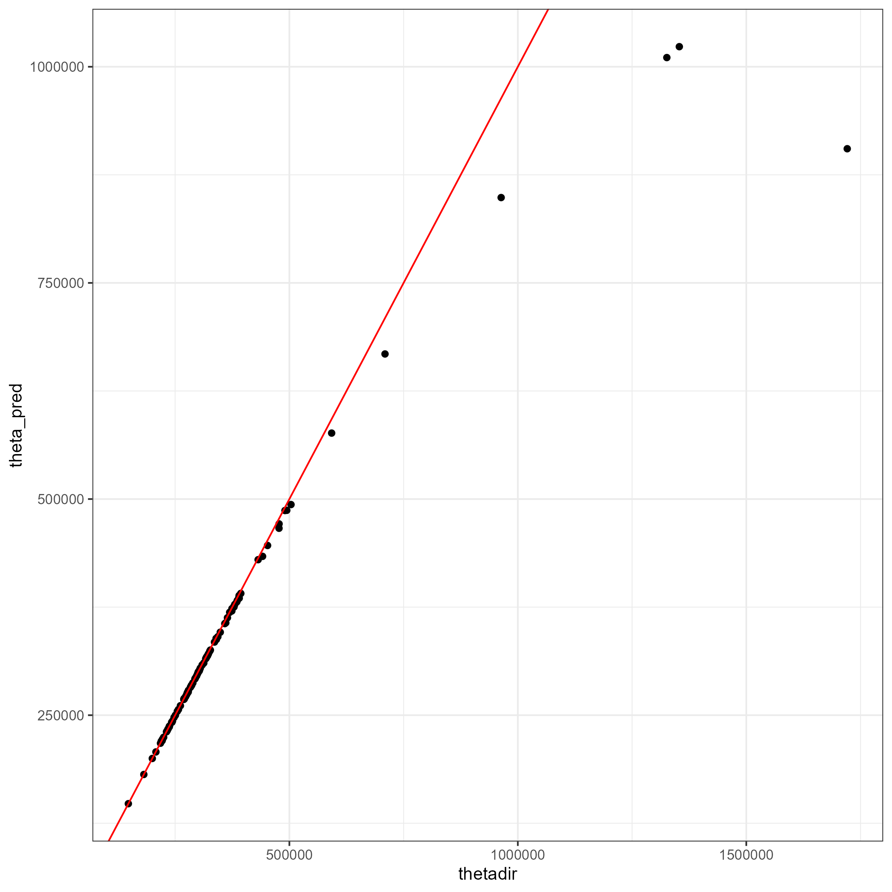
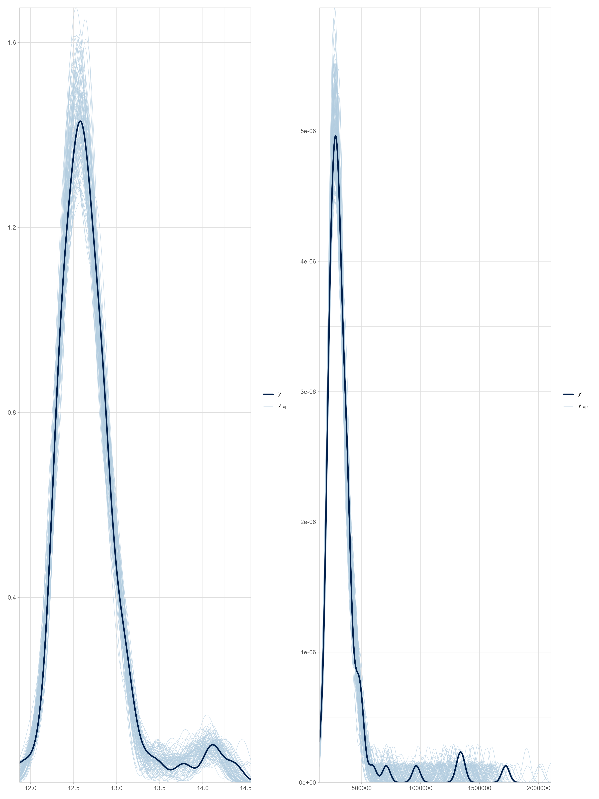
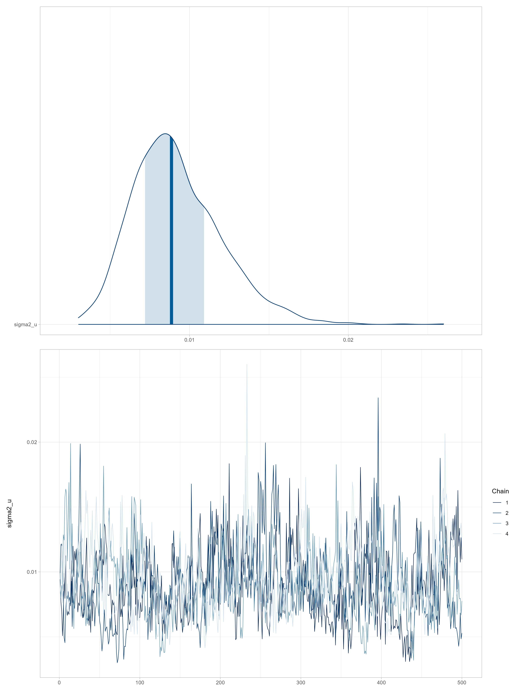
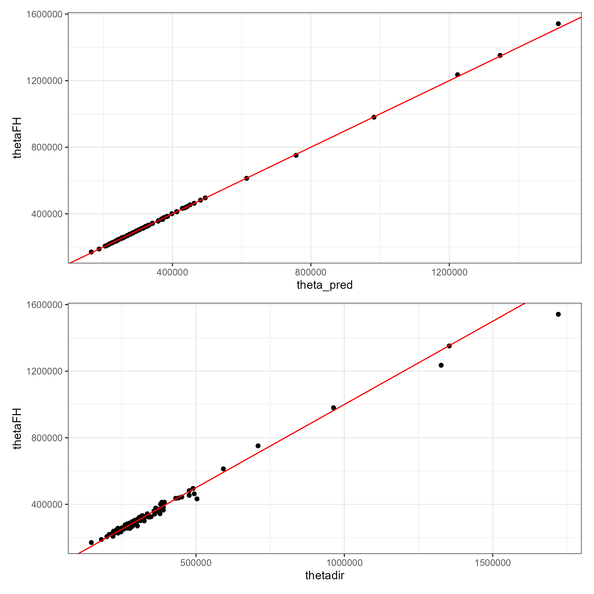

```{r setup, include=FALSE, message=FALSE, error=FALSE, warning=FALSE}
knitr::opts_chunk$set(
  echo = TRUE,
  message = FALSE,
  warning = FALSE,
  cache = FALSE
)

tba <- function(dat, cap = NA){
  kable(dat,
      format = "html", digits =  4,
      caption = cap) %>% 
     kable_styling(bootstrap_options = "striped", full_width = F)%>%
         kable_classic(full_width = F, html_font = "Arial Narrow")
}
library(rstan)
library(knitr)
library(kableExtra)
library(tidyverse)
library(magrittr)
library(bayesplot)
library(posterior)
library(patchwork)
```


## Introducción al modelo de Fay–Herriot

El modelo de @fay1979estimates es el modelo de área más utilizado en la estimación en áreas pequeñas (SAE).

Su popularidad radica en que suele disponerse de información agregada por dominios (departamentos, municipios, provincias), más que de microdatos a nivel individual.

Este modelo lineal mixto fue el primero en incorporar **efectos aleatorios a nivel de área**, permitiendo combinar la información muestral directa con covariables auxiliares externas.

$$
\theta_d = \boldsymbol{x}_d^{T}\boldsymbol{\beta} + u_d,\quad 
u_d \stackrel{ind}{\sim} (0,\sigma_u^2)
$$

## Modelo básico de estimación

Los verdaderos valores del ingreso medio $\theta_d$ no son observables, por lo que se emplean estimadores directos provenientes de encuestas de hogares:

$$
\hat{\theta}^{DIR}_d = \theta_d + e_d,\quad e_d \stackrel{ind}{\sim} (0,\sigma^2_{e_d})
$$

Sustituyendo en el modelo de Fay–Herriot se obtiene:

$$
\hat{\theta}^{DIR}_d = \boldsymbol{x}_d^{T}\boldsymbol{\beta} + u_d + e_d
$$

donde $\sigma^2_{e_d}$ representa la **varianza del error de muestreo** estimada a partir de la encuesta (usando linealización o bootstrap).

## Estimador BLUP bajo el modelo FH

El *mejor predictor lineal insesgado (BLUP)* de $\theta_d$ se define como:

$$
\tilde{\theta}^{FH}_d = \boldsymbol{x}_d^{T}\tilde{\boldsymbol{\beta}} + \tilde{u}_d,
\quad 
\tilde{u}_d = \gamma_d(\hat{\theta}^{DIR}_d - \boldsymbol{x}_d^{T}\tilde{\boldsymbol{\beta}})
$$

donde

$$
\gamma_d = \frac{\sigma_u^2}{\sigma_u^2 + \sigma^2_{e_d}}
$$

El parámetro $\gamma_d$ actúa como *factor de ponderación*. Si la varianza del error de muestreo $\sigma^2_{e_d}$ es grande (poca precisión en la encuesta), $\gamma_d$ tiende a 0 y el modelo da más peso a la predicción sintética $\boldsymbol{x}_d^{T}\tilde{\boldsymbol{\beta}}$.

## Aplicación al Ingreso Medio

Sea $\theta_d$ el ingreso promedio per cápita en el dominio $d$.  
El modelo de área se define como:

$$
\hat{\theta}^{DIR}_d = \boldsymbol{x}_d^{T}\boldsymbol{\beta} + u_d + e_d
$$

Se asume normalidad en la distribución muestral del estimador directo (justificado por el Teorema del Límite Central):

$$
\hat{\theta}^{DIR}_d \mid u_d \sim N(\boldsymbol{x}_d^{T}\boldsymbol{\beta}+u_d, \sigma^2_{e_d}), \quad 
u_d \sim N(0, \sigma_u^2)
$$

Para la estimación bayesiana, asignamos distribuciones previas (priors) a $\boldsymbol{\beta}$ y $\sigma_u^2$:

$$
\beta_p \sim N(0,10000), \quad \sigma_u^2 \sim IG(0.0001, 0.0001)
$$

## Predictor bayesiano y forma cerrada

El *predictor óptimo* del ingreso medio $\theta_d$ es el valor esperado condicional:

$$
E(\theta_d|\hat{\theta}^{DIR}_d) = \gamma_d\hat{\theta}^{DIR}_d + (1-\gamma_d)\boldsymbol{x}_d^{T}\boldsymbol{\beta}
$$

con

$$
\gamma_d = \frac{\sigma_u^2}{\sigma_u^2 + \sigma_{e_d}^2}
$$

Este predictor suaviza las estimaciones directas extremas causadas por tamaños de muestra pequeños, "encogiéndolas" hacia la media predicha por el modelo de regresión.

## Interpretación

  - El modelo de Fay–Herriot mejora la eficiencia de las estimaciones del ingreso en municipios o dominios con pocos datos.

  - La precisión depende del equilibrio entre la varianza del área ($\sigma_u^2$) y la varianza de muestreo ($\sigma_{e_d}^2$).

  - **Nota práctica:** Aunque aquí presentamos el modelo sobre el ingreso directo, en la práctica es común modelar el logaritmo del ingreso ($\log(\hat{\theta}_d)$) para satisfacer mejor los supuestos de normalidad de los residuos y el efecto aleatorio.

# Estimación del modelo de área en `Stan`

## Preparación del entorno

El procedimiento de estimación utiliza las librerías `tidyverse` y `magrittr` para la manipulación y transformación de datos.

El modelo se implementa bajo un enfoque bayesiano mediante `Stan`.

::: {.callout-tip}

### Código de `R`

```{r  message=FALSE, warning=FALSE}
library(tidyverse)
library(magrittr)
```
:::


## Lectura de datos base

Se cargan las estimaciones directas de ingreso y su varianza suavizada a nivel de dominio para el año 2017.
Luego, se seleccionan las variables relevantes: `dam2`, `nd`, `ingreso`, `vardir` y `hat_var`.

::: {.callout-tip}

### Código de `R`

```{r}
base_FH <- readRDS("../Recurso/data/Modelo_area/ingreso/base_FH.rds") %>% 
  transmute(dam2, nd = n_obs, ingreso, vardir = ingreso_se^2, hat_var)
```
:::

```{r, echo=FALSE}
head(base_FH) %>% tba()
```


## Lectura y normalización de covariables

Se cargan los predictores auxiliares a nivel de dominio y se estandarizan para evitar problemas de escala.

::: {.callout-tip}

### Código de `R`

```{r}
statelevel_predictors_df <- readRDS("../Recurso/data/Modelo_area/ingreso/statelevel_predictors_df_dam2.rds") %>% 
  mutate_at(.vars = c("luces_nocturnas",
                      "cubrimiento_cultivo",
                      "cubrimiento_urbano",
                      "modificacion_humana",
                      "accesibilidad_hospitales",
                      "accesibilidad_hosp_caminado"),
            function(x) as.numeric(scale(x)))
```
:::


## Unión de datos

Se realiza una unión completa entre las estimaciones directas y las covariables, utilizando `dam2` como clave.
Esto asegura que se mantengan todos los dominios, observados y no observados.

::: {.callout-tip}

### Código de `R`

```{r}
base_FH <- full_join(base_FH, statelevel_predictors_df, by = "dam2")
```
:::

```{r, echo=FALSE}
tba(base_FH[1:5,1:8])
```


## División por dominios observados y no observados

Los dominios con información muestral (`ingreso` no nula) se separan de los dominios sin información (`NA`).

::: {.callout-tip}

### Código de `R`
```{r}
data_dir <- base_FH %>% filter(!is.na(ingreso))
data_syn <- base_FH %>% anti_join(data_dir %>% select(dam2))
```
:::

```{r, echo=FALSE}
tba(data_syn[1:10,1:8] %>% head())
```


## Construcción de la matriz de covariables

Se define la fórmula del modelo lineal con las variables predictoras.

A partir de ella, se construyen las matrices de diseño `Xdat` (observados) y `Xs` (no observados).

::: {.callout-tip}

### Código de `R`
```{r}
formula_mod <- formula(~ dam + sexo2 + anoest2 + anoest3 + anoest4 +
                        edad2 + edad3 + edad4 + edad5 +
                        etnia1 + etnia2 + tasa_desocupacion )

library(stringr)

data_dir %<>% mutate(dam = str_sub(dam2, 1,2))
data_syn %<>% mutate(dam = str_sub(dam2, 1,2))
Xdat <- model.matrix(formula_mod, data = data_dir)
Xs   <- model.matrix(formula_mod, data = data_syn)
```
:::


## Alineación de matrices

Se identifican y agregan columnas faltantes a `Xs` para asegurar que ambas matrices tengan la misma estructura.

::: {.callout-tip}

### Código de `R`

```{r}
temp <- setdiff(colnames(Xdat), colnames(Xs))
temp <- matrix(0, nrow = nrow(Xs), ncol = length(temp), dimnames = list(1:nrow(Xs), temp))
Xs <- cbind(Xs, temp)[, colnames(Xdat)]
```
:::


## Preparación de la lista para Stan

Se crea la lista `sample_data`, que contiene toda la información necesaria para ejecutar el modelo en `Stan`.

::: {.callout-tip}

### Código de `R`

```{r}
sample_data <- list(
  N1 = nrow(Xdat),   
  N2 = nrow(Xs),   
  p  = ncol(Xdat),       
  X  = as.matrix(Xdat),  
  Xs = as.matrix(Xs),    
  y  = as.numeric(data_dir$ingreso), 
  sigma_e = sqrt(data_dir$hat_var)
)
```
:::


## Modelo en `Stan`: *data*

A continuación, se presenta la estructura del modelo de Fay–Herriot en el lenguaje de modelado probabilístico Stan.

::: {.callout-important}

### Código de `Stan`

```{r, eval=FALSE}
data {
  int<lower=0> N1;   // number of data items
  int<lower=0> N2;   // number of data items for prediction
  int<lower=0> p;   // number of predictors
  matrix[N1, p] X;   // predictor matrix
  matrix[N2, p] Xs;   // predictor matrix
  vector[N1] y;      // predictor matrix 
  vector[N1] sigma_e; // known variances
}
```
:::

## Modelo en `Stan`: *parameters*

::: {.callout-important}

### Código de `Stan`

```{r, eval=FALSE}
parameters {
  vector[p] beta;       // coefficients for predictors
  real<lower=0> sigma2_u;
  vector[N1] u;
}

transformed parameters{
  vector[N1] theta;
  vector[N1] thetaSyn;
  vector[N1] thetaFH;
  vector[N1] gammaj;
  real<lower=0> sigma_u;
  thetaSyn = X * beta;
  theta = thetaSyn + u;
  sigma_u = sqrt(sigma2_u);
  gammaj =  to_vector(sigma_u ./ (sigma_u + sigma_e));
  thetaFH = (gammaj) .* y + (1-gammaj).*thetaSyn; 
}
```
:::

## Modelo en `Stan`: *model* y *generated quantities*

::: {.callout-important}

### Código de `Stan`

```{r, eval=FALSE}
model {
  // likelihood
  y ~ normal(theta, sigma_e); 
  // priors
  beta ~ normal(0, 100);
  u ~ normal(0, sigma_u);
  sigma2_u ~ inv_gamma(0.0001, 0.0001);
}

generated quantities{
  vector[N2] y_pred;
  for(j in 1:N2) {
    y_pred[j] = normal_rng(Xs[j] * beta, sigma_u);
  }
}

```
:::


## Compilación del modelo en R

Se ajusta el modelo de Stan utilizando la función `stan()` de la librería `rstan`.
El modelo se guarda como objeto `.rds` para su posterior análisis.

::: {.callout-tip}

### Código de `R`

```{r, eval=FALSE}
library(rstan)
fit_FH_normal <- "../Recurso/data/Modelo_area/ingreso/modelosStan/17FH_normal.stan"
options(mc.cores = parallel::detectCores())
rstan::rstan_options(auto_write = TRUE)

model_FH_normal <- stan(
  file = fit_FH_normal,  
  data = sample_data,
  warmup = 9500, iter = 10000, cores = 4, 
  verbose = FALSE
)

saveRDS(model_FH_normal, "../Recurso/data/Modelo_area/ingreso/model_FH_normal.rds")
```
:::


## Lectura del modelo estimado

Para evitar recalcular el modelo, se puede cargar directamente el objeto ajustado.

::: {.callout-tip}

### Código de `R`

```{r, eval=FALSE}
model_FH_normal <- readRDS("../Recurso/data/Modelo_area/ingreso/model_FH_normal.rds")
```
:::

##  Resultados del modelo para dominios observados

Se evalúa la capacidad predictiva del modelo mediante comparaciones gráficas entre la distribución empírica y las distribuciones predictivas posteriores de ingreso:


::: {.callout-tip}

### Código de `R`

```{r, eval=FALSE}
library(bayesplot)
library(posterior)
library(patchwork)
y_pred_B <- as.array(model_FH_normal, pars = "theta") %>% 
  as_draws_matrix()
rowsrandom <- sample(nrow(y_pred_B), 500)
y_pred2 <- y_pred_B[rowsrandom, ]

p1 <- ppc_dens_overlay(y = as.numeric(data_dir$ingreso), y_pred2) +
  theme_light()

ggsave(filename = "img/FH1.png",plot = p1, width = 12, height = 16)

```
:::

## Comparación de densidades observadas y simuladas

Esta visualización compara la densidad observada $y$ con las densidades simuladas $\tilde{y}$ a partir de la distribución posterior, permitiendo identificar ajustes adecuados o desviaciones sistemáticas en la predicción.


```{r echo=FALSE, out.width="200%"}

```

## Análisis de convergencia

El análisis de convergencia de las cadenas de Markov se realiza sobre el parámetro de varianza de los efectos aleatorios, $\sigma^2_u$.

Se examinan los gráficos de densidad, áreas y trazas de MCMC:

::: {.callout-tip}

### Código de `R`
```{r, eval=FALSE}
posterior_sigma2_u <- as.array(model_FH_normal, pars = "sigma2_u")
p1 <- (mcmc_areas(posterior_sigma2_u)  +
  theme_light()) / 
  mcmc_trace(posterior_sigma2_u) +
  theme_light()

ggsave(filename = "img/FH2.png",plot = p1, width = 12, height = 16)
```
:::

##  Convergencia de las cadenas de $\sigma^2_u$

Una convergencia adecuada se evidencia cuando las cadenas se mezclan bien y no presentan tendencias sistemáticas.

```{r echo=FALSE, out.width="200%"}

```


## Estrayendo la cadenas para comparaciones gráficas entre estimaciones

::: {.callout-tip}

### Código de `R`

```{r, eval=FALSE}
theta <-   summary(model_FH_normal,pars =  "theta")$summary %>%
  data.frame()

data_dir %<>% mutate(
            thetadir = ingreso,
            theta_pred = theta$mean,
            theta_pred_EE = theta$sd,
            Cv_theta_pred = theta_pred_EE/theta_pred
            )
```
:::

## Comparaciones gráficas entre estimaciones

::: {.callout-tip}

### Código de `R`

```{r, eval=FALSE}

p22 <- ggplot(data_dir, aes(x = thetadir , y = theta_pred)) +
  geom_point() + 
  geom_abline(slope = 1,intercept = 0, colour = "red") +
  theme_bw(10) 


p1 <- p22 
ggsave(filename = "img/FH3.png",plot = p1, scale = 2)

```
:::

## Comparaciones gráficas entre estimaciones

```{r echo=FALSE, out.width="200%"}

```


## Predicciones para dominios no observados y consolidación (I)

A partir de las muestras posteriores de $y_{\text{pred}}$, se obtienen estimaciones de ingreso para los dominios sin información directa.  
Cada dominio no observado recibe una predicción $\hat{\theta}_d$ con su error estándar asociado.

$$
\text{CV}{(\hat{\theta}_d)} = \frac{\text{EE}(\hat{\theta}_d)}{\hat{\theta}_d}
$$


Estimación del FH de la ingreso en los dominios NO observados. 

## Predicciones para dominios no observados y consolidación (II)

::: {.callout-tip}

### Código de `R`

```{r, eval=FALSE}
theta_syn_pred <- summary(model_FH_normal,pars =  "y_pred")$summary %>%
  data.frame()

data_syn <- data_syn %>% 
  mutate(
    theta_pred = theta_syn_pred$mean,
    theta_pred_EE = theta_syn_pred$sd,
    Cv_theta_pred = theta_pred_EE/theta_pred)

saveRDS(data_syn, "../Recurso/data/Modelo_area/ingreso/data_syn.rds")
saveRDS(data_dir, "../Recurso/data/Modelo_area/ingreso/data_dir.rds")


```

:::

## Predicciones para dominios no observados y consolidación (III)


```{r, echo=FALSE}
data_syn <- readRDS("../Recurso/data/Modelo_area/ingreso/data_syn.rds")
data_dir <- readRDS("../Recurso/data/Modelo_area/ingreso/data_dir.rds")

tba(data_syn %>% slice(1:10) %>%
      select(dam2:hat_var,theta_pred:Cv_theta_pred))

```

## Consolidar las bases 

Finalmente, se consolidan las bases de estimaciones directas y sintéticas:

::: {.callout-tip}

### Código de `R`
```{r}
estimacionesPre <- bind_rows(data_dir, data_syn) %>% 
  select(dam2, estimacion_normal = theta_pred, 
         ee_normal = theta_pred_EE,
         cv_normal = Cv_theta_pred) %>% 
  mutate(dam = substr(dam2,1,2))

saveRDS(estimacionesPre, file = "../Recurso/data/Modelo_area/ingreso/estimacionesPre_normal.rds")
```
:::


## Transformación logarítmica

Como algunas predicciones de los ingresos son negativas, es necesario modificar el modelo y realizar una transformación que garantice el rango plausible de valores estimados y predichos. 

Siendo $\hat{\theta}_d$ la estimación directa del ingreso medio en el municipio $d$, se define la variable transformada:

$$
\hat{z}_d = g(\hat{\theta}_d)=\log(\hat{\theta}_d)
$$

La parte lineal del desarrollo de Taylor alrededor de $\hat{\theta}_d = \theta_d$ está dada por:

$$
\hat{z}_d \approx g(\theta_d) +
(\hat{\theta}_d - \theta_d)
\left. \frac{\partial}{\partial \hat{\theta}_d} g(\hat{\theta}_d) \right|_{\hat{\theta}_d = \theta_d}
$$


## Derivada y aproximación lineal

Teniendo en cuenta que:

$$
\left. \frac{\partial}{\partial \hat{\theta}_d} 
\log(\hat{\theta}_d) \right|_{\hat{\theta}_d = \theta_d}
= \frac{1}{\theta_d}
$$

Entonces:

$$
\hat{z}_d \approx 
\log(\theta_d) + 
\frac{1}{\theta_d}(\hat{\theta}_d - \theta_d)
$$

Por lo tanto, el valor esperado y la varianza (Método Delta) están dados por:

1. **Valor esperado**

$$
E(\hat{z}_d) \approx \log(\theta_d)
$$

2. **Varianza aproximada**

$$
V(\hat{z}_d) \approx 
\frac{1}{\theta_d^2}\,\text{Var}(\hat{\theta}_d)
$$


## Construcción de la matriz de covariables

Se define la fórmula del modelo lineal con las variables predictoras.

A partir de ella, se construyen las matrices de diseño `Xdat` (observados) y `Xs` (no observados).

::: {.callout-tip}

### Código de `R`
```{r}
data_dir <- base_FH %>% filter(!is.na(ingreso)) %>% 
  mutate(dam = str_sub(dam2, 1,2), 
         logingreso = log1p(ingreso), 
         var_inglog = (hat_var)/(ingreso^2))
  
data_syn <- base_FH %>% anti_join(data_dir %>% select(dam2)) %>% 
  mutate(dam = str_sub(dam2, 1,2))
```
:::

## Construcción de la matriz de covariables

::: {.callout-tip}

### Código de `R`

```{r}
formula_mod <- formula(~ dam + sexo2 + anoest2 + anoest3 + anoest4 +
                        edad2 + edad3 + edad4 + edad5 +
                        etnia1 + etnia2 + tasa_desocupacion +
                        luces_nocturnas + cubrimiento_urbano +
                        pollution_CO + vegetation_NDVI +
                        Elevation + precipitation +
                        population_density + cubrimiento_cultivo +
                        alfabeta)

Xdat <- model.matrix(formula_mod, data = data_dir)
Xs   <- model.matrix(formula_mod, data = data_syn)
```
:::

## Alineación de matrices

Se identifican y agregan columnas faltantes a `Xs` para asegurar que ambas matrices tengan la misma estructura.

::: {.callout-tip}

### Código de `R`

```{r}
temp <- setdiff(colnames(Xdat), colnames(Xs))
temp <- matrix(0, nrow = nrow(Xs), ncol = length(temp), dimnames = list(1:nrow(Xs), temp))
Xs <- cbind(Xs, temp)[, colnames(Xdat)]
```
:::


## Preparación de la lista para Stan

Se crea la lista `sample_data`, que contiene toda la información necesaria para ejecutar el modelo en `Stan`.

::: {.callout-tip}

### Código de `R`

```{r}
sample_data <- list(
  N1 = nrow(Xdat),   
  N2 = nrow(Xs),   
  p  = ncol(Xdat),       
  X  = as.matrix(Xdat),  
  Xs = as.matrix(Xs),    
  y  = as.numeric(data_dir$logingreso), 
  sigma_e = sqrt(data_dir$var_inglog)
)
```
:::


## Compilación del modelo en R

Se ajusta el modelo de Stan utilizando la función `stan()` de la librería `rstan`.
El modelo se guarda como objeto `.rds` para su posterior análisis.

::: {.callout-tip}

### Código de `R`

```{r, eval=FALSE}
fit_FH_normal <- "../Recurso/data/Modelo_area/ingreso/modelosStan/17FH_normal.stan"
options(mc.cores = parallel::detectCores())
rstan::rstan_options(auto_write = TRUE)

model_FH_normal <- stan(
  file = fit_FH_normal,  
  data = sample_data,
  warmup = 9500, iter = 10000, cores = 4, verbose = FALSE
)

saveRDS(model_FH_normal, "../Recurso/data/Modelo_area/ingreso/model_FH_normal_loging.rds")
```
:::


## Lectura del modelo estimado

Para evitar recalcular el modelo, se puede cargar directamente el objeto ajustado.

::: {.callout-tip}

### Código de `R`

```{r, eval=FALSE}
model_FH_normal <- readRDS("../Recurso/data/Modelo_area/ingreso/model_FH_normal_loging.rds")
```
:::

##  Resultados del modelo para dominios observados

Se evalúa la capacidad predictiva del modelo mediante comparaciones gráficas entre la distribución empírica y las distribuciones predictivas posteriores de ingreso:


::: {.callout-tip}

### Código de `R`

```{r, eval=FALSE}
y_pred_B <- as.array(model_FH_normal, pars = "theta") %>% 
  as_draws_matrix()
rowsrandom <- sample(nrow(y_pred_B), 100)
y_pred2 <- y_pred_B[rowsrandom, ]

p1 <- ppc_dens_overlay(y = as.numeric(data_dir$logingreso), y_pred2) +
  theme_light()

p2 <- ppc_dens_overlay(y = as.numeric(data_dir$ingreso), exp(y_pred2)) +
  theme_light()
p3 <- p1|p2
ggsave(filename = "img/FH1_log.png",plot = p3, width = 12, height = 16)

```
:::

## Comparación de densidades observadas y simuladas

Esta visualización compara la densidad observada $y$ con las densidades simuladas $\tilde{y}$ a partir de la distribución posterior, permitiendo identificar ajustes adecuados o desviaciones sistemáticas en la predicción.


```{r echo=FALSE, out.width="200%"}

```

## Análisis de convergencia

El análisis de convergencia de las cadenas de Markov se realiza sobre el parámetro de varianza de los efectos aleatorios, $\sigma^2_u$.

Se examinan los gráficos de densidad, áreas y trazas de MCMC:

::: {.callout-tip}

### Código de `R`
```{r, eval=FALSE}
posterior_sigma2_u <- as.array(model_FH_normal, pars = "sigma2_u")
p1 <- (mcmc_areas(posterior_sigma2_u)  +
  theme_light()) / 
  mcmc_trace(posterior_sigma2_u) +
  theme_light()

ggsave(filename = "img/FH2_log.png",plot = p1, width = 12, height = 16)
```
:::

##  Convergencia de las cadenas de $\sigma^2_u$

Una convergencia adecuada se evidencia cuando las cadenas se mezclan bien y no presentan tendencias sistemáticas.

```{r echo=FALSE, out.width="200%"}

```

## Estrayendo la cadenas para comparaciones gráficas entre estimaciones

::: {.callout-tip}

### Código de `R`

```{r, eval=FALSE}
theta <-   summary(model_FH_normal,pars =  "theta")$summary %>%
  data.frame()
theta_FH <-   summary(model_FH_normal,pars =  "thetaFH")$summary %>%
  data.frame()

data_dir %<>% mutate(
            thetadir = ingreso,
            theta_pred = exp(theta$mean),
            thetaFH = exp(theta_FH$mean),
            theta_pred_EE = exp(theta$sd),
            Cv_theta_pred = theta_pred_EE/theta_pred
            )
```
:::

## Comparaciones gráficas entre estimaciones

::: {.callout-tip}

### Código de `R`

```{r, eval=FALSE}
# Estimación predicción del modelo vs ecuación ponderada de FH 
p11 <- ggplot(data_dir, aes(x = theta_pred, y = thetaFH)) +
  geom_point() + 
  geom_abline(slope = 1,intercept = 0, colour = "red") +
  theme_bw(10) 


# Estimación con la ecuación ponderada de FH Vs estimación directa

p21 <- ggplot(data_dir, aes(x = thetadir, y = thetaFH)) +
  geom_point() + 
  geom_abline(slope = 1,intercept = 0, colour = "red") +
  theme_bw(10) 


p1 <- (p11)/(p21)
ggsave(filename = "img/FH3_log.png",plot = p1, scale = 2)

```
:::

## Comparaciones gráficas entre estimaciones

```{r echo=FALSE, out.width="200%"}

```


## Predicciones para dominios no observados y consolidación (II)

::: {.callout-tip}

### Código de `R`

```{r, eval=FALSE}
theta_syn_pred <- summary(model_FH_normal,pars =  "y_pred")$summary %>%
  data.frame()

data_syn <- data_syn %>% 
  mutate(
    theta_pred = exp(theta_syn_pred$mean),
    thetaFH = exp(theta_pred),
    theta_pred_EE = exp(theta_syn_pred$sd),
    Cv_theta_pred = theta_pred_EE/theta_pred)

saveRDS(data_syn, "../Recurso/data/Modelo_area/ingreso/data_syn_log.rds")
saveRDS(data_dir, "../Recurso/data/Modelo_area/ingreso/data_dir_log.rds")


```

:::

## Predicciones para dominios no observados y consolidación (III)


```{r, echo=FALSE}
data_syn <- readRDS("../Recurso/data/Modelo_area/ingreso/data_syn_log.rds")
data_dir <- readRDS("../Recurso/data/Modelo_area/ingreso/data_dir_log.rds")

tba(data_syn %>% slice(1:10) %>%
      select(dam2:hat_var,theta_pred:Cv_theta_pred))

```

## Consolidar las bases 

Finalmente, se consolidan las bases de estimaciones directas y sintéticas:

::: {.callout-tip}

### Código de `R`
```{r}
estimacionesPre <- bind_rows(data_dir, data_syn) %>% 
  select(dam2, estimacion_normal = theta_pred, 
         ee_normal = theta_pred_EE,
         cv_normal = Cv_theta_pred) %>% 
  mutate(dam = substr(dam2,1,2))

saveRDS(estimacionesPre, file = "../Recurso/data/Modelo_area/ingreso/estimacionesPre_normal_log.rds")
```
:::


# Conclusiones

* El **modelo de Fay-Herriot** permite combinar información directa y auxiliar, mejorando la precisión en dominios pequeños.

* Las gráficas de densidad y convergencia sugieren que el ajuste fue adecuado y estable.

* Los resultados finales proveen estimaciones coherentes para dominios observados y no observados.


# Referencias


