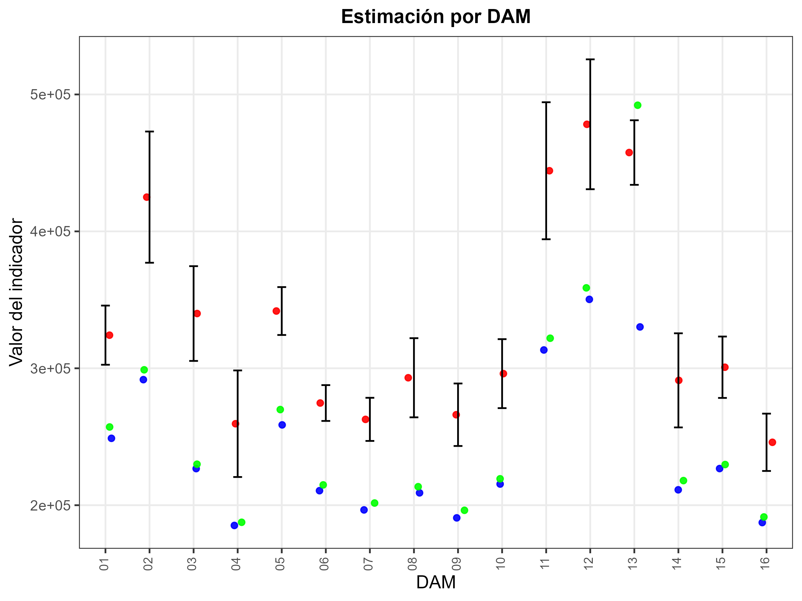
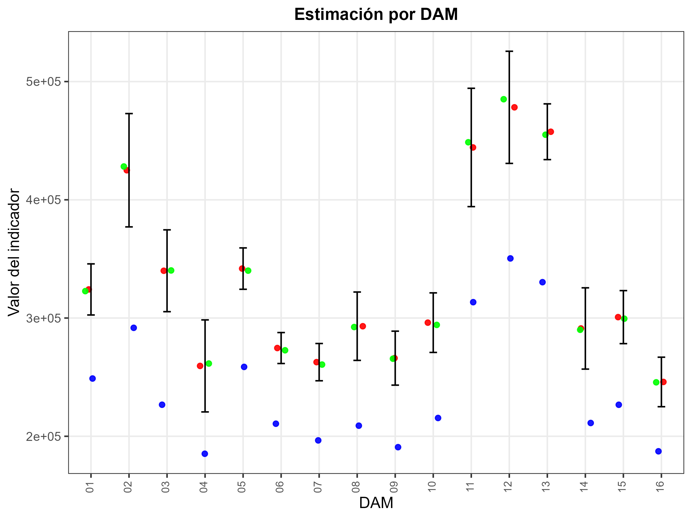

```{r setup, include=FALSE, message=FALSE, error=FALSE, warning=FALSE}
knitr::opts_chunk$set(
  echo = TRUE,
  message = FALSE,
  warning = FALSE,
  cache = FALSE
)

tba <- function(dat, cap = NA){
  kable(dat,
      format = "html", digits =  4,
      caption = cap) %>% 
     kable_styling(bootstrap_options = "striped", full_width = F)%>%
         kable_classic(full_width = F, html_font = "Arial Narrow")
}
library(rstan)
library(knitr)
library(kableExtra)
library(tidyverse)
library(magrittr)
library(survey)
library(srvyr)
library(reshape2)
```


## Introducción

* El proceso de benchmarking de cadenas MCMC es crucial en SAE, porque:

  - Garantiza que las estimaciones desagregadas sean coherentes con los niveles de agregación donde la encuesta es representativa, por ejemplo, divisiones administrativas mayores o nivel nacional.  

  - Debe tenerse presente que el benchmarking es un procedimiento de ajuste estético: no mejora la calidad intrínseca del estimador, pero sí asegura consistencia y comparabilidad.  


## Benchmarking por iteración de la cadena MCMC

Para estimar correctamente la incertidumbre posterior y garantizar coherencia con los totales observados, el cálculo de los factores de calibración se repite para **cada realización** $l$ de las cadena MCMC. Así obtenemos una familia de factores $\{g_k^{(l)}\}_{l=1}^L$ y, a partir de ellos, una familia de estimadores calibrados $\{\widehat{\bar{Y}}_d^{(l),\text{cal}}\}_{l=1}^L$.


## Notación

- $l = 1,\ldots,L$: índice de la iteración de la cadena MCMC.  

- $\boldsymbol{\theta}^{(l)}$: vector de parámetros muestreados en la iteración $l$ 

- $\hat{y}_k^{(l)}$: predicción del modelo para el post-estrato $k$ usando $\boldsymbol{\theta}^{(l)}$.

- $n_k$: tamaño del post-estrato $k$.  

- $\mathbf{x}_k$: vector de calibración (dummies) del post-estrato $k$.  

- $\mathbf{t}_X$: totales de encuesta conocidos (objetivo de calibración).


## Proceso para cada iteración $l$ (I)

1. **Predicción condicional (con parámetros de la iteración):**
$$
\hat{y}_k^{(l)} \;=\; E\big(y_k \mid \boldsymbol{\theta}^{(l)}  \big)
$$

2. **Estimación directa a nivel de dominio**
$$
\widehat{\mathbf{t}}_X^{DIR} 
$$

## Proceso para cada iteración $l$ (II)

3. **Calibración — resolver para $g_k^{(l)}$:**  

Encontrar $g_k^{(l)}>0$ tales que

$$
\sum_{k} g_k^{(l)} \, n_k \, \mathbf{x}_k \equiv \widehat{\mathbf{t}}_X^{DIR} 
$$
En la práctica se obtiene $g_k^{(l)} = h(\lambda^{(l)\top}\mathbf{x}_k)$, donde $\lambda^{(l)}$ es el vector de Lagrange o parámetros de calibración de la iteración $l$ y $h(\cdot)$ depende del método (`linear`, `logit`).

## Proceso para cada iteración $l$ (III)

4. **Estimador calibrado del ingreso medio por dominio $d$ en la iteración $l$:**
$$
\widehat{\bar{Y}}_d^{(l),\text{cal}} \;=\; \frac{1}{N_d}\sum_{k\in d} g_k^{(l)}\, n_k\, \hat{y}_k^{(l)}
$$


5. **Repetir para $l=1,\dots,L$.**  
Obtener la muestra posterior calibrada:
$$
\{\widehat{\bar{Y}}_d^{(l),\text{cal}}\}_{l=1}^L .
$$

6. Resumen posterior calibrado

$$
\widehat{\bar{Y}}_d^{\text{cal}} \;=\; \frac{1}{L}\sum_{l=1}^L \widehat{\bar{Y}}_d^{(l),\text{cal}}, \qquad
\text{IC}_{1-\alpha}:\ \text{quantiles}\big(\{\widehat{\bar{Y}}_d^{(l),\text{cal}}\}\big).
$$


## Observaciones prácticas y requisitos (I)

- **Positividad:** exigir $g_k^{(l)}>0$. Si el método produce valores no positivos, rechazarlos o cambiar el enlace (p.ej. usar `logit`).  

- **Propagación de incertidumbre:** este esquema incorpora la variabilidad debida tanto al modelo (a través de $\boldsymbol{\theta}^{(l)}$) como al proceso de calibración (a través de $\lambda^{(l)}$ y $g_k^{(l)}$).  

## Observaciones prácticas y requisitos (II)

- **Costo computacional:** la calibración por iteración incrementa el tiempo; por eso es habitual usar post-estratos agregados (reducir número de $k$) 

- **Diagnósticos:** revisar la distribución de $\{g_k^{(l)}\}$ (por ejemplo histogramas y percentiles) y comprobar que las sumas calibradas coincidan con $\mathbf{t}_X$ dentro de tolerancia numérica en cada $l$.


## Benchmarking para el ingreso medio

::: {.callout-tip}
### Librerías principales utilizadas:
```{r}
# Interprete de STAN en R
library(rstan)
library(rstanarm)
# Manejo de bases de datos.
library(tidyverse)
# Gráficas de los modelos. 
library(ggplot2)
library(bayesplot)
library(patchwork)
# Organizar la presentación de las tablas
library(kableExtra)
library(printr)
```
:::


## Encuesta de hogares

Los datos empleados en esta ocasión corresponden a la ultima encuesta de hogares, la cual ha sido estandarizada por *CEPAL* y se encuentra disponible en *BADEHOG*


```{r, echo=FALSE}
encuesta_mrp <- readRDS("../Recurso/data/Modelo_unidad/encuesta_mrp.rds") %>% 
  mutate( Nacional = "01")
tba(encuesta_mrp %>% head(10)) 
```

## Lectura de covariables 

```{r, echo=FALSE, eval=TRUE}
statelevel_predictors_df <-
  readRDS("../Recurso/data/Modelo_unidad/statelevel_predictors_df_dam2.rds") %>% 
    mutate_at(.vars = c("luces_nocturnas",
                      "cubrimiento_cultivo",
                      "cubrimiento_urbano",
                      "modificacion_humana",
                      "accesibilidad_hospitales",
                      "accesibilidad_hosp_caminado"),
            function(x) as.numeric(scale(x)))
tba(statelevel_predictors_df  %>%  head(5))
```


## Proceso de estimación y predicción

Obtener el modelo es solo un paso más, ahora se debe realizar la predicción en el censo, el cual a sido previamente estandarizado y homologado con la encuesta. 

::: {.callout-tip}
### Código en R
```{r, }
poststrat_df <- readRDS("../Recurso/data/Modelo_unidad/censo_dam2.rds") %>% 
     inner_join(statelevel_predictors_df)
```
:::

```{r, echo=FALSE}
tba( poststrat_df %>% arrange(desc(n)) %>% head(5))
```
Note que la información del censo esta agregada.

## Distribución posterior.

Para obtener una distribución posterior de cada observación se hace uso de la función *posterior_epred* de la siguiente forma.

::: {.callout-tip}
### Código en R
```{r, eval=FALSE}
fit <- readRDS("../Recurso/data/Modelo_unidad/fit_ingresos.rds")
epred_mat <- posterior_epred(fit, newdata = poststrat_df,  type = "response") %>% exp() - 1
saveRDS(epred_mat, "../Recurso/data/Modelo_unidad/epred_mat.rds")
```
:::

## Proceso de estimación en `R` (I)

En cada iteración $l$ de la cadena MCMC:

1. Sustituir $\hat{y}_k^{(l)}$ en la tabla de post-estratificación.  
2. Construir la matriz de calibración $\mathbf{X}_k$.  

::: {.callout-tip}
### Código en R

```{r, eval=TRUE}
library(sampling)
epred_mat <- readRDS("../Recurso/data/Modelo_unidad/epred_mat.rds")

iter <- 10 
names_cov <- "Nacional"
metodo <- "linear"

# 1. Predicciones en el post-estrato
temp_post <- poststrat_df %>%
  mutate(
    Nacional = "01",
    yk = epred_mat[iter,]) %>% 
  select(dam:n,Nacional, yk)
```
:::

## Proceso de estimación en `R` (II)

::: {.callout-tip}
### Código en R

```{r, eval=TRUE}
# 2. Matriz de calibración
Xk <- temp_post %>% 
  select(all_of(names_cov)) %>%
  fastDummies::dummy_cols(select_columns = names_cov,
                          remove_selected_columns = TRUE) %>%
  mutate(
    num_factor = temp_post$yk,
    den_factor = 1, 
    across(
      .cols = matches("\\d$"),
      .fns = list(
        num = ~ .x * num_factor,
        den = ~ .x * den_factor
      )
    )
  ) %>% select( matches("(num|den)$")) %>% as.matrix()

```
:::

## Proceso de estimación en `R` (III)

3. Calcular los totales de la encuesta $\mathbf{t}_X$.  

::: {.callout-tip}
### Código en R

```{r, eval=TRUE}
# 3. Totales de la encuesta
encuesta_sta <- encuesta_mrp %>%
  select(all_of(names_cov)) %>%
  fastDummies::dummy_cols(select_columns = names_cov,
                          remove_selected_columns = TRUE)
```
:::

## Proceso de estimación en `R` (IV)

::: {.callout-tip}
### Código en R

```{r, eval=TRUE}
Total_Xk <- encuesta_sta %>%
  mutate(
    num_factor = encuesta_mrp$ingreso * encuesta_mrp$fep,
    den_factor = encuesta_mrp$fep
  ) %>%
  summarise(
    across(
      .cols = matches("\\d$"),
      .fns = list(
        num = ~ sum(.x * num_factor, na.rm = TRUE),
        den = ~ sum(.x * den_factor, na.rm = TRUE)
      )
    )
  ) %>% as.matrix() %>% t()

```
:::

```{r, eval=TRUE, echo=FALSE}
Total_Xk  
```


## Proceso de estimación en `R` (IV)

4. Resolver el sistema de calibración para obtener $g_k^{(l)}$.  

::: {.callout-tip}
### Código en R

```{r, eval=TRUE}
# 4. Resolver calibración
gk_calib <- calib(
  Xs = Xk ,
  d = temp_post$n,
  total = Total_Xk,
  method = metodo
)
```
:::

```{r, eval=TRUE, echo=FALSE}
summary(gk_calib)
```


## Proceso de estimación en `R` (V)

::: {.callout-tip}
### Código en R

```{r, eval=TRUE}
# Diagnóstico
check_calib <- checkcalibration(
  Xs = Xk, d = temp_post$n,
  total = Total_Xk, g = gk_calib
)
check_calib
```
:::

## Proceso de estimación en `R` (VI)

::: {.callout-tip}
### Código en R

```{r, eval=TRUE}
# Totales ajustados
hat_tx <- Xk %>% as.data.frame() %>% 
  mutate_at(vars(matches("(num|den)$")), ~ . * temp_post$n * gk_calib) %>% 
  colSums() %>% matrix() 
```
:::

```{r, eval=TRUE, echo=FALSE}
round(Total_Xk - hat_tx, 4)
```

## Estimación del ingreso medio nacional

::: {.callout-tip}
### Código en R

```{r}
temp_post <- temp_post %>% mutate(gk = gk_calib, 
                                  n2 = gk_calib*n)
temp_post %>% group_by(Nacional) %>% 
  summarise(
    prom_sin_calib_01 = sum(n*yk)/sum(n), 
    prom_calib_01 = sum(n*yk*gk)/sum(n*gk),
    prom_sin_calib_02 = weighted.mean(yk, n), 
    prom_calib_02 = weighted.mean(yk, n*gk), 
    prom_calib_03 = weighted.mean(yk, n2) 
  )


```
:::

## Estimación del ingreso medio por sexo

::: {.callout-tip}
### Código en R

```{r}
temp_post %>% group_by(sexo) %>% 
  summarise(
    prom_sin_calib_01 = sum(n*yk)/sum(n), 
    prom_calib_01 = sum(n*yk*gk)/sum(n*gk),
    prom_sin_calib_02 = weighted.mean(yk, n), 
    prom_calib_02 = weighted.mean(yk, n*gk), 
    prom_calib_03 = weighted.mean(yk, n2) 
  )

```
:::

## Estimación del ingreso medio por etnia

::: {.callout-tip}
### Código en R

```{r}
temp_post %>% group_by(etnia) %>% 
  summarise(
  prom_sin_calib_01 = sum(n*yk)/sum(n), 
    prom_calib_01 = sum(n*yk*gk)/sum(n*gk),
    prom_sin_calib_02 = weighted.mean(yk, n), 
    prom_calib_02 = weighted.mean(yk, n*gk), 
    prom_calib_03 = weighted.mean(yk, n2) 
  )

```
:::

## Estimación del ingreso medio por DAM

::: {.callout-tip}
### Código en R

```{r}
temp_post %>% group_by(dam) %>% 
  summarise(
  prom_sin_calib_01 = sum(n*yk)/sum(n), 
    prom_calib_01 = sum(n*yk*gk)/sum(n*gk),
    prom_sin_calib_02 = weighted.mean(yk, n), 
    prom_calib_02 = weighted.mean(yk, n*gk), 
    prom_calib_03 = weighted.mean(yk, n2) 
  ) %>% head(7)

```
:::

## Estimación del ingreso medio por DAM-sexo


```{r, echo=FALSE}
temp_post %>% group_by(dam, sexo) %>% 
  summarise(
    prom_sin_calib_01 = sum(n*yk)/sum(n), 
    prom_calib_01 = sum(n*yk*gk)/sum(n*gk),
    prom_sin_calib_02 = weighted.mean(yk, n), 
    prom_calib_02 = weighted.mean(yk, n*gk), 
    prom_calib_03 = weighted.mean(yk, n2) 
  ) %>% ungroup() %>% head(7)

```


## Proceso de estimación en `R` (Función benchmarking)

::: {.callout-tip}
### Código en R

```{r}
source("../Recurso/data/Modelo_unidad/funciones/benchmarking_ingreso.r")
iter <- 15

temp_post <- poststrat_df %>%
  mutate(
    Nacional = "01",
    yk = epred_mat[iter,]) %>% 
  select(dam:n,Nacional, yk)

poststrat_df_iter <- benchmarking(
  poststrat_df = temp_post %>% data.frame(),
  encuesta_sta = encuesta_mrp %>%
     mutate(Nacional = "01", yk = ingreso),
  names_cov = "Nacional",
  metodo = "logit", 
  show_plot = FALSE
)
```
:::

```{r, echo=FALSE}
tba(poststrat_df_iter %>% head(5))
```


## Proceso de estimación en `R` para la MCMC

::: {.callout-tip}
### Código en R

```{r, eval=FALSE}
poststrat_df_iter_nacional <- map(1:nrow(epred_mat),
  ~{
temp_post <- poststrat_df %>%
  mutate(Nacional = "01", yk = epred_mat[.x,]) %>% 
  select(dam:n, Nacional, yk)

poststrat_df_iter <- benchmarking(
  poststrat_df = temp_post %>% data.frame(),
  encuesta_sta = encuesta_mrp %>%
    mutate(Nacional = "01", yk = ingreso),
  names_cov = "Nacional",
  metodo = "linear", 
  show_plot = FALSE
)
poststrat_df_iter
  }, .progress = TRUE
)
saveRDS(poststrat_df_iter_nacional,
        "../Recurso/data/Modelo_unidad/poststrat_df_iter_ingreso_nacional.rds")

```
:::


## Validación 

```{r}
poststrat_df_iter_nacional <- readRDS("../Recurso/data/Modelo_unidad/poststrat_df_iter_ingreso_nacional.rds")

encuesta_mrp %>% group_by(Nacional) %>% 
  summarise(bench = weighted.mean(ingreso,fep) )

poststrat_df_iter_nacional[[4]] %>% group_by(Nacional) %>% 
  summarise(bench = weighted.mean(yk,n2) )
  
```


## Función para la estimación agregada 

::: {.callout-tip}
### Código en R

```{r}
library(future) ; library(furrr)

procesar_iteraciones <- function(data_list, var_n, by_grupo) {
plan(multisession, workers = parallel::detectCores() - 1)  
  future_map(data_list, ~{
    .x %>%
      group_by(.data[[by_grupo]]) %>%
      summarise(theta = weighted.mean(yk , .data[[var_n]]), .groups = "drop")
  }, .progress = TRUE) %>%
    bind_rows() %>%
    group_by(.data[[by_grupo]]) %>%
    summarise(
      estimate = mean(theta),
      sd       = sd(theta),
      lci      = quantile(theta, probs = (1 - 0.95) / 2),
      uci      = quantile(theta, probs = 1 - (1 - 0.95) / 2),
      .groups  = "drop"
    )
}
```
:::


## Estimación nacional 

- SIN benchmarking (usa n)

::: {.callout-tip}
### Código en R

```{r, eval=FALSE}
poststrat_df_iter_nacional <- readRDS("../Recurso/data/Modelo_unidad/poststrat_df_iter_ingreso_nacional.rds")

theta_modelo_sin <- procesar_iteraciones(
  data_list = poststrat_df_iter_nacional,
  var_n     = "n",   by_grupo = "Nacional"
)
saveRDS(theta_modelo_sin, "../Recurso/data/Modelo_unidad/02.theta_modelo_ingreso.rds")
```
:::

- CON benchmarking (usa n2)

::: {.callout-tip}
### Código en R

```{r, eval=FALSE}
theta_modelo_con <- procesar_iteraciones(
  data_list = poststrat_df_iter_nacional,
  var_n     = "n2",   by_grupo = "Nacional"
)
saveRDS(theta_modelo_con, "../Recurso/data/Modelo_unidad/03.theta_modelo_ingreso_con.rds")

```
:::

## Resultado de la estimación nacional 


```{r, echo=FALSE}
theta_modelo_sin <- readRDS("../Recurso/data/Modelo_unidad/02.theta_modelo_ingreso.rds") %>% 
  mutate(Metodo = "Sin benchmarking")
theta_modelo_con <- readRDS("../Recurso/data/Modelo_unidad/03.theta_modelo_ingreso_con.rds") %>% 
  mutate(Metodo = "Con benchmarking")
bind_rows(theta_modelo_con, theta_modelo_sin) %>% tba()

```


## Estimación DAM 

- SIN benchmarking (usa n)

::: {.callout-tip}
### Código en R

```{r, eval=FALSE}
theta_modelo_sin <- procesar_iteraciones(
  data_list = poststrat_df_iter_nacional,
  var_n     = "n",   by_grupo = "dam"
)
saveRDS(theta_modelo_sin, "../Recurso/data/Modelo_unidad/04.theta_modelo_ingreso_sin_dam.rds")
```
:::


- CON benchmarking (usa n2)

::: {.callout-tip}
### Código en R

```{r, eval=FALSE}
theta_modelo_con <- procesar_iteraciones(
  data_list = poststrat_df_iter_nacional,
  var_n     = "n2",   by_grupo = "dam"
)
saveRDS(theta_modelo_con, "../Recurso/data/Modelo_unidad/05.theta_modelo_ingreso_con_dam.rds")

```
:::


## Resultado de la estimación DAM 

```{r, echo=FALSE}
theta_modelo_sin_dam <- 
  readRDS("../Recurso/data/Modelo_unidad/04.theta_modelo_ingreso_sin_dam.rds") %>%
  transmute(dam, estimate_sin = estimate, sd_sin = sd)

theta_modelo_con_dam <- 
  readRDS("../Recurso/data/Modelo_unidad/05.theta_modelo_ingreso_con_dam.rds") %>%
  transmute(dam, estimate_con = estimate, sd_con = sd)
inner_join(theta_modelo_con_dam, theta_modelo_sin_dam)
```

## Estimaciones desagregadas por DAM - área 

::: {.callout-tip}
### Código en R

```{r, eval=FALSE}
source("../Recurso/data/Modelo_unidad/funciones/calc_theta.R")

theta_modelo_sin_dam_area  <- calc_theta(
    result_list = poststrat_df_iter_nacional,
    levels = c("dam", "area"),
    ci_level = 0.95, var_n = "n"
)$estimates %>% 
    transmute(dam, area, estimate_sin = estimate, sd_sin = sd)

saveRDS(theta_modelo_sin_dam_area, "../Recurso/data/Modelo_unidad/06.theta_modelo_ingreso_sin_dam_area.rds")

theta_modelo_con_dam_area  <- calc_theta(
    result_list = poststrat_df_iter_nacional,
    levels = c("dam", "area"),
    ci_level = 0.95, var_n = "n2"
)$estimates %>% 
    transmute(dam, area, estimate_con = estimate, sd_con = sd)
saveRDS(theta_modelo_con_dam_area, "../Recurso/data/Modelo_unidad/07.theta_modelo_ingreso_con_dam_area.rds")

```
:::

## Estimaciones desagregadas por DAM - área 

```{r, echo=FALSE}
theta_modelo_sin_dam_area <- 
  readRDS("../Recurso/data/Modelo_unidad/06.theta_modelo_ingreso_sin_dam_area.rds") 
theta_modelo_con_dam_area <- 
  readRDS("../Recurso/data/Modelo_unidad/07.theta_modelo_ingreso_con_dam_area.rds") 

inner_join(theta_modelo_sin_dam_area, theta_modelo_con_dam_area) %>% 
  head(10)
```


## Proceso de benchmarking por DAM


::: {.callout-tip}
### Código en R

```{r, eval=FALSE}
poststrat_df_iter_nacional <- map(1:500,
  ~{
temp_post <- poststrat_df %>%
  mutate(Nacional = "01", yk = epred_mat[.x,]) %>% 
  select(dam:n, Nacional, yk)

poststrat_df_iter <- benchmarking(
  poststrat_df = temp_post %>% data.frame(),
  encuesta_sta = encuesta_mrp %>%
    mutate(Nacional = "01", yk = ingreso),
  names_cov = "dam",
  metodo = "linear", 
  show_plot = FALSE
)
poststrat_df_iter
  }, .progress = TRUE
)
saveRDS(poststrat_df_iter_nacional,
        "../Recurso/data/Modelo_unidad/poststrat_df_iter_ingreso_dam.rds")

```
:::

## Estimación nacional 

- SIN benchmarking (usa n)

::: {.callout-tip}
### Código en R

```{r, eval=FALSE}
theta_modelo_sin <- calc_theta(
  result_list = poststrat_df_iter_nacional,
  var_n     = "n",   levels = "Nacional"
)$estimates
saveRDS(theta_modelo_sin, "../Recurso/data/Modelo_unidad/08.theta_modelo_ingreso.rds")
```
:::

- CON benchmarking (usa n2)

::: {.callout-tip}
### Código en R

```{r, eval=FALSE}
theta_modelo_con <- calc_theta(
  result_list = poststrat_df_iter_nacional,
  var_n     = "n2",   levels = "Nacional"
)$estimates

saveRDS(theta_modelo_con, "../Recurso/data/Modelo_unidad/09.theta_modelo_ingreso_con.rds")

```
:::

## Resultado de la estimación nacional 


```{r, echo=FALSE}
theta_modelo_sin <- readRDS("../Recurso/data/Modelo_unidad/08.theta_modelo_ingreso.rds") %>% 
  mutate(Metodo = "Sin benchmarking")
theta_modelo_con <- readRDS("../Recurso/data/Modelo_unidad/09.theta_modelo_ingreso_con.rds") %>% 
  mutate(Metodo = "Con benchmarking")
bind_rows(theta_modelo_con, theta_modelo_sin) %>% tba()

```


## Estimación DAM 

- SIN benchmarking (usa n)

::: {.callout-tip}
### Código en R

```{r, eval=FALSE}
 theta_modelo_sin <- calc_theta(
  result_list = poststrat_df_iter_nacional,
  var_n     = "n",   levels = "dam"
)$estimates
saveRDS(theta_modelo_sin, "../Recurso/data/Modelo_unidad/10.theta_modelo_ingreso_sin_dam.rds")
```
:::


- CON benchmarking (usa n2)

::: {.callout-tip}
### Código en R

```{r, eval=FALSE}
 theta_modelo_con <- calc_theta(
  result_list = poststrat_df_iter_nacional,
  var_n     = "n2",   levels = "dam"
)$estimates

saveRDS(theta_modelo_con, "../Recurso/data/Modelo_unidad/11.theta_modelo_ingreso_con_dam.rds")

```
:::


## Resultado de la estimación DAM 

```{r, echo=FALSE}
theta_modelo_sin_dam <- 
  readRDS("../Recurso/data/Modelo_unidad/10.theta_modelo_ingreso_sin_dam.rds") %>%
  transmute(dam, estimate_sin = estimate, sd_sin = sd)

theta_modelo_con_dam <- 
  readRDS("../Recurso/data/Modelo_unidad/11.theta_modelo_ingreso_con_dam.rds") %>%
  transmute(dam, estimate_con = estimate, sd_con = sd)
inner_join(theta_modelo_con_dam, theta_modelo_sin_dam)
```

## Estimaciones desagregadas por DAM - área 

::: {.callout-tip}
### Código en R

```{r, eval=FALSE}
theta_modelo_sin_dam_area  <- calc_theta(
    result_list = poststrat_df_iter_nacional,
    levels = c("dam", "area"),
    ci_level = 0.95, var_n = "n"
)$estimates %>% 
    transmute(dam, area, estimate_sin = estimate, sd_sin = sd)

saveRDS(theta_modelo_sin_dam_area, "../Recurso/data/Modelo_unidad/12.theta_modelo_ingreso_sin_dam_area.rds")

theta_modelo_con_dam_area  <- calc_theta(
    result_list = poststrat_df_iter_nacional,
    levels = c("dam", "area"),
    ci_level = 0.95, var_n = "n2"
)$estimates %>% 
    transmute(dam, area, estimate_con = estimate, sd_con = sd)
saveRDS(theta_modelo_con_dam_area, "../Recurso/data/Modelo_unidad/13.theta_modelo_ingreso_con_dam_area.rds")

```
:::

## Estimaciones desagregadas por DAM - área 

```{r, echo=FALSE}
theta_modelo_sin_dam_area <- 
  readRDS("../Recurso/data/Modelo_unidad/12.theta_modelo_ingreso_sin_dam_area.rds") 
theta_modelo_con_dam_area <- 
  readRDS("../Recurso/data/Modelo_unidad/13.theta_modelo_ingreso_con_dam_area.rds") 

inner_join(theta_modelo_sin_dam_area, theta_modelo_con_dam_area) %>% 
  head(10)
```

## Calibración Nacional 

```{r, echo=FALSE}
source("../Recurso/data/Modelo_unidad/funciones/plot_validacion.R")

diseno <- encuesta_mrp %>% 
  as_survey_design(
    ids     = upm,
    weights = fep,
    strata  = estrato,
    nest    = TRUE
  )

estimate_dir <- diseno %>% 
  group_by(dam) %>% 
  summarise(
    n_sample = unweighted(n()),
    directo  = survey_mean(ingreso, vartype = "ci")
  )

estimate_bench <- readRDS(
  "../Recurso/data/Modelo_unidad/05.theta_modelo_ingreso_con_dam.rds"
) %>% 
  transmute(dam, bench = estimate)

modelo <- readRDS(
  "../Recurso/data/Modelo_unidad/04.theta_modelo_ingreso_sin_dam.rds"
) %>% 
  transmute(dam, modelo = estimate)

tabla_dam <- estimate_dir %>% 
  inner_join(estimate_bench, by = "dam") %>% 
  inner_join(modelo, by = "dam")


p1 <- plot_validacion(
  tabla    = tabla_dam,
  aggregado = "dam",
  titulo    = "Estimación por DAM"
)

ggsave(
  filename = "img/01_calib_nac_dam.png",
  plot     = p1,
  width    = 8, 
  height   = 6
)
  

```


```{r echo=FALSE, out.width = "1000px", out.height="650px",fig.align='center'}

```

## Calibración por DAM 

```{r, echo=FALSE}

estimate_bench <- readRDS(
  "../Recurso/data/Modelo_unidad/11.theta_modelo_ingreso_con_dam.rds"
) %>% 
  transmute(dam, bench = estimate)

modelo <- readRDS(
  "../Recurso/data/Modelo_unidad/10.theta_modelo_ingreso_sin_dam.rds"
) %>% 
  transmute(dam, modelo = estimate)

tabla_dam <- estimate_dir %>% 
  inner_join(estimate_bench, by = "dam") %>% 
  inner_join(modelo, by = "dam")


p1 <- plot_validacion(
  tabla    = tabla_dam,
  aggregado = "dam",
  titulo    = "Estimación por DAM"
)

ggsave(
  filename = "img/02_calib_nac_dam.png",
  plot     = p1,
  width    = 8, 
  height   = 6
)
  

```


```{r echo=FALSE, out.width = "1000px", out.height="650px",fig.align='center'}

```

# ¡Gracias! 