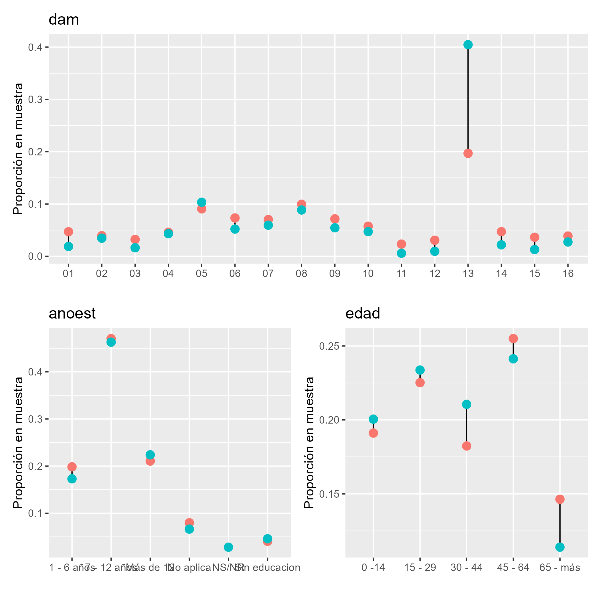
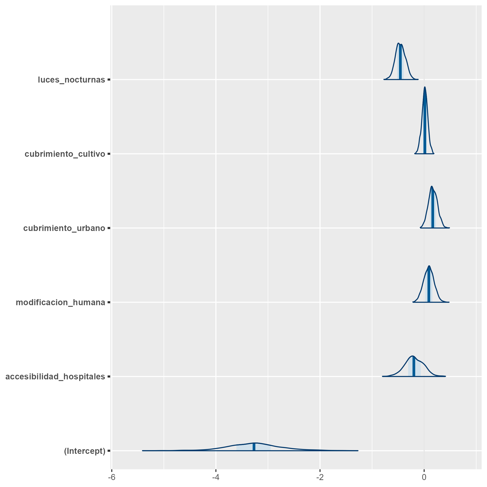
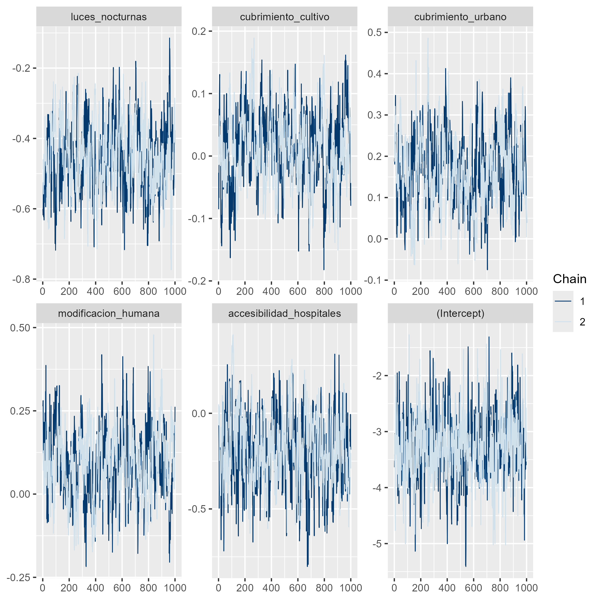

```{r setup, include=FALSE, message=FALSE, error=FALSE, warning=FALSE}
knitr::opts_chunk$set(
  echo = TRUE,
  message = FALSE,
  warning = FALSE,
  cache = FALSE
)

tba <- function(dat, cap = NA){
  kable(dat,
      format = "html", digits =  4,
      caption = cap) %>% 
     kable_styling(bootstrap_options = "striped", full_width = F)%>%
         kable_classic(full_width = F, html_font = "Arial Narrow")
}
library(rstan)
library(knitr)
library(kableExtra)
library(tidyverse)
library(magrittr)
```


## Introducción (I)

* En la inferencia Bayesiana para estimación de áreas pequeñas (SAE), los métodos de Monte Carlo por Cadenas de Markov (MCMC) permiten aproximar distribuciones posteriores complejas.  

* Estos métodos se emplean para modelos con:
  - Estructura jerárquica.  
  - Supuestos de distribución no estándar.  

* La validez de los estimadores depende de la convergencia y eficiencia de las cadenas.


# Modelo de unidad

##  Contexto y problema

* No es apropiado usar regresión lineal cuando la variable dependiente es **binaria**.

* ¿Por qué? Porque una regresión lineal puede predecir probabilidades fuera del rango ([0,1]) y la varianza depende de la media —violando supuestos fundamentales.


## Solución: regresión logística

* Se modela la **probabilidad** del evento mediante una transformación logit:

$$
\operatorname{logit}(\theta)=\ln\left(\frac{\theta}{1-\theta}\right)
$$

* $\theta$ = probabilidad de éxito (evento de interés).


## Definición de la variable dependiente

Sea la variable indicadora:

$$
y_{ji}=\begin{cases}
1 & \text{si } ingreso_{ji}\le lp,\\
0 & \text{en caso contrario.}
\end{cases}
$$

* $ingreso_{ji}$: ingreso de la persona (i) en el post-estrato (j).
* $lp$: línea de pobreza (umbral).


## Modelo: logit con efecto aleatorio de área

Se modela la relación entre la probabilidad esperada $\theta_{ji}=E[y_{ji}]$ y las covariables a nivel de unidad $\mathbf{x}_{ji}$ más un efecto aleatorio de área $u_d$:

$$
\operatorname{logit}(\theta_{ji})=\mathbf{x}_{ji}^{T}\boldsymbol{\beta}+u_d
$$

* $\boldsymbol{\beta}$: efectos fijos de las covariables.
* $u_d\sim N(0,\sigma_u^2)$: efecto aleatorio para el área/dominio.


## Interpretación breve

* $\beta_k$: cambio en el log-odds por unidad de la covariable $x_k$, manteniendo las demás constantes.

* Para obtener cambios en probabilidad, convertir log-odds a probabilidades vía la función logística:

$$
\theta=\frac{\exp(\eta)}{1+\exp(\eta)},\quad \eta=\mathbf{x}^{T}\boldsymbol{\beta}+u_d
$$


## Prioriad descriptas (no informativas)

* Para los coeficientes fijos:

$$\beta_k\sim N(0,1000)$$

* Para la varianza del efecto aleatorio:

$$\sigma^2_u\sim IG(0.0001,0.0001)$$


## Obejtivo

Estimar la proporción de personas que están por debajo de la linea pobreza, es decir, 
$$
P_d = \frac{\sum_{U_d}y_{di}}{N_d}
$$
donde $y_{di}$ toma el valor de 1 cuando el ingreso de la persona es menor a la linea de pobreza 0 en caso contrario. 


## Descomposición muestral

- Separando la población en la **muestra** $s_d$ y el **complemento fuera de muestra** $s_d^c$:

$$
\begin{equation*}
\bar{Y}_d = P_d =  \frac{\sum_{s_d}y_{di} + \sum_{s^c_d}y_{di}}{N_d} 
\end{equation*}
$$


- Esto muestra que la pobreza del dominio depende tanto de los datos observados como de los no observados.

## Estimador bajo modelo de unidad (I)

- Sustituimos los valores fuera de muestra por predicciones del modelo:


$$
\hat{P} = \frac{\sum_{s_d}y_{di} + \sum_{s^c_d}\hat{y}_{di}}{N_d}
$$

donde

$$\hat{y}_{di}=E_{\mathscr{M}}\left(y_{di}\mid\boldsymbol{x}_{d},\boldsymbol{\beta}\right)$$,

donde $\mathscr{M}$ hace referencia a la medida de probabilidad inducida por el modelamiento.


## Estimador bajo modelo de unidad (II)

- De esta forma:

$$
\hat{P} = \frac{\sum_{U_{d}}\hat{y}_{di}}{N_d}
$$

- Es decir, el estimador combina la información muestral con las predicciones del modelo para toda la población.


## Estimación bajo MCMC 

- El proceso de predicción de la pobreza en dominios no observados se realiza mediante **MCMC**, combinando la información muestral y la estructura del modelo de unidad.  

- Esta aproximación permite:  
  - Propagar la incertidumbre de los parámetros.  
  - Obtener predicciones consistentes a nivel de unidad y dominio.


## Proceso de estimación en `R` (I)

::: {.callout-tip}
### Librerías principales utilizadas:
```{r}
# Interprete de STAN en R
library(rstan)
library(rstanarm)
# Manejo de bases de datos.
library(tidyverse)
# Gráficas de los modelos. 
library(bayesplot)
library(patchwork)
# Organizar la presentación de las tablas
library(kableExtra)
library(printr)
#  devtools::install_github("hrbrmstr/ggalt")
source("../Recursos/Modelo_unidad/funciones/funciones_mrp.R")
source("../Recursos/Modelo_unidad/funciones/geom_dumbbell.R")
```
:::

## Proceso de estimación en `R` (II) {.scroll-container}

- Funciones desarrolladas para simplificar la metodología (archivo `funciones_mrp.R`):

1. **plot_interaction**:  
   - Crea diagramas de líneas para estudiar la interacción entre variables.
   - Útil para detectar solapamientos y decidir si incluir interacción en el modelo.

2. **Plot_Compare**:  
   - Valida la homologación entre censo y encuesta.
   - Compara proporciones de variables homogéneas entre ambos conjuntos de datos.

3. **Aux_Agregado**:  
   - Genera estimaciones a diferentes niveles de agregación.
   - Especialmente útil en procesos repetitivos o cuando se requiere análisis por dominios.

**Las funciones están diseñada específicamente  para este  proceso**


## Encuesta de hogares

Los datos empleados en esta ocasión corresponden a la ultima encuesta de hogares, la cual ha sido estandarizada por *CEPAL* y se encuentra disponible en *BADEHOG*


```{r, echo = FALSE, eval=FALSE}
encuesta <- readRDS("../Recursos/encuesta2017CHL.Rds")

encuesta_mrp <- encuesta %>% 
  transmute(
    dam =  haven::as_factor(dam_ee ,levels = "values"),
    dam2 =  haven::as_factor(comuna,levels = "values"),
    dam = str_pad(dam, width = 2, pad = "0"),
    dam2 = str_pad(dam2, width = 5, pad = "0"), 
    upm = `_upm`,
    estrato = `_estrato`,
    ingreso = ingcorte,lp,li,
    pobreza = ifelse(ingcorte < lp,1,0),
    logingreso = log(ingcorte + 1),
  area = case_when(area_ee == 1 ~ "1", TRUE ~ "0"),
  sexo = as.character(sexo),

  anoest = case_when(
    edad < 6 | is.na(anoest)   ~ "98"  , #No aplica
    anoest == 99 ~ "99", #NS/NR
    anoest == 0  ~ "1", # Sin educacion
    anoest %in% c(1:6) ~ "2",       # 1 - 6
    anoest %in% c(7:12) ~ "3",      # 7 - 12
    anoest > 12 ~ "4",      # mas de 12
    TRUE ~ "Error"  ),

  edad = case_when(
    edad < 15 ~ "1",
    edad < 30 ~ "2",
    edad < 45 ~ "3",
    edad < 65 ~ "4",
    TRUE ~ "5"),

  etnia = case_when(
    etnia_ee == 1 ~ "1", # Indigena
    etnia_ee == 2 ~ "2",
     TRUE ~ "3"), # Otro
 fep = `_feh`
) 

saveRDS(encuesta_mrp, "../Recursos/Modelo_unidad/encuesta_mrp.rds")
```


```{r, echo=FALSE}
encuesta_mrp <- readRDS("../Recursos/Modelo_unidad/encuesta_mrp.rds")
tba(encuesta_mrp %>% head(10)) 
```


## Variables de la encuesta

-   *dam*: Corresponde al código asignado a la división administrativa mayor del país.

-   *dam2*: Corresponde al código asignado a la segunda división administrativa del país.

-   *lp* y *li* lineas de pobreza y pobreza extrema definidas por CEPAL. 

-   *área* división geográfica (Urbano y Rural). 

-   *sexo* Hombre y Mujer. 

-   *etnia* En estas variable se definen tres grupos:  afrodescendientes, indígenas y Otros. 

-   *anoest* Años de escolaridad  

-   *edad* Rangos de edad 

-   *fep* Factor de expansión por persona


## Validación de encuesta frente al censo.

```{r, eval=FALSE, echo=FALSE}
library(survey)
library(srvyr)
library(patchwork)

censo_dam2 <- readRDS("../Recursos/Modelo_unidad/censo_dam2.rds")

p1_dam <- Plot_Compare(dat_encuesta = encuesta_mrp,
             dat_censo = censo_dam2,
             by = "dam")
p1_anotes <- Plot_Compare(dat_encuesta = encuesta_mrp,
             dat_censo = censo_dam2,
             by = "anoest")
p1_edad <- Plot_Compare(dat_encuesta = encuesta_mrp,
             dat_censo = censo_dam2,
             by = "edad")
p1 <- (p1_dam )/(p1_anotes + p1_edad)

ggsave(plot = p1 + theme_light(),
       filename = "img/plot_comp.png",
       scale = 3)

```

```{r echo=FALSE, out.width = "1000px", out.height="650px",fig.align='center'}

```

## Información Auxiliar (I)

- La información auxiliar proviene de:
  - **Censo de población**
  - **Imágenes satelitales**

- Variables estandarizadas (ejemplo):
  - Luces nocturnas  
  - Cobertura de cultivos y urbano  
  - Modificación humana  
  - Accesibilidad a hospitales  

## Información Auxiliar (II)

```{r, echo=FALSE}
statelevel_predictors_df <-
    readRDS("../Recursos/Modelo_unidad/statelevel_predictors_df_dam2.rds") %>% 
    mutate_at(.vars = c("luces_nocturnas",
                      "cubrimiento_cultivo",
                      "cubrimiento_urbano",
                      "modificacion_humana",
                      "accesibilidad_hospitales",
                      "accesibilidad_hosp_caminado"),
            function(x) as.numeric(scale(x)))
tba(statelevel_predictors_df  %>%  head(5))
```


## Niveles de Agregación

- De la literatura y simulaciones se concluye que:  
  - Las predicciones con muestra sin agregar y agregada convergen a la media del dominio.  
  - Usar muestra agregada reduce el tiempo computacional para la convergencia MCMC.  

- Variables de agregación seleccionadas: dam2 (división administrativa menor),  área, sexo,   anoest (años de estudio), edad y etnia


## Encuesta Agregada

- Construcción de la base de datos agregada:

```{r, echo=FALSE}
byAgrega <- c("dam2",  "area", "sexo",   "anoest", "edad",   "etnia")

encuesta_df_agg <-
  encuesta_mrp %>%                    # Encuesta  
  group_by_at(all_of(byAgrega)) %>%   # Agrupar por el listado de variables
  summarise(n = n(),                  # Número de observaciones
  # conteo de personas con características similares.           
             pobreza = sum(pobreza),
             no_pobreza = n-pobreza,
            .groups = "drop") %>%     
  arrange(desc(pobreza))                       # Ordenar la base.

tba(encuesta_df_agg %>% head(8))
```

- Finalmente, se unifica con la información auxiliar:

::: {.callout-tip}
### Código de R
```{r}
encuesta_df_agg <- inner_join(encuesta_df_agg, statelevel_predictors_df)
```
:::


## Definición del Modelo Multinivel

- Se utiliza un **modelo jerárquico bayesiano** para el ingreso medio:
$$
\begin{align*}
\log(Y_{di}) &\sim (1 \mid dam2) + (1 \mid edad) + (1 \mid etnia) \\ 
& + \beta_0 + \beta_1\times edad + \beta_2\times sexo + \beta_3\times tasa\_desocupacion \\
             &+ \beta_4\times luces\_nocturnas + \beta_5\times cubrimiento\_cultivo \\
             &+ \beta_6\times cubrimiento\_urbano + \beta_7\times modificacion\_humana
\end{align*}
$$

- Estimado con `stan_lmer` (`rstanarm`).  
- Efecto aleatorio: $u_d$ por dominio (`dam2`).  
- Covariables: demográficas y satelitales.  


## Proceso de estimación en `R` (I)

::: {.callout-tip}
### Código de R 
```{r, eval = FALSE}
options(MC.cores=parallel::detectCores()) # Permite procesar en paralelo. 
fit <- stan_glmer(
  cbind(pobreza, no_pobreza) ~                               # Ingreso medio (Y)
    (1 | dam2) +                          # Efecto aleatorio (ud)
    (1 | edad) +
    (1 | etnia) +
    sexo  +                               # Efecto fijo (Variables X)
   tasa_desocupacion +
   luces_nocturnas +
   cubrimiento_cultivo +
   cubrimiento_urbano +
   modificacion_humana +
   accesibilidad_hospitales + 
   accesibilidad_hosp_caminado ,  ,
   data = encuesta_df_agg, # Encuesta agregada 
   verbose = TRUE,         # Muestre el avance del proceso
    chains = 2,             # Número de cadenas.
    iter = 2000,              # Número de realizaciones de la cadena
        family = binomial(link = "logit")
                )
saveRDS(fit, file = "../Recursos/Modelo_unidad/fit_pobreza.rds")
```
:::


## Proceso de estimación en `R` (II)
::: {.callout-tip}
### Código de R 
```{r, eval=FALSE}
fit <- readRDS("../Recursos/Modelo_unidad/fit_pobreza.rds")
```
:::

```{r, echo=FALSE}
#saveRDS(coef(fit)$dam2, "../Recursos/Modelo_unidad/01_tab_coef_dam2.rds")
tab_coef_dam2 <- readRDS("../Recursos/Modelo_unidad/01_tab_coef_dam2.rds")
tba(tab_coef_dam2 %>% head(5))
```


## Validación del Modelo (I)

- Comparación de densidades observadas vs predichas:

::: {.callout-tip}
### Código de R 
```{r,eval=FALSE}
library(posterior)
library(bayesplot)

encuesta_mrp2 <- inner_join(encuesta_mrp, statelevel_predictors_df)

y_pred_B <- posterior_epred(fit, newdata = encuesta_mrp2)
rowsrandom <- sample(nrow(y_pred_B), 100)

y_pred2 <- y_pred_B[rowsrandom, ]
p1 <- ppc_dens_overlay(y = as.numeric(encuesta_mrp2$pobreza), y_pred2) 


ggsave(filename = "img/pobreza.PNG", plot = p1)
```
:::


## Validación del Modelo (II)


```{r echo=FALSE, out.width = "900px", fig.align="center"}
knitr::include_graphics("Img/pobreza.PNG")
```


## Validación del Modelo (III)


```{r, eval=FALSE, echo = FALSE}
var_names <- c("luces_nocturnas", "cubrimiento_cultivo","cubrimiento_urbano", 
               "modificacion_humana", "accesibilidad_hospitales",
               "(Intercept)")
p1 <- mcmc_areas(fit,pars = var_names)


ggsave(filename = "img/pobreza1.PNG", plot = p1)
```


- Convergencia de parámetros:  Gráficos área.  

```{r echo=FALSE, out.width = "900px", fig.align="center"}

```

## Validación del Modelo (II)

- Convergencia de parámetros:  Gráficos Trace  

::: {.callout-tip}
### Código de `R` 

```{r, eval=FALSE}
p1 <- mcmc_trace(fit,pars = var_names)
ggsave(filename = "img/pobreza2.PNG", plot = p1)
```
:::

```{r echo=FALSE, fig.align='center'}

```


## Predicción de la pobreza 

::: {.callout-tip}

### Código de `R` 

```{r, eval=FALSE}
perdidos <- anti_join(censo_dam2, 
                      statelevel_predictors_df, by = "dam2") %>%
  select(dam, dam2)

poststrat <- censo_dam2 %>% anti_join(perdidos)

poststrat <- inner_join(poststrat, statelevel_predictors_df)

draw_predict <- posterior_epred(fit, newdata = poststrat)

censo_pred <- poststrat %>% select(names(censo_dam2)) %>% 
  mutate(
  pobreza =  colMeans(draw_predict)
)
saveRDS(censo_pred, file = "../Recursos/Modelo_unidad/censo_pred.rds")
```
:::

## Estimación de la pobreza nacional

::: {.callout-tip}
### Código de R 

```{r}
censo_pred <- readRDS( "../Recursos/Modelo_unidad/censo_pred.rds")
tab_nac <- censo_pred %>% summarise(
  pobreza = weighted.mean(pobreza, n)
)
```
:::

```{r, echo=FALSE}
tba(tab_nac)
```

## Estimación de la pobreza por sexo 

::: {.callout-tip}
### Código de `R` 

```{r}
tab_sexo_nac <- censo_pred %>% group_by(sexo) %>% summarise(
  pobreza = weighted.mean(pobreza, n)
)
```
:::


```{r, echo=FALSE}
tba(tab_sexo_nac)
```

## Estimación de la pobreza por dam 

::: {.callout-tip}
### Código de R 

```{r}
tab_dam <- censo_pred %>% group_by(dam) %>% summarise(
  pobreza = weighted.mean(pobreza, n)
)
```
:::


```{r, echo=FALSE}
tba(tab_dam %>% head(8)) 
```


# ¡Gracias! 