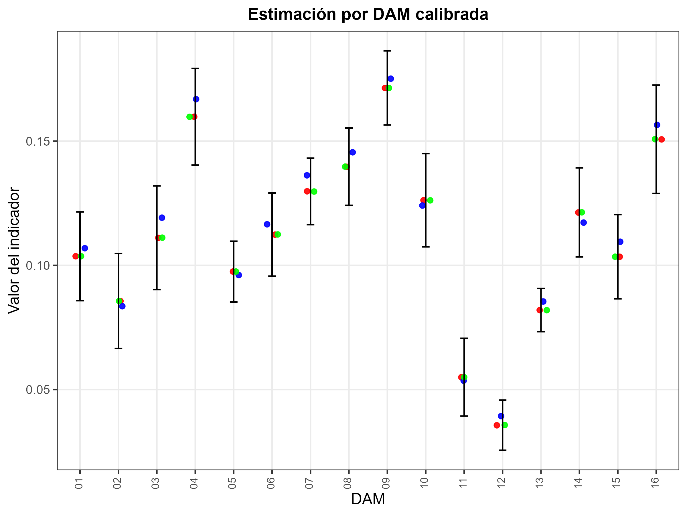

```{r setup, include=FALSE, message=FALSE, error=FALSE, warning=FALSE}
knitr::opts_chunk$set(
  echo = TRUE,
  message = FALSE,
  warning = FALSE,
  cache = TRUE
)

tba <- function(dat, cap = NA){
  kable(dat,
      format = "html", digits =  4,
      caption = cap) %>% 
     kable_styling(bootstrap_options = "striped", full_width = F)%>%
         kable_classic(full_width = F, html_font = "Arial Narrow")
}
library(rstan)
library(knitr)
library(kableExtra)
library(tidyverse)
library(magrittr)
library(survey)
library(srvyr)
library(reshape2)
```


## Introducción

* El proceso de benchmarking de cadenas MCMC es crucial en SAE, porque:

  - Garantiza que las estimaciones desagregadas sean coherentes con los niveles de agregación donde la encuesta es representativa, por ejemplo, divisiones administrativas mayores o nivel nacional.  

  - Debe tenerse presente que el benchmarking es un procedimiento de ajuste estético: no mejora la calidad intrínseca del estimador, pero sí asegura consistencia y comparabilidad.  

## Estimación bajo MCMC 

- El proceso de predicción de la pobreza en dominios no observados se realiza mediante **MCMC**, combinando la información muestral y la estructura del modelo de unidad.  

- Esta aproximación permite:  
  - Propagar la incertidumbre de los parámetros.  
  - Obtener predicciones consistentes a nivel de unidad y dominio.


## Proceso de estimación en `R` (I)

::: {.callout-tip}
### Librerías principales utilizadas:
```{r}
# Interprete de STAN en R
library(rstan)
library(rstanarm)
# Manejo de bases de datos.
library(tidyverse)
# Gráficas de los modelos. 
library(ggplot2)
library(bayesplot)
library(patchwork)
# Organizar la presentación de las tablas
library(kableExtra)
library(printr)
```
:::


## Encuesta de hogares

Los datos empleados en esta ocasión corresponden a la ultima encuesta de hogares, la cual ha sido estandarizada por *CEPAL* y se encuentra disponible en *BADEHOG*


```{r, echo=FALSE}
encuesta_mrp <- readRDS("../Recursos/Modelo_unidad/encuesta_mrp.rds") %>% 
  mutate(yk = pobreza)
tba(encuesta_mrp %>% head(5)) 
```

## Lectura de covariables 

```{r, echo=FALSE, eval=TRUE}
statelevel_predictors_df <-
  readRDS("../Recursos/Modelo_unidad/statelevel_predictors_df_dam2.rds") %>% 
    mutate_at(.vars = c("luces_nocturnas",
                      "cubrimiento_cultivo",
                      "cubrimiento_urbano",
                      "modificacion_humana",
                      "accesibilidad_hospitales",
                      "accesibilidad_hosp_caminado"),
            function(x) as.numeric(scale(x)))
tba(statelevel_predictors_df  %>%  head(5))
```

## Benchmarking por iteración de la cadena MCMC

Para estimar correctamente la incertidumbre posterior y garantizar coherencia con los **totales directos de pobreza**, el cálculo de los factores de calibración se repite para **cada realización** (l) de la cadena MCMC.

De esta forma obtenemos una familia de factores

$$
\{g_k^{(l)} \}_{l=1}^L
$$

y, a partir de ellos, una familia de estimadores calibrados de la tasa de pobreza:

$$
\{\widehat{P}_d^{(l)\text{cal}}\}_{l=1}^L.
$$

## Notación

* $l = 1,\ldots,L$: iteración de la cadena MCMC
* $\boldsymbol{P}^{(l)}$: parámetros muestreados en la iteración $l$
* $\hat{p}_k^{(l)}$: tasa de pobreza predicha para el post-estrato $k$ dada $\boldsymbol{P}^{(l)}$
* $n_k$: tamaño poblacional del post-estrato
* $\mathbf{x}_k$: vector de calibración (dummies por DAM) del post-estrato
* $\mathbf{t}_X$: totales directos de pobreza a nivel nacional o por DAM


## Proceso para cada iteración $l$ (I)

### 1. Predicción condicional (modelo)

$$
\hat{p}_k^{(l)} = E\big(P_k  \mid \boldsymbol{\theta}^{(l)}  \big)
$$

donde $P_k$ es la tasa de pobreza del post-estrato.

### 2. Estimación directa de la pobreza a nivel de dominio 

$$
\widehat{\mathbf{t}}_X^{DIR} 
$$


## Proceso para cada iteración $l$ (II)

### 3. Calibración — resolver para $g_k^{(l)}$

Buscamos valores positivos $g_k^{(l)}$ tales que:

$$
\sum_{k} g_k^{(l)}  n_k  \mathbf{x}_k \equiv 
\widehat{\mathbf{t}}_X^{DIR}
$$

donde $\mathbf{t}_X$ incluye:

* totales poblacionales por DAM
* totales de personas pobres por DAM o a nivel nacional

En la práctica, `calib()` obtiene:

$$
g_k^{(l)} = h\left(\lambda^{(l)\top}\mathbf{x}_k \right),
$$

donde $h(\cdot)$ depende del método (`logit` recomendado para tasas),
y $\lambda^{(l)}$ es el vector de Lagrange de la iteración.


## Proceso para cada iteración $l$ (III)

### 4. Estimador calibrado de la tasa de pobreza por dominio (d)

$$
\widehat{P}_d^{(l)\text{cal}}
= \frac{1}{N_d} \sum_{k\in d} g_k^{(l)} n_k \hat{p}_k^{(l)}.
$$

donde (N_d = \sum_{k\in d} n_k).

Así se obtiene la tasa ajustada respetando los totales directos.


## Proceso para cada iteración $l$ (IV)

### 5. Repetir para $l=1,\dots,L$

Esto genera la muestra posterior calibrada:

$$
\{\widehat{P}_d^{(l),\text{cal}}\}_{l=1}^L.
$$

### 6. Obtención del estimador final e intervalos creíbles

$$
\widehat{P}_d^{\text{cal}}
= \frac{1}{L}\sum_{l=1}^L \widehat{P}_d^{(l),\text{cal}}
$$

$$
IC_{1-\alpha}(P_d)
= \text{quantiles}\left({\widehat{P}_d^{(l),\text{cal}}}\right).
$$


## Observaciones prácticas y requisitos (I)

* **Positividad:**
  Debe cumplirse $g_k^{(l)} > 0$.
  Si no ocurre, conviene usar método `"logit"` o descartar la iteración (muy raro).

* **Propagación de incertidumbre:**
  La incertidumbre proviene tanto del modelo como de la calibración.
  Esto produce intervalos más realistas y coherentes con los totales observados.


## Observaciones prácticas y requisitos (II)

* **Costo computacional:**
  Calibrar en cada iteración puede ser costoso.
  Se recomienda reducir el número de post-estratos o usar agregaciones intermedias.

* **Diagnósticos:**
  Revisar la distribución de $g_k^{(l)}$:

  * histogramas
  * percentiles
  * valores extremos
  * verificar que se cumplen exactamente los totales fijados:

$$
\sum_k g_k^{(l)} n_k \mathbf{x}_k \approx \mathbf{t}_X.
$$

## Proceso de estimación y predicción

Obtener el modelo es solo un paso más, ahora se debe realizar la predicción en el censo, el cual a sido previamente estandarizado y homologado con la encuesta. 

::: {.callout-tip}
### Código en R
```{r, }
poststrat_df <- readRDS("../Recursos/Modelo_unidad/censo_dam2.rds") %>% 
     inner_join(statelevel_predictors_df)
```
:::

```{r, echo=FALSE}
tba( poststrat_df %>% arrange(desc(n)) %>% head(5))
```
Note que la información del censo esta agregada.

## Distribución posterior.

Para obtener una distribución posterior de cada observación se hace uso de la función *posterior_epred* de la siguiente forma.

::: {.callout-tip}
### Código en R
```{r, eval=FALSE}
fit <- readRDS("../Recursos/Modelo_unidad/fit_pobreza.rds")
epred_mat <- posterior_epred(fit, newdata = poststrat_df,  type = "response")
saveRDS(epred_mat, "../Recursos/Modelo_unidad/epred_mat.rds")
```
:::

## Proceso de estimación en `R` (I)

En cada iteración $l$ de la cadena MCMC:

1. Sustituir $\hat{y}_k^{(l)}$ en la tabla de post-estratificación.  
2. Construir la matriz de calibración $\mathbf{X}_k$.  

::: {.callout-tip}
### Código en R

```{r, eval=TRUE}
library(sampling)
epred_mat <- readRDS("../Recursos/Modelo_unidad/epred_mat.rds")

iter <- 1 
names_cov <- "dam"
metodo <- "logit"

# 1. Predicciones en el post-estrato
temp_post <- poststrat_df %>%
  mutate(yk = epred_mat[iter,]) %>% 
  select(dam:n, yk)
```
:::

## Proceso de estimación en `R` (II)

::: {.callout-tip}
### Código en R

```{r, eval=TRUE}
# 2. Matriz de calibración
  Xk_num <- temp_post %>% select(all_of(names_cov)) %>% 
    fastDummies::dummy_cols(select_columns = names_cov,
                            remove_selected_columns = TRUE) %>% 
    mutate_at(vars(matches("\\d$")) ,~.*temp_post$yk) %>%
    as.matrix()
 
  Xk_den <- temp_post %>% select(all_of(names_cov)) %>% 
    fastDummies::dummy_cols(select_columns = names_cov,
                            remove_selected_columns = TRUE) %>%
    as.matrix()
  
  colnames(Xk_num) <- paste0("num_", colnames(Xk_num))
  colnames(Xk_den) <- paste0("den_", colnames(Xk_den))
  
  Xk <- cbind(Xk_num, Xk_den)

```
:::

## Proceso de estimación en `R` (III)

3. Calcular los totales de la encuesta $\mathbf{t}_X$.  

::: {.callout-tip}
### Código en R

```{r, eval=TRUE}
# 3. Totales de la encuesta
 encuesta_temp <- encuesta_mrp %>% select(all_of(names_cov)) %>% 
    fastDummies::dummy_cols(select_columns = names_cov,
                            remove_selected_columns = TRUE)

  num_total <- encuesta_temp %>% 
    mutate_at(vars(matches("\\d$"))
              ,~.*encuesta_mrp$yk*encuesta_mrp$fep) %>% 
    colSums()
  
  den_total <- encuesta_temp %>% 
    mutate_at(vars(matches("\\d$")) ,~.*encuesta_mrp$fep) %>% 
    colSums()
  
  names(num_total) <- paste0("num_", names(num_total))  
  names(den_total) <- paste0("den_", names(den_total))
  
  Total_Xk <- c(num_total, den_total)
  Xk <- Xk[,names(Total_Xk)]
Total_Xk
```
:::

## Proceso de estimación en `R` (IV)

4. Resolver el sistema de calibración para obtener $g_k^{(l)}$.  

::: {.callout-tip}
### Código en R

```{r, eval=TRUE}
# 4. Resolver calibración
gk_calib <- calib(
  Xs = Xk,
  d = temp_post$n,
  total = Total_Xk,
  method = metodo
)
```
:::

```{r, eval=TRUE}
summary(gk_calib)
```

## Diagnóstico

::: {.callout-tip}

### Código en R

```{r, eval=TRUE}
check_calib <- checkcalibration(
  Xs = Xk, d = temp_post$n,
  total = Total_Xk, g = gk_calib
)
check_calib
```
:::

## Proceso de estimación en `R` (V)

::: {.callout-tip}
### Código en R

```{r, eval=TRUE}
# Totales ajustados
hat_tx <- Xk %>% data.frame() %>% 
  mutate_at(vars(matches("\\d$")), ~ . * temp_post$n * gk_calib) %>% 
  colSums()

round(Total_Xk - hat_tx, 4)
```
:::

## Proceso de estimación en `R` (Función benchmarking)

::: {.callout-tip}
### Código en R

```{r}
source("../Recursos/Modelo_unidad/funciones/benchmarking_ingreso.r")

poststrat_df_iter <- benchmarking_pobreza(
  poststrat_df = temp_post %>% data.frame(),
  encuesta_sta = encuesta_mrp %>% mutate(yk = pobreza),
  names_cov = "dam",
  metodo = "logit", 
  show_plot = FALSE
)
```
:::

```{r, echo=FALSE}
tba(poststrat_df_iter %>% head(5))
```


## Proceso de estimación en `R` para la MCMC

::: {.callout-tip}
### Código en R

```{r, eval=FALSE}
poststrat_df_iter2 <- map(1:500,
  ~{
temp_post <- poststrat_df %>%
  mutate(yk = epred_mat[.x,]) %>% 
  select(dam:n, yk)

poststrat_df_iter <- benchmarking_pobreza(
  poststrat_df = temp_post %>% data.frame(),
  encuesta_sta = encuesta_mrp %>% mutate(yk = pobreza),
  names_cov = "dam",
  metodo = "logit", 
  show_plot = FALSE
)
poststrat_df_iter
  }
)
saveRDS(poststrat_df_iter2, "../Recursos/Modelo_unidad/poststrat_df_iter_pobreza.rds")

```
:::


## Estimación nacional 

- SIN benchmarking (usa n)

::: {.callout-tip}
### Código en R

```{r, eval=FALSE}
theta_modelo_sin <- calc_theta(
  result_list = poststrat_df_iter2,
  var_n     = "n",
  levels    = NULL
)$estimates

saveRDS(theta_modelo_sin, 
        "../Recursos/Modelo_unidad/02.theta_modelo_pobreza.rds")
```

:::

## CON benchmarking (usa n2)

::: {.callout-tip}

### Código en R

```{r, eval=FALSE}
theta_modelo_con <- calc_theta(
  result_list = poststrat_df_iter2,
  var_n     = "n2",
  levels    = NULL
)$estimates

saveRDS(theta_modelo_con, 
        "../Recursos/Modelo_unidad/03.theta_modelo_pobreza_con.rds")
```

:::

## Resultado de la estimación nacional

```{r, echo=FALSE}
theta_modelo_sin <- readRDS(
  "../Recursos/Modelo_unidad/02.theta_modelo_pobreza.rds"
) %>% mutate(Metodo = "Sin benchmarking")

theta_modelo_con <- readRDS(
  "../Recursos/Modelo_unidad/03.theta_modelo_pobreza_con.rds"
) %>% mutate(Metodo = "Con benchmarking")

bind_rows(theta_modelo_con, theta_modelo_sin) %>% 
  tba("Estimación nacional de pobreza (MCMC)")
```

## Estimación por DAM  *SIN benchmarking*

::: {.callout-tip}

### Código en R

```{r, eval=FALSE}
theta_modelo_sin <- calc_theta(
  result_list = poststrat_df_iter2,
  var_n     = "n",
  levels    = "dam"
)$estimates

saveRDS(theta_modelo_sin, 
        "../Recursos/Modelo_unidad/04.theta_modelo_pobreza_sin_dam.rds")
```

:::

## Estimación por DAM  *CON benchmarking*


::: {.callout-tip}

### Código en R

```{r, eval=FALSE}
theta_modelo_con <- calc_theta(
  result_list = poststrat_df_iter2,
  var_n     = "n2",
  levels    = "dam"
)$estimates

saveRDS(theta_modelo_con, 
        "../Recursos/Modelo_unidad/05.theta_modelo_pobreza_con_dam.rds")
```

:::

## Resultado de la estimación DAM

```{r, echo=FALSE}
theta_modelo_sin_dam <- 
  readRDS("../Recursos/Modelo_unidad/04.theta_modelo_pobreza_sin_dam.rds") %>%
  transmute(dam, estimate_sin = estimate, sd_sin = sd)

theta_modelo_con_dam <- 
  readRDS("../Recursos/Modelo_unidad/05.theta_modelo_pobreza_con_dam.rds") %>%
  transmute(dam, estimate_con = estimate, sd_con = sd)

inner_join(theta_modelo_con_dam, theta_modelo_sin_dam) %>% 
  tba("Estimación por DAM (MCMC)")
```

## Resultado de la estimación DAM

```{r, echo=FALSE}
source("../Recursos/Modelo_unidad/funciones/plot_validacion.R")

diseno <- encuesta_mrp %>% 
  as_survey_design(
    ids     = upm,
    weights = fep,
    strata  = estrato,
    nest    = TRUE
  )

estimate_dir <- diseno %>% 
  group_by(dam) %>% 
  summarise(
    n_sample = unweighted(n()),
    directo  = survey_mean(pobreza, vartype = "ci")
  )

tabla_dam <- 
inner_join(theta_modelo_con_dam, theta_modelo_sin_dam) %>% 
  transmute(dam,bench = estimate_con, modelo = estimate_sin ) %>% 
  inner_join(estimate_dir)

p1 <- plot_validacion(
  tabla    = tabla_dam,
  aggregado = "dam",
  titulo    = "Estimación por DAM calibrada"
)

ggsave(
  filename = "img/02_calib_nac_dam.png",
  plot     = p1,
  width    = 8, 
  height   = 6
)
  

```

```{r echo=FALSE, out.width = "1000px", out.height="650px",fig.align='center'}

```


## Estimaciones desagregadas por DAM – área

::: {.callout-tip}

### Código en R

```{r, eval=FALSE}
theta_modelo_sin_dam_area  <- calc_theta(
    result_list = poststrat_df_iter2,
    levels = c("dam", "area"),
    ci_level = 0.95,
    var_n = "n"
)$estimates %>% 
    transmute(dam, area, estimate_sin = estimate, sd_sin = sd)

saveRDS(theta_modelo_sin_dam_area, 
        "../Recursos/Modelo_unidad/06.theta_modelo_pobreza_sin_dam_area.rds")
```
:::

## Estimaciones desagregadas por DAM – área

::: {.callout-tip}

### Código en R

```{r, eval=FALSE}
theta_modelo_con_dam_area  <- calc_theta(
    result_list = poststrat_df_iter2,
    levels = c("dam", "area"),
    ci_level = 0.95,
    var_n = "n2"
)$estimates %>% 
    transmute(dam, area, estimate_con = estimate, sd_con = sd)

saveRDS(theta_modelo_con_dam_area,
        "../Recursos/Modelo_unidad/07.theta_modelo_pobreza_con_dam_area.rds")
```

:::

## Estimaciones desagregadas por DAM – área

```{r, echo=FALSE}
theta_modelo_sin_dam_area <- 
  readRDS("../Recursos/Modelo_unidad/06.theta_modelo_pobreza_sin_dam_area.rds")

theta_modelo_con_dam_area <- 
  readRDS("../Recursos/Modelo_unidad/07.theta_modelo_pobreza_con_dam_area.rds")

inner_join(theta_modelo_sin_dam_area, theta_modelo_con_dam_area) %>% 
  head(10) %>% 
  tba("DAM × Área")
```


# ¡Gracias! 