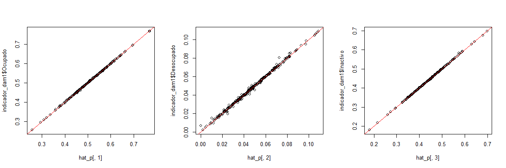
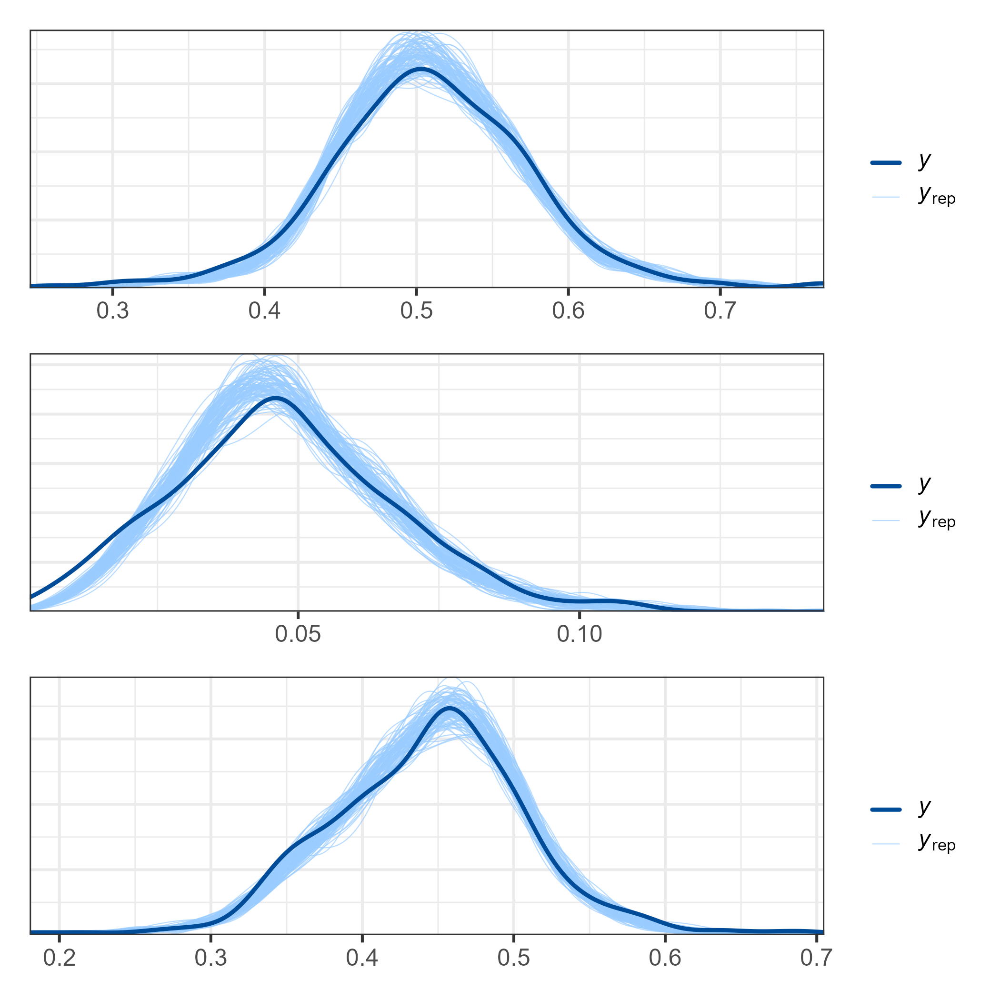
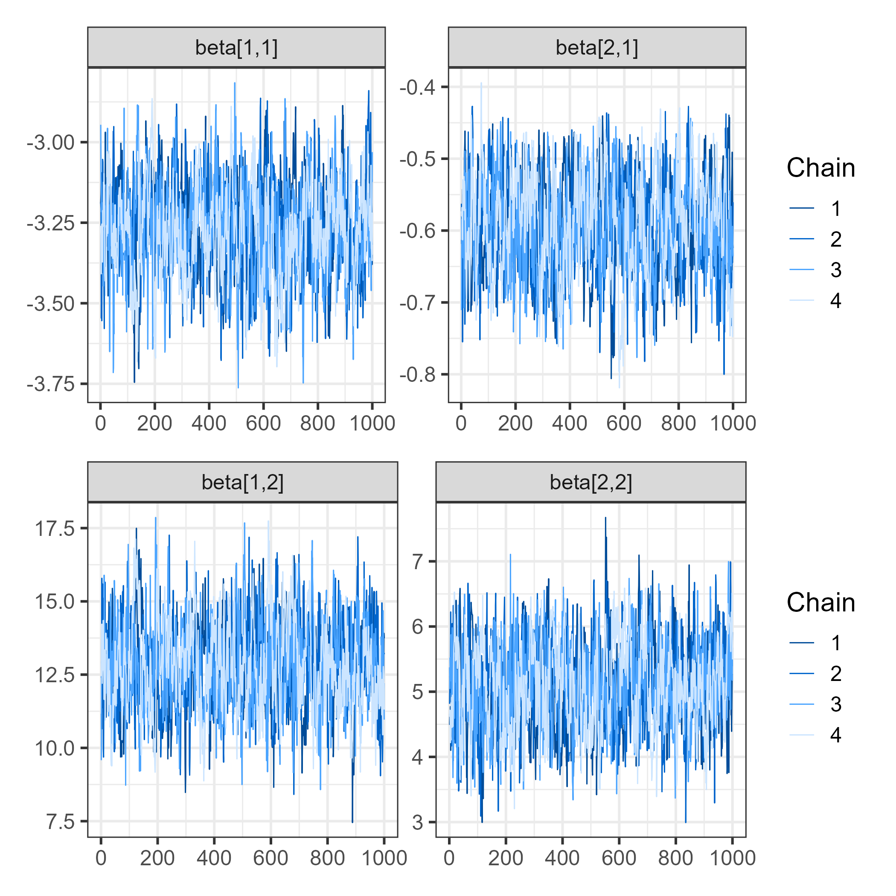

```{r setup, include=FALSE, message=FALSE, error=FALSE, warning=FALSE}
knitr::opts_chunk$set(
  echo = TRUE,
  message = FALSE,
  warning = FALSE,
  cache = FALSE
)

tba <- function(dat, cap = NA){
  kable(dat,
      format = "html", digits =  4,
      caption = cap) %>% 
     kable_styling(bootstrap_options = "striped", full_width = F)%>%
         kable_classic(full_width = F, html_font = "Arial Narrow")
}
library(rstan)
library(knitr)
library(kableExtra)
library(tidyverse)
library(magrittr)
library(bayesplot)
library(posterior)
library(patchwork)
```

## Introducción

La **Encuesta de Caracterización Socioeconómica Nacional (CASEN)**, ejecutada por el Instituto Nacional de Estadísticas (INE) de Chile, constituye una de las principales fuentes de información para el seguimiento de la situación social y económica del país.

Entre sus objetivos se encuentra la medición de indicadores del **mercado de trabajo**, tales como la **tasa de participación**, **ocupación** y **desempleo**.

Sin embargo, los estimadores directos derivados de la encuesta suelen presentar **alta variabilidad** en dominios pequeños (regiones, provincias, comunas), lo que motiva el uso de **modelos de área** para mejorar la precisión y estabilidad de las estimaciones.


## Indicadores del mercado de trabajo

Los indicadores que se modelan de manera conjunta son:

* $p_{1}$: Proporción de personas **ocupadas**.
* $p_{2}$: Proporción de personas **desocupadas**.
* $p_{3}$: Proporción de personas **inactivas**.

Dado que las tres categorías son mutuamente excluyentes y exhaustivas, el vector de probabilidades $\boldsymbol{\theta}_d = (p_{d1}, p_{d2}, p_{d3})'$ debe cumplir:

$$
\sum_{k=1}^{3} p_{dk} = 1
$$

## Tamaño de muestra efectivo por categoría (design effect)

- Debido al diseño muestral, la varianza observada de $\hat p_{dk}$ contiene efecto de diseño. Se define un **tamaño efectivo** aproximado $\tilde n_{dk}$ como

$$
\tilde n_{dk} \;=\; \frac{\tilde p_{dk}(1-\tilde p_{dk})}{\widehat v_{dk}},
$$

donde $\tilde p_{dk}$ es un estimador estable de la proporción (por ejemplo $\hat p_{dk}$ o una versión suavizada).

- A partir de $\tilde n_{dk}$ definimos el conteo pseudo-observado

$$
\tilde y_{dk} = \tilde n_{dk}\times \hat p_{dk}.
$$

- Luego se define el total efectivo por dominio

$$
\hat n_d = \sum_{k=1}^K \tilde y_{dk},
$$

y la reconstrucción de conteos coherentes:

$$
\hat y_{dk} = \hat n_d \times \hat p_{dk}.
$$


## Modelo multinomial-logit jerárquico

- Para cada dominio $d$ trabajamos con los conteos pseudo-observados
  $(\tilde y_{d1},\dots,\tilde y_{dK})$ condicionados a $\hat n_d$:

$$
(\tilde y_{d1},\dots,\tilde y_{dK}) \mid \hat n_d,\boldsymbol{\theta}_d
\sim \text{Multinomial}(\hat n_d,\; \boldsymbol{\theta}_d).
$$


## Transformación a probabilidades

- Modelo lineal para los logits (categoría 1 como referencia): para $k=2,\dots,K$,

$$
\eta_{dk} = \ln\left(\frac{p_{dk}}{p_{d1}}\right) =  \mathbf{X}_d^\top \boldsymbol{\beta}_k + u_{dk},
$$


donde

- $\mathbf{X}_d\in\mathbb{R}^p$: vector de $p$ covariables del dominio $d$,

- $\boldsymbol{\beta}_k\in\mathbb{R}^p$: coeficientes fijos de la categoría $k$,

- $u_{dk}$: efecto aleatorio del dominio $d$ en la categoría $k$.


## Ecuaciones del modelo

Definiendo la categoría base como ocupado ($k=1$), se tiene:

$$
\ln\left(\frac{p_{d2}}{p_{d1}}\right) = \mathbf{X}_d^\top \boldsymbol{\beta_2} + u_{i2}
$$

$$
\ln\left(\frac{p_{d3}}{p_{d1}}\right) = \mathbf{X}_d^\top \boldsymbol{\beta_3} + u_{d3}
$$

donde $u_{ik}$ son efectos aleatorios de área, con:

$$
(u_{i2}, u_{i3})' \sim N(\mathbf{0}, \boldsymbol{\Sigma_u})
$$


## Restricciones y derivación

Usando la restricción $\sum_{k=1}^3 p_{dk} = 1$, se obtiene:

$$
p_{d1} = \frac{1}{1 + e^{\mathbf{X}_d^\top \boldsymbol{\beta_2} + u_{d2}} + e^{\mathbf{X}_d^\top \boldsymbol{\beta_3} + u_{d3}}}
$$

$$
p_{d2} = \frac{e^{\mathbf{X}_d^\top \boldsymbol{\beta_2} + u_{d2}}}{1 + e^{\mathbf{X}_d^\top \boldsymbol{\beta_2} + u_{d2}} + e^{\mathbf{X}_d^\top \boldsymbol{\beta_3} + u_{d3}}}
$$

$$
p_{d3} = \frac{e^{\mathbf{X}_d^\top \boldsymbol{\beta_3} + u_{d3}}}{1 + e^{\mathbf{X}_d^\top \boldsymbol{\beta_2} + u_{i2}} + e^{\mathbf{X}_d^\top \boldsymbol{\beta_3} + u_{d3}}}
$$


# Implementación del modelo en R

## Librerías,  configuración inicial y lectura de la encuesta

::: {.callout-tip}

### Código de `R`

```{r}
library(survey)
library(tidyverse)
library(srvyr)
library(TeachingSampling)
library(haven)
library(bayesplot)
library(patchwork)
library(stringr)
library(rstan)

set_data <- readRDS('../Recurso/encuesta2017CHL.Rds')

length_upm <- max(nchar(set_data[["_upm"]]))
length_estrato <- max(nchar(set_data[["_estrato"]]))
id_dominio <- "dam2"
```
:::

## Selección de variables
::: {.callout-tip}

### Código de `R`

```{r}
set_data <- set_data %>%
  transmute(
    dam = as_factor(dam_ee, levels = "values"),
    dam = str_pad(string = dam, width = 2, pad = "0"),
    dam2 = as_factor(comuna, levels = "values"),
    dam2 = str_pad(string = dam2, width = 5, pad = "0"),
    nombre_dam = as_factor(dam_ee, levels = "labels"),
    nombre_dam2 = as_factor(comuna, levels = "labels"),
    upm = str_pad(`_upm`, width = length_upm, pad = "0"),
    estrato = str_pad(`_estrato`, width = length_estrato, pad = "0"),
    fep = `_fep`,
    empleo = condact3
  )
```
:::

## Definición del diseño muestral

::: {.callout-tip}

### Código de `R`

```{r}
options(survey.lonely.psu = 'adjust')

diseno <- set_data %>%
  as_survey_design(
    strata = estrato,
    ids = upm,
    weights = fep,
    nest = TRUE
  )
```
:::

## Estimaciones directas por dominio

Se calculan proporciones y estadísticas de empleo, desocupación e inactividad por dominio:

::: {.callout-tip}

### Código de `R`

```{r, eval=FALSE}
indicador_dam <- diseno %>%
  group_by_at(id_dominio) %>%
  filter(empleo %in% c(1:3)) %>%
  summarise(
    n_ocupado = unweighted(sum(empleo == 1)),
    n_desocupado = unweighted(sum(empleo == 2)),
    n_inactivo = unweighted(sum(empleo == 3)),
    Ocupado = survey_mean(empleo == 1, vartype = c("se", "var"), deff = TRUE),
    Desocupado = survey_mean(empleo == 2, vartype = c("se", "var"), deff = TRUE),
    Inactivo = survey_mean(empleo == 3, vartype = c("se", "var"), deff = TRUE)
  )
```
:::


## Selección de dominios válidos

::: {.callout-tip}

### Código de `R`

```{r, eval=FALSE}
indicador_dam <- set_data %>%
  select(id_dominio, upm) %>%
  distinct() %>%
  group_by_at(id_dominio) %>%
  tally(name = "n_upm") %>%
  inner_join(indicador_dam, by = id_dominio)

indicador_dam1 <- indicador_dam %>%
  filter(n_upm >= 2, !is.na(Desocupado_deff)) %>%
  mutate(id_orden = 1:n())

saveRDS(indicador_dam1, "../Recurso/Modelo_area/base_modelo.Rds")
```
:::

## Tabla de resultados 

```{r, echo=FALSE}
indicador_dam1 <- readRDS("../Recurso/Modelo_area/base_modelo.Rds")
tba(head(indicador_dam1, 10))
```

## Modelo multinomial jerárquico en `STAN`

* Variable respuesta por dominio: $Y_d = (\text{ocupado}, \text{desocupado}, \text{inactivo})$

* Distribución: $Y_d \mid n_d, \boldsymbol{\theta}_d \sim \text{Multinomial}(n_d, \boldsymbol{\theta}_d)$

::: {.callout-important}

### Código de `Stan`

```stan
data {
  int<lower=1> D; // número de dominios 
  int<lower=1> P; // categorías
  int<lower=1> K; // cantidad de regresores
  int hat_y[D, P]; // matriz de datos
  matrix[D, K] X_obs; // matriz de covariables
  int<lower=1> D1; // número de dominios 
  matrix[D1, K] X_pred; // matriz de covariables
}
```
:::

## Modelo en `Stan`: parameters y  transformed parameters

::: {.callout-important}

### Código de `Stan`

```stan
parameters {
  matrix[P-1, K] beta;// matriz de parámetros 
  vector<lower=0>[P-1] sigma_u;       // random effects standard deviations
  // declare L_u to be the Choleski factor of a 2x2 correlation matrix
  cholesky_factor_corr[P-1] L_u;
  matrix[P-1, D] z_u;                  
}

transformed parameters {
  simplex[P] theta[D];// vector de parámetros;
  real num[D, P];
  real den[D];
  // this transform random effects so that they have the correlation
  // matrix specified by the correlation matrix above
  matrix[P-1, D] u; // random effect matrix
  u = diag_pre_multiply(sigma_u, L_u) * z_u;
  
  for(d in 1:D){
    num[d, 1] = 1;
    num[d, 2] = exp(X_obs[d, ] * beta[1, ]' + u[1, d]) ;
    num[d, 3] = exp(X_obs[d, ] * beta[2, ]' + u[2, d]) ;
    
    den[d] = sum(num[d, ]);
  }
  
  for(d in 1:D){
    for(p in 2:P){
    theta[d, p] = num[d, p]/den[d];
    }
    theta[d, 1] = 1/den[d];
  }
}

```

:::

## Modelo en `Stan`: model y  generated quantities

::: {.callout-important}

### Código de `Stan`

```stan
model {
  L_u ~ lkj_corr_cholesky(1); // LKJ prior for the correlation matrix
  to_vector(z_u) ~ normal(0, 10000);
  // sigma_u ~ cauchy(0, 50);
  sigma_u ~ inv_gamma(0.0001, 0.0001);
  
  for(p in 2:P){
    for(k in 1:K){
      beta[p-1, k] ~ normal(0, 10000);
    }
    }
  
  for(d in 1:D){
    target += multinomial_lpmf(hat_y[d, ] | theta[d, ]); 
  }
}

  
generated quantities {
  matrix[D1,P] theta_pred;
  matrix[2, 2] Omega;
  Omega = L_u * L_u'; // so that it return the correlation matrix
  
 theta_pred = pred_theta(X_pred, P, beta);
}

```

:::

## Modelo en `Stan`: functions 

::: {.callout-important}

### Código de `Stan`

```stan
functions {
  matrix pred_theta(matrix Xp, int p, matrix beta){
  int D1 = rows(Xp);
  real num1[D1, p];
  real den1[D1];
  matrix[D1,p] theta_p;
  
  for(d in 1:D1){
    num1[d, 1] = 1;
    num1[d, 2] = exp(Xp[d, ] * beta[1, ]' ) ;
    num1[d, 3] = exp(Xp[d, ] * beta[2, ]' ) ;
    
    den1[d] = sum(num1[d, ]);
  }
  
  for(d in 1:D1){
    for(i in 2:p){
    theta_p[d, i] = num1[d, i]/den1[d];
    }
    theta_p[d, 1] = 1/den1[d];
   }

  return theta_p  ;
  }
  
}

```
:::

# Preparando insumos para `STAN`

## Lectura y adecuación de covariables
  
::: {.callout-tip}

### Código de `R`

```{r}
statelevel_predictors_df <-
  readRDS('../Recurso/Modelo_area/statelevel_predictors_df_dam2.rds') 
## Estandarizando las variables para controlar el efecto de la escala. 
statelevel_predictors_df %<>%
  mutate_at(vars("luces_nocturnas", 
                 "cubrimiento_cultivo",
                 "cubrimiento_urbano",
                 "modificacion_humana",
                 "accesibilidad_hospitales",
                 "accesibilidad_hosp_caminado"),
            function(x)as.numeric(scale(x)))
```
:::

## Seleccionar las variables del modelo y crear matriz de covariables.
  
::: {.callout-tip}

### Código de `R`

```{r}
names_cov <- c( "dam2", "tasa_desocupacion",
    "material_paredes", "piso_tierra",   "luces_nocturnas",
    "cubrimiento_cultivo",  "modificacion_humana"
  )

X_pred <-
  anti_join(statelevel_predictors_df %>% select(all_of(names_cov)),
            indicador_dam1 %>% select(dam2))
```
:::

En el bloque de código se identifican que dominios para ser predichos.  

::: {.callout-tip}

### Código de `R`

```{r}
X_pred %>% select(dam2) %>% 
  saveRDS(file = "../Recurso/Modelo_area/dam_pred.rds")
```
:::

## Obteniendo la matrix 

Creando la matriz de covariables para los dominios no observados (`X_pred`) y los observados (`X_obs`)

::: {.callout-tip}

### Código de `R`
  
```{r, eval=FALSE}
X_pred %<>%
  data.frame() %>%
  select(-dam2)  %>%  as.matrix()
```
:::

Identificando los dominios para realizar estimación del modelo

::: {.callout-tip}

### Código de `R`
```{r, eval=FALSE}
X_obs <- inner_join(
  indicador_dam1 %>% select(dam2, id_orden),
  statelevel_predictors_df %>% select(all_of(names_cov))
) %>% arrange(id_orden) %>%
  data.frame() %>%
  select(-dam2, -id_orden)  %>%  as.matrix()
```
:::

## Calculando el $n$ efectivo y el $\tilde{y}$ 

::: {.callout-tip}

### Código de `R`

```{r,eval=FALSE}
D <- nrow(indicador_dam1)
P <- 3 # Ocupado, desocupado, inactivo.
Y_tilde <- matrix(NA, D, P)
n_tilde <- matrix(NA, D, P)
Y_hat <- matrix(NA, D, P)

# n efectivos ocupado
n_tilde[,1] <- (indicador_dam1$Ocupado*(1 - indicador_dam1$Ocupado))/indicador_dam1$Ocupado_var
Y_tilde[,1] <- n_tilde[,1]* indicador_dam1$Ocupado
```
:::

## $n$ efectivos Desocupado y Inactivo

::: {.callout-tip}

### Código de `R`

```{r,eval=FALSE}
# n efectivos desocupado

n_tilde[,2] <- (indicador_dam1$Desocupado*(1 - indicador_dam1$Desocupado))/indicador_dam1$Desocupado_var
Y_tilde[,2] <- n_tilde[,2]* indicador_dam1$Desocupado

# n efectivos Inactivo
n_tilde[,3] <- (indicador_dam1$Inactivo*(1 - indicador_dam1$Inactivo))/indicador_dam1$Inactivo_var
Y_tilde[,3] <- n_tilde[,3]* indicador_dam1$Inactivo

```
:::

##  Validamos la coherencia de los cálculos realizados 

::: {.callout-tip}

### Código de `R`

```{r, eval=FALSE}
ni_hat = rowSums(Y_tilde)
Y_hat[,1] <- ni_hat* indicador_dam1$Ocupado
Y_hat[,2] <- ni_hat* indicador_dam1$Desocupado
Y_hat[,3] <- ni_hat* indicador_dam1$Inactivo
Y_hat <- round(Y_hat)

png("img/Modelo_areaeta_ajustado.png",
    width = 1200, height = 400, res = 120)
hat_p <- Y_hat/rowSums(Y_hat)
par(mfrow = c(1,3))
plot(hat_p[,1],indicador_dam1$Ocupado)
abline(a = 0,b=1,col = "red")
plot(hat_p[,2],indicador_dam1$Desocupado)
abline(a = 0,b=1,col = "red")
plot(hat_p[,3],indicador_dam1$Inactivo)
abline(a = 0,b=1,col = "red")
dev.off()

```
:::

##  Validamos la coherencia de los cálculos realizados 

```{r echo=FALSE,fig.align='center'}

```  

## Compilando el modelo 
::: {.callout-tip}

### Código de `R`

```{r, eval=FALSE}
X1_obs <- cbind(matrix(1,nrow = D,ncol = 1),X_obs)
K = ncol(X1_obs)
D1 <- nrow(X_pred)
X1_pred <- cbind(matrix(1,nrow = D1,ncol = 1),X_pred)

sample_data <- list(D = D,
                    P = P,
                    K = K,
                    y_tilde = Y_hat,
                    X_obs = X1_obs,
                    X_pred = X1_pred,
                    D1 = D1)
```
:::

## Ajuste del modelo en R

::: {.callout-tip}

### Código de `R`

```{r, eval=FALSE}
fit_mcmc2 <- stan(
  file = "../Recurso/Modelo_area/modelosStan/00 Multinomial_simple_no_cor.stan",  # Stan program
  data = sample_data,    # named list of data
  verbose = TRUE,
  warmup = 1000,          # number of warmup iterations per chain
  iter = 2000,            # total number of iterations per chain
  cores = 4,              # number of cores (could use one per chain)
)

saveRDS(fit_mcmc2,
        "../Recurso/Modelo_area/fit_multinomial_no_cor.Rds")
```
:::

## Valiando el modelo: Cadenas del modelo
::: {.callout-tip}

### Código de `R`

```{r, echo=TRUE, eval=FALSE}
fit <- readRDS("../Recurso/Modelo_area/fit_multinomial_no_cor.Rds")

theta_dir <- indicador_dam1 %>%  
  transmute(dam2,
    n = n_desocupado + n_ocupado + n_inactivo,
            Ocupado, Desocupado, Inactivo) 


y_pred_B <- as.array(fit, pars = "theta") %>%
  as_draws_matrix()

rowsrandom <- sample(nrow(y_pred_B), 100)
```
:::

## Valiando el modelo: Organizando las cadenas 

::: {.callout-tip}

### Código de `R`

```{r, echo=TRUE, eval=FALSE}
theta_1<-  grep(pattern = "1]",x = colnames(y_pred_B),value = TRUE)
theta_2<-  grep(pattern = "2]",x = colnames(y_pred_B),value = TRUE)
theta_3<-  grep(pattern = "3]",x = colnames(y_pred_B),value = TRUE)
y_pred1 <- y_pred_B[rowsrandom,theta_1 ]
y_pred2 <- y_pred_B[rowsrandom,theta_2 ]
y_pred3 <- y_pred_B[rowsrandom,theta_3 ]
```
:::

## Valiando el modelo: PPC 

::: {.callout-tip}

### Código de `R`

```{r, echo=TRUE, eval=FALSE}
color_scheme_set("brightblue")
theme_set(theme_bw(base_size = 15))

p1 <- ppc_dens_overlay(y = as.numeric(theta_dir$Ocupado), y_pred1)/
  ppc_dens_overlay(y = as.numeric(theta_dir$Desocupado), y_pred2)/
  ppc_dens_overlay(y = as.numeric(theta_dir$Inactivo), y_pred3)

ggsave(filename = "img/Modelo_areac_empleo.png",plot = p1, scale = 2)

```
:::

## Valiando el modelo : Resultados 

```{r echo=FALSE,fig.align='center'}

```  


## Diagnóstico preliminar

Evalúa la convergencia de las cadenas y la estabilidad de los efectos aleatorios.

::: {.callout-tip}

### Código de `R`

```{r, eval=FALSE, echo=TRUE}
p1 <- mcmc_trace(fit, pars = c("beta[1,1]", "beta[2,1]")) /
mcmc_trace(fit, pars = c("beta[1,2]", "beta[2,2]"))
```


```{r, eval=FALSE, echo=FALSE}
ggsave(filename = "img/Modelo_areac_empleo2.png", plot = p1,
       scale = 2)

```
:::


```{r echo=FALSE, out.width = "800px", out.height="200px",fig.align='center'}

```  

## Estimación de $\boldsymbol{\theta}_{obs}$

::: {.callout-tip}

### Código de `R`

```{r, eval=FALSE}
P <- 3 
D <- nrow(indicador_dam1)
## Estimación del modelo. 
theta_obs <- summary(fit, pars = "theta")$summary[, "mean"]
## Ordenando la matrix de theta 
theta_obs_ordenado <- matrix(theta_obs, nrow = D,
                             ncol = P,byrow = TRUE) %>% 
  as.data.frame()
colnames(theta_obs_ordenado) <- c("Ocupado_pred", "Desocupado_pred", "Inactivo_pred")

theta_obs_ordenado <- cbind(dam2 = indicador_dam1$dam2,
                            theta_obs_ordenado)
saveRDS(theta_obs_ordenado, "../Recurso/Modelo_area/Predi_obs_theta.rds")
```
:::

## Validando que  $\sum_{k=1}^3 p_{dk} = 1$ para los observados

```{r, echo=FALSE}
theta_obs_ordenado <- readRDS("../Recurso/Modelo_area/Predi_obs_theta.rds")
theta_obs_ordenado %>% 
   mutate(
    Total_pred = Ocupado_pred + Desocupado_pred + Inactivo_pred
  ) %>% head(10) %>% tba()

```

## Estimación de $\boldsymbol{\theta}_{\text(no obs)}$

::: {.callout-tip}

### Código de `R`

```{r, eval=FALSE}
dam_pred <- readRDS("../Recurso/Modelo_area/dam_pred.rds")
D1 <- nrow(dam_pred)
theta_pred <- summary(fit, pars = "theta_pred")$summary[, "mean"]

theta_pred_ordenado <- matrix(theta_pred, nrow = D1,
                              ncol = P,byrow = TRUE) %>% 
as.data.frame()

colnames(theta_pred_ordenado) <- c("Ocupado_pred", "Desocupado_pred", "Inactivo_pred")
theta_pred_ordenado <- cbind(dam2 = dam_pred$dam2, theta_pred_ordenado)
saveRDS(theta_pred_ordenado, "../Recurso/Modelo_area/Predi_no_obs_theta.rds")
```

:::

## Validando que  $\sum_{k=1}^3 p_{dk} = 1$ para no observados

```{r, echo=FALSE}
theta_pred_ordenado <- readRDS("../Recurso/Modelo_area/Predi_no_obs_theta.rds")
theta_pred_ordenado %>% 
   mutate(
    Total_pred = Ocupado_pred + Desocupado_pred + Inactivo_pred
  ) %>% head(10) %>% tba()

```

## Estimacion de las Tasas de ocupación, desocupación e inactivos 

::: {.callout-tip}

### Código de `R`
```{r}
estimaciones_pred <- bind_rows(theta_obs_ordenado, theta_pred_ordenado)

estimaciones_pred_tasa <- estimaciones_pred %>% 
  mutate(
  TP_pred = (Ocupado_pred  + Desocupado_pred )/(Ocupado_pred  + Desocupado_pred + Inactivo_pred ),
  TD_pred = Desocupado_pred /(Ocupado_pred  + Desocupado_pred ),
  TO_pred = (Ocupado_pred )/(Ocupado_pred  + Desocupado_pred + Inactivo_pred )
)


```
:::


## Estimacion de las Tasas de ocupación, desocupación e inactivos 

```{r, echo=FALSE}
estimaciones_pred_tasa %>%  head(10) %>% tba()
```


# Conclusiones

* El modelo multinomial permite integrar simultáneamente múltiples categorías del mercado laboral.

* La estructura jerárquica capta la variabilidad entre dominios y reduce la inestabilidad de los estimadores.

* Este enfoque es adecuado para la producción de indicadores regionales coherentes y comparables.


# Referencias


