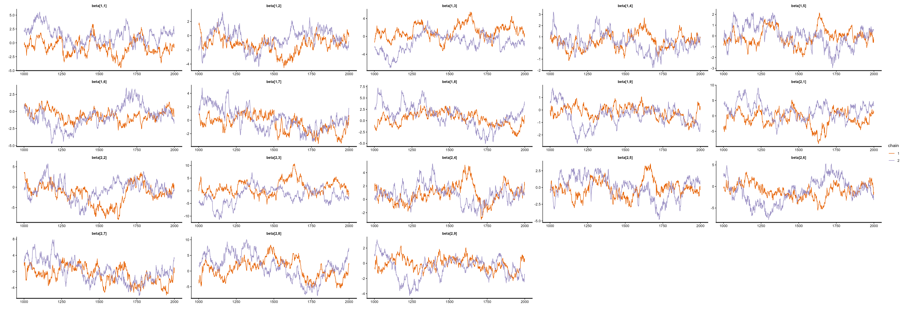
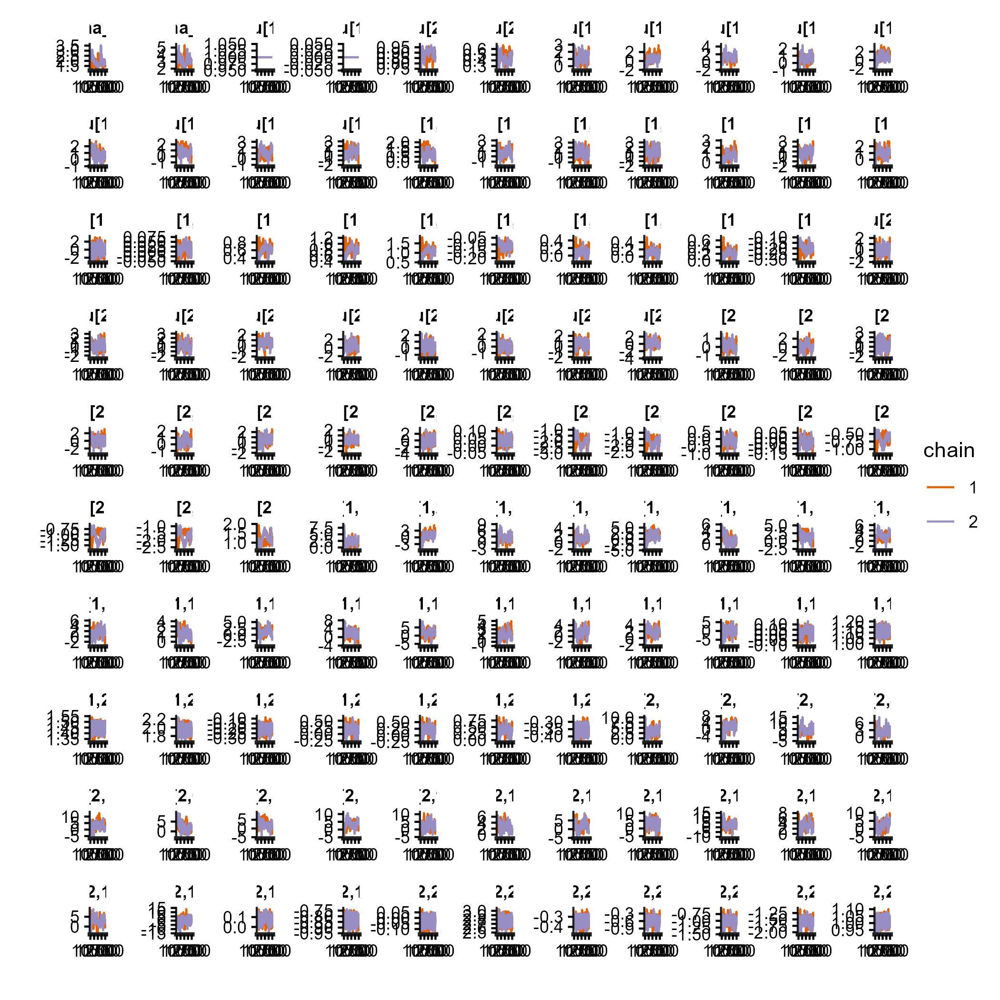
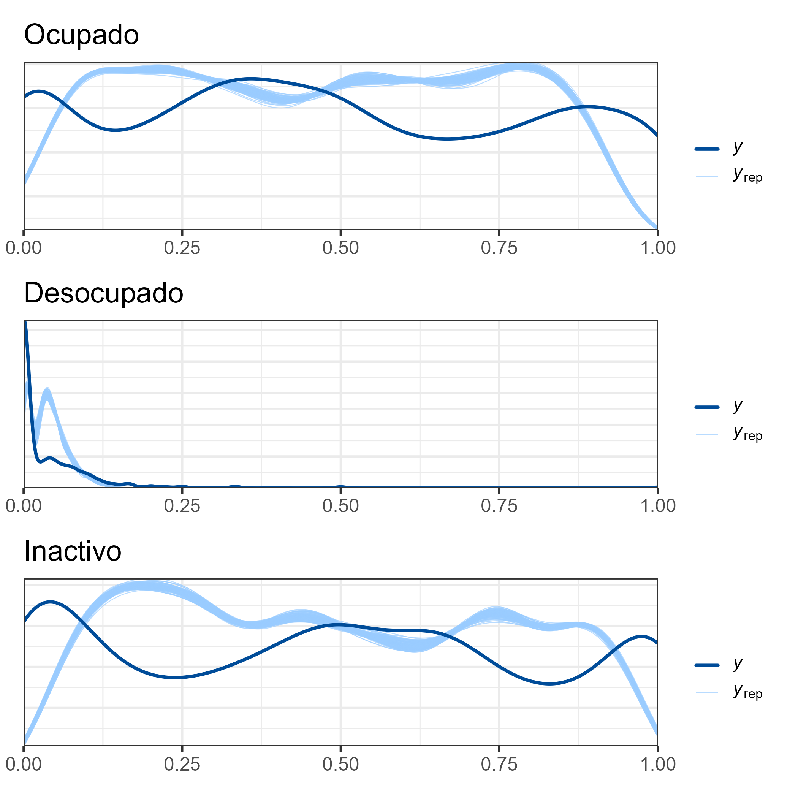

```{r setup, include=FALSE, message=FALSE, error=FALSE, warning=FALSE}
knitr::opts_chunk$set(
  echo = TRUE,
  message = FALSE,
  warning = FALSE,
  cache = FALSE
)

tba <- function(dat, cap = NA){
  kable(dat,
      format = "html", digits =  4,
      caption = cap) %>% 
     kable_styling(bootstrap_options = "striped", full_width = F)%>%
         kable_classic(full_width = F, html_font = "Arial Narrow")
}
library(rstan)
library(knitr)
library(kableExtra)
library(tidyverse)
library(magrittr)
```


## Introducción (I)

* En la inferencia Bayesiana para estimación de áreas pequeñas (SAE), los métodos de Monte Carlo por Cadenas de Markov (MCMC) permiten aproximar distribuciones posteriores complejas.  

* Estos métodos se emplean para modelos con:
  - Estructura jerárquica.  
  - Supuestos de distribución no estándar.  

* La validez de los estimadores depende de la convergencia y eficiencia de las cadenas.


## Indicadores del Mercado del Trabajo

* Punto de partida: caracterizar la dinámica del mercado del trabajo.
* Se emplean tres indicadores fundamentales:

  1. Tasa de Ocupación (TO)
  2. Tasa de Participación (TP)
  3. Tasa de Desempleo (TD)


## 1. Tasa de Ocupación (TO)

$$
TO = \frac{\text{Ocupados}}{\text{Población en Edad de Trabajar}} \times 100
$$

* Numerador: personas ocupadas (empleadas o ausentes temporalmente de un empleo).
* Denominador: población en edad de trabajar (PET, usualmente ≥ 15 años).

Interpretación: mide la capacidad de absorción del empleo en la población disponible.


## 2. Tasa de Participación (TP)

$$
TP = \frac{\text{Fuerza de Trabajo}}{\text{Población en Edad de Trabajar}} \times 100
$$

* Numerador: fuerza de trabajo = ocupados + desocupados.
* Denominador: población en edad de trabajar.


## 3. Tasa de Desempleo (TD)

$$
TD = \frac{\text{Desocupados}}{\text{Fuerza de Trabajo}} \times 100
$$

* Numerador: desocupados (personas sin empleo, disponibles y en búsqueda activa).
* Denominador: fuerza de trabajo.


## Realción entre las tasas

Note que 

$$
  TP = \frac{TO}{1 - TD},
$$

Sea:

* $PET$ = Población en Edad de Trabajar (denominador común).
* $O$ = Ocupados.
* $D$ = Desocupados.
* Fuerza de Trabajo: $F = O + D$.

## Indicadores:

$$
TO = \frac{O}{PET}, \\
$$

$$
TP = \frac{F}{PET} = \frac{O + D}{PET}, \\
$$

$$
TD = \frac{D}{F} = \frac{D}{O + D}.
$$

**Condiciones**: $PET>0,\; F>0$ (por tanto $0 \le TD < 1$).


## Demostración (I)

1. Partir de definiciones:

$$
TP = \frac{O + D}{PET} = \frac{O}{PET} + \frac{D}{PET} = TO + \frac{D}{PET}.
$$

2. Relacione $\dfrac{D}{PET}$ con $TD$ y $TP$:

$$
\frac{D}{PET} = \frac{D}{O + D}\cdot\frac{O + D}{PET} = TD \cdot TP.
$$

## Demostración (II)

3. Sustituya en la expresión de $TP$:

$$
TP = TO + TD\cdot TP \quad\Rightarrow\quad TP - TD\cdot TP = TO
$$

$$
TP(1 - TD) = TO \quad\Rightarrow\quad TP = \frac{TO}{1 - TD}.
$$


## Observaciones (I)

* Es necesario $TD<1$ (caso trivial: si $TD=1$ entonces $O=0$ y la TO = 0; la fórmula tiene sentido por continuidad).

* En SAE: al usar estimadores para $TO$ y $TD$ (con varianza asociada), la relación implica que la varianza estimada de $TP$ debe considerar la covarianza entre estimadores de $TO$ y $TD$.

* Si $\widehat{TP} = \widehat{TO}/(1-\widehat{TD})$, simulación posterior (MCMC) para obtener varianza/intervalos fiables.
  
* Para benchmarking y consistencia entre niveles, la relación algebraica permite reexpresar totales y verificar coherencia entre estimaciones por dominio y agregadas.

## Notación básica 

Supongamos que cada unidad $i$ pertenece a un dominio/postestrato $d$ y que la condición de empleo tiene tres categorías:

* $k = 1$: Desocupado
* $k = 2$: Ocupado
* $k = 3$: Inactivo

Definimos la variable de respuesta categórica a nivel de unidad:

$$
Y_{id} \in {1,2,3}.
$$

En la práctica, los conteos agregados son una combinación (dominio/postestrato), es decir:
$$
\mathbf{y}_d = \big(y_{d1},y_{d2},y_{d3}\big),\quad
n_d = \sum_{k=1}^3 y_{dk},
$$

## El modelo multinomial se define 

$$
\mathbf{y}_d \mid \boldsymbol{\theta}_d \sim \text{Multinomial}\big(n_d, \boldsymbol{\theta}_d\big),
$$
donde
$$
\boldsymbol{\theta}_{d} =
\big(\theta_{d1},\theta_{d2},\theta_{d3}\big), \qquad
\sum_{k=1}^3 \theta_{dk} = 1,\quad \theta_{dk} > 0.
$$


## Estructura multinomial logit con categoría de referencia

Tomamos la categoría $k=1$ (Desocupado) como referencia. Para $k = 2,3$, definimos los predictores lineales:

$$
\eta_{dk} = \mathbf{x}_d^\top \boldsymbol{\beta}_k + \mathbf{z}_d^\top \mathbf{u}_k,
\qquad k = 2,3,
$$

donde:

* $\mathbf{x}_d \in \mathbb{R}^K$ es el vector de covariables fijas,

* $\mathbf{z}_d \in \mathbb{R}^{K_z}$ es el vector de predictores,

* $\boldsymbol{\beta}_k \in \mathbb{R}^K$ es el vector de coeficientes fijos para la categoría $k$,

* $\mathbf{u}_k \in \mathbb{R}^{K_z}$ es el vector de efectos aleatorios para la categoría (k).

## Parametrización de $\boldsymbol{\theta}$

La parametrización multinomial logit con categoría base se escribe:

$$
\theta_{d1} =
\frac{1}{1 + \exp(\eta_{d2}) + \exp(\eta_{d3})},
$$

$$
\theta_{d2} =
\frac{\exp(\eta_{d2})}{1 + \exp(\eta_{d2}) + \exp(\eta_{d3})},
$$

$$
\theta_{d3} =
\frac{\exp(\eta_{d3})}{1 + \exp(\eta_{d2}) + \exp(\eta_{d3})}.
$$


## Estructura jerárquica de efectos aleatorios y priors

Para cada categoría no base $k = 2,3$ y cada componente $j = 1,\dots,K_z$ del vector de efectos aleatorios, asumes:

$$
u_{kj} \sim \mathcal{N}(0, \sigma_k^2),
$$

con varianzas a priori:
$$
\sigma_k^2 \sim \text{Inv-Gamma}(0.0001,, 0.0001), \qquad k=2,3.
$$

Los coeficientes fijos para cada categoría (k) tienen prior normal:

$$
\beta_{kl} \sim \mathcal{N}\big(0,, 100^2\big), \qquad l = 1,\dots,K.
$$

## El modelo estructura completa

En conjunto, el modelo completo para los conteos $\mathbf{y}_d$ es:

$$
\mathbf{y}_d \mid \boldsymbol{\theta}_d \sim \text{Multinomial}\big(n_d,\boldsymbol{\theta}_d\big),
$$

$$
\log\frac{\theta_{dk}}{\theta_{d1}} = \mathbf{x}_d^\top \boldsymbol{\beta}_k + \mathbf{z}_d^\top \mathbf{u}_k,
\qquad k=2,3,
$$

$$
u_{kj} \sim \mathcal{N}(0,\sigma_k^2),\quad
\sigma_k^2 \sim \text{Inv-Gamma}(0.0001,0.0001),\quad
\beta_{kl} \sim \mathcal{N}(0,100^2).
$$


## Predicción en el censo y tasas derivadas (TD, TO, TP)

Para cada unidad/postestrato del censo $j=1,\dots,D_1$ con covariables $\mathbf{x}_j^{(p)}$ y $\mathbf{z}_j^{(p)}$, defines los predictores lineales:

$$
\eta_{jk}^{(p)} = \big(\mathbf{x}_j^{(p)}\big)^\top \boldsymbol{\beta}_k + \big(\mathbf{z}_j^{(p)}\big)^\top \mathbf{u}_k,
  \qquad k=2,3,
$$

y las probabilidades predichas:

$$
\theta_{j1}^{(p)} =
\frac{1}{1 + \exp\big(\eta_{j2}^{(p)}\big) + \exp\big(\eta_{j3}^{(p)}\big)}, \qquad 
\theta_{j2}^{(p)} =
\frac{\exp\big(\eta_{j2}^{(p)}\big)}{1 + \exp\big(\eta_{j2}^{(p)}\big) + \exp\big(\eta_{j3}^{(p)}\big)},
$$

$$
\theta_{j3}^{(p)} =
\frac{\exp\big(\eta_{j3}^{(p)}\big)}{1 + \exp\big(\eta_{j2}^{(p)}\big) + \exp\big(\eta_{j3}^{(p)}\big)}.
$$

Denotando:
$$
\theta_{j1}^{(p)} = \Pr(\text{Desocupado}),\quad
\theta_{j2}^{(p)} = \Pr(\text{Ocupado}),\quad
\theta_{j3}^{(p)} = \Pr(\text{Inactivo}),
$$

## Predicción en el censo y tasas derivadas (TD, TO, TP)

Ahora, puedes definir las tasas usuales de mercado laboral como:

* **Tasa de desocupación (TD)**:

$$
\text{TD}_j =   \frac{\theta_{j1}^{(p)}}{\theta_{j1}^{(p)} + \theta_{j2}^{(p)}}.
$$

* **Tasa de ocupación (TO)**:

$$
\text{TO}_j = \theta_{j2}^{(p)}.
$$

* **Tasa de participación (TP)**:

$$
\text{TP}_j = \frac{\text{TO}_j}{1 - \text{TD}_j},
$$


## Modelo en Stan  multinomia (pred_theta)

::: {.callout-important}
### Función pred_theta
```{r, eval=FALSE}
functions {
  matrix pred_theta(matrix Xp, matrix Zp, int p, matrix beta, matrix u){
  int D1 = rows(Xp);
  real num1[D1, p];
  real den1[D1];
  matrix[D1,p] theta_p;
  matrix[D1,p] tasa_pred;
  
  for(d in 1:D1){
    num1[d, 1] = 1;
    num1[d, 2] = exp(Xp[d, ] * beta[1, ]' + Zp[d, ] * u[1, ]') ;
    num1[d, 3] = exp(Xp[d, ] * beta[2, ]' + Zp[d, ] * u[2, ]') ;
    
    den1[d] = sum(num1[d, ]);
  }
  
  for(d in 1:D1){
    for(i in 2:p){
    theta_p[d, i] = num1[d, i]/den1[d];
    }
    theta_p[d, 1] = 1/den1[d];
   }


for(d in 1:D1){
    tasa_pred[d, 1] = theta_p[d,1]/(theta_p[d,1] + theta_p[d,2]);// TD
    tasa_pred[d, 2] = theta_p[d,2];                              // TO
    tasa_pred[d, 3] = tasa_pred[d, 2]/(1- tasa_pred[d, 1]);               // TP
    }

  return tasa_pred  ;
  }
  
}
```
:::

## Modelo en Stan  multinomia (data)

::: {.callout-important}
### data

```{r, eval=FALSE}
data {
  int<lower=1> D;    // número de postestrto 
  int<lower=1> D1;   // número de dominios por predesir 
  int<lower=1> P;    // categorías
  int<lower=1> K;  // cantidad de regresores
  int<lower=1> Kz; // cantidad de regresores en Z
  int y[D, P];       // matriz de datos
  matrix[D, K] X; // matriz de covariables
  matrix[D, Kz] Z; // matriz de covariables
  matrix[D1, K] Xp; // matriz de covariables
  matrix[D1, Kz] Zp; // matriz de covariables
}
  
```
:::

## Modelo en Stan  multinomia (parameters)

::: {.callout-important}
### parameters

```{r, eval=FALSE}
parameters {
  matrix[P-1, K] beta;// matriz de parámetros 
  vector<lower=0>[P-1] sigma_u;       // random effects standard deviations
  // declare L_u to be the Choleski factor of a 2x2 correlation matrix
  cholesky_factor_corr[P-1] L_u;
  matrix[P-1, Kz] z_u;                  
}
```
:::

## Modelo en Stan  multinomia (transformed parameters)

::: {.callout-important}
### transformed parameters

```{r, eval=FALSE}
transformed parameters {
  simplex[P] theta[D];// vector de parámetros;
  real num[D, P];
  real den[D];
  // this transform random effects so that they have the correlation
  // matrix specified by the correlation matrix above
  matrix[P-1, Kz] u; // random effect matrix
  u = diag_pre_multiply(sigma_u, L_u) * z_u;
  
  for(d in 1:D){
    num[d, 1] = 1;
    num[d, 2] = exp(X[d, ] * beta[1, ]' + Z[d, ] * u[1, ]') ;
    num[d, 3] = exp(X[d, ] * beta[2, ]' + Z[d, ] * u[2, ]') ;
    
    den[d] = sum(num[d, ]);

  }
  for(d in 1:D){
    for(p in 2:P){
    theta[d, p] = num[d, p]/den[d];
    }
    theta[d, 1] = 1/den[d];
  }
}
```

:::

## Modelo en Stan  multinomia (model)

::: {.callout-important}
### model

```{r, eval=FALSE}
model {
  L_u ~ lkj_corr_cholesky(1); // LKJ prior for the correlation matrix
  to_vector(z_u) ~ normal(0, 1);
  sigma_u ~ inv_gamma(0.0001, 0.0001);
  to_vector(beta) ~ normal(0, 100);
 
  for(d in 1:D){
    target += multinomial_lpmf(y[d, ] | theta[d, ]); 
  }
}
```
:::

## Modelo en Stan  multinomia (generated quantities)

::: {.callout-important}
### generated quantities

```{r, eval=FALSE}
generated quantities {
  // predict 
  matrix[D1,P] tasa_pred;// vector de parámetros;
  matrix[2, 2] Omega;
  Omega = L_u * L_u'; // so that it return the correlation matrix
// predicción 

tasa_pred = pred_theta(Xp,Zp,P, beta, u) ; 

}

```
:::


## Lectura bases de datos (Censo).   

::: {.callout-tip}
### Código de R
```{r, eval=FALSE, echo=TRUE}
censo_mrp <- readRDS("../Recurso/Modelo_unidad/censo_dam.rds")
tba(censo_mrp %>% head(5))

```
:::

```{r, eval=TRUE, echo=FALSE}
censo_mrp <- readRDS("../Recurso/Modelo_unidad/censo_dam.rds")
tba(censo_mrp %>% head(8))

```

## Lectura bases de datos (Encuesta).   

::: {.callout-tip}
### Código de R
```{r, eval=FALSE, echo=TRUE}
encuesta_sta_MT <- readRDS('../Recurso/Modelo_unidad/encuesta_sta_MT.rds')
encuesta_sta_MT <- encuesta_sta_MT %>% 
  filter(edad>1, anoest %in% c("1","2","3","4"))

tba(encuesta_sta_MT %>% head(8))

```
:::

```{r, eval=TRUE, echo=FALSE}
encuesta_sta_MT <- readRDS('../Recurso/Modelo_unidad/encuesta_sta_MT.rds')
encuesta_sta_MT <- encuesta_sta_MT %>% 
  filter(edad>1, anoest %in% c("1","2","3","4"))

tba(encuesta_sta_MT %>% head(8))
```


## Lectura de datos (Covariables)

::: {.callout-tip}
### Código de R
```{r, eval=FALSE, echo=TRUE}
statelevel_predictors <- 
  readRDS("../Recurso/Modelo_unidad/statelevel_predictors_df.rds") %>% 
  mutate_if(is.numeric, ~{as.numeric(scale(.x))})
tba(statelevel_predictors %>% head(8))

```
:::


```{r, echo=FALSE}
statelevel_predictors <- readRDS("../Recurso/Modelo_unidad/statelevel_predictors_df.rds") %>% 
  mutate_if(is.numeric, ~{as.numeric(scale(.x))})
tba(statelevel_predictors %>% head(5))
```

## Compilar modelo de `Stan` en `R`

::: {.callout-tip}
### Código de R
```{r, eval=FALSE}
source("../Recurso/Modelo_unidad/funciones/modelo_empleo.R")
library(magrittr)
library(fastDummies)
encuesta_sta_MT %<>% dummy_cols(select_columns = "empleo")
multi_fit <- modelo_empleo(
  encuesta_sta = encuesta_sta_MT,
  censo_sta = censo_mrp,
  predictors = statelevel_predictors,
  X_fijo = "luces_nocturnas + cubrimiento_rural + cubrimiento_urbano + modificacion_humana + material_paredes + material_techo + rezago_escolar + alfabeta +tasa_desocupacion",
  Z_aleatorio = "dam + etnia + edad + area + anoest + sexo",
  fit_STAN = "../Recurso/Modelo_unidad/Multinivel_multinomial_no_cor.stan",
  path_model = "../Recurso/Modelo_unidad/Multinivel_multinomial_model_no_cor.rds"
)
```
:::


## Compilar modelo de `Stan` en `R`

::: {.callout-tip}
### Código de R

```{r, eval=FALSE}
source("../Recurso/Modelo_unidad/funciones/validar_modelo_bayes.R")
source("../Recurso/Modelo_unidad/funciones/Plot_dens_draws.R")

encuesta_sta_MT %<>% fastDummies::dummy_cols(select_columns = "empleo")
multi_fit <- readRDS("../Recurso/Modelo_unidad/Multinivel_multinomial_model_no_cor.rds")

resul_validar_modelo <-
  validar_modelo_bayes(model_bayes = multi_fit$model_bayes, 
                       encuesta_sta = encuesta_sta_MT)

saveRDS(resul_validar_modelo, file = "../Recurso/Modelo_unidad/resul_validar_modelo_no_cor2.rds")
```
:::

## Resultados del modelo, r-hat

::: {.callout-tip}
### Código de R
```{r, echo=FALSE, eval=FALSE}
resul_validar_modelo <- readRDS("../Recurso/Modelo_unidad/resul_validar_modelo_no_cor.rds")
saveRDS(resul_validar_modelo$tbla_rhat, file = "../Recurso/Modelo_unidad/tbla_rhat.rds")
```
:::

```{r, echo=FALSE}

tbla_rhat <- readRDS("../Recurso/Modelo_unidad/tbla_rhat.rds")
tbla_rhat %>% tba()
```

## Resultados del modelo, efectos fijos. 

```{r, echo=FALSE, eval=FALSE}
ggsave(plot = resul_validar_modelo$plot_E_fijo, filename = "img/plot_E_fijo.png", scale = 3)
```


```{r echo=FALSE, out.width = "900px", out.height="600px",fig.align='center'}

```


## Resultados del modelo, efectos aleatorios 

```{r, echo=FALSE, eval=FALSE}
ggsave(plot = resul_validar_modelo$plot_E_Aleatorio, filename = "img/plot_E_Aleatorio.png", scale = 3)
```


```{r echo=FALSE, out.width = "1000px", out.height="800px",fig.align='center'}

```


## Resultados del modelo, PPC  

```{r, echo=FALSE, eval=FALSE}
ggsave(plot = resul_validar_modelo$plot_ppc, filename = "img/plot_ppc_empelo.png", scale = 3)
```


```{r echo=FALSE, out.width = "1000px", out.height="800px",fig.align='center'}

```

## Estimación del Tasa de ocupación, desocupación e participación


::: {.callout-tip}
### Código de R 

```{r}
# censo_pred <- multi_fit$censo_pred
censo_pred <- readRDS("../Recurso/Modelo_unidad/censo_pred.rds")

tab_nac <- censo_pred %>% summarise(
  TD = weighted.mean(TD, n),
  TO = weighted.mean(TO, n),
  TP = weighted.mean(TP, n)
)
```
:::

```{r, echo=FALSE}
tba(tab_nac)
```

## Estimación del pobreza por sexo 

::: {.callout-tip}
### Código de R 

```{r}
tab_sexo_nac <- censo_pred %>% group_by(sexo) %>%
  summarise(
  TD = weighted.mean(TD, n),
  TO = weighted.mean(TO, n),
  TP = weighted.mean(TP, n)
)
```
:::


```{r, echo=FALSE}
tba(tab_sexo_nac)
```

## Estimación del pobreza por dam 

::: {.callout-tip}
### Código de R 

```{r}
tab_dam <- censo_pred %>% group_by(dam) %>% summarise(
  TD = weighted.mean(TD, n),
  TO = weighted.mean(TO, n),
  TP = weighted.mean(TP, n)
)
```
:::


```{r, echo=FALSE}
tba(tab_dam %>% head(8)) 
```


# ¡Gracias! 