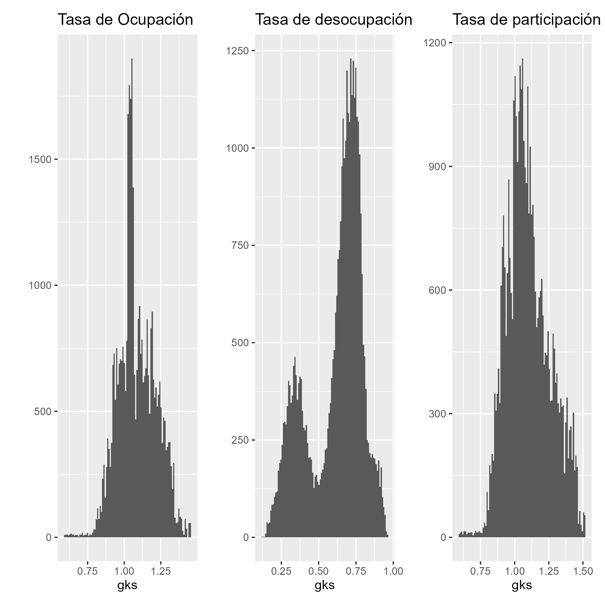
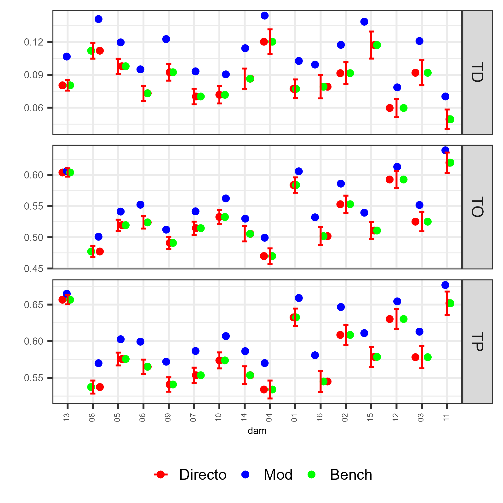
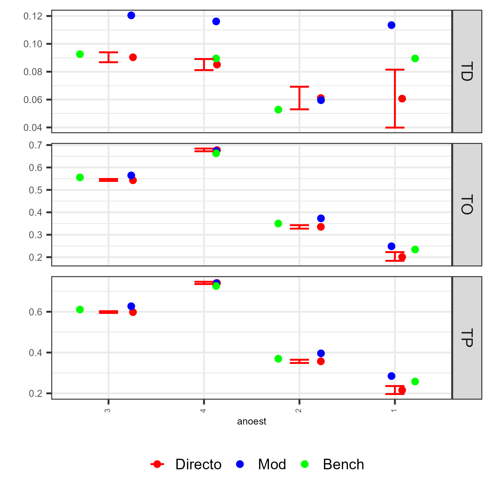
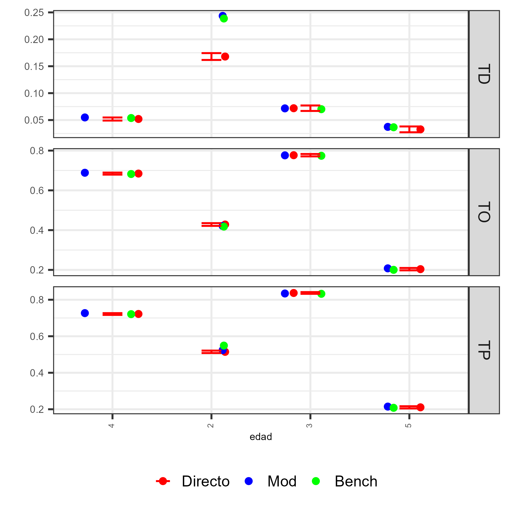

```{r setup, include=FALSE, message=FALSE, error=FALSE, warning=FALSE}
knitr::opts_chunk$set(
  echo = TRUE,
  message = FALSE,
  warning = FALSE,
  cache = TRUE
)

tba <- function(dat, cap = NA){
  kable(dat,
      format = "html", digits =  4,
      caption = cap) %>% 
     kable_styling(bootstrap_options = "striped", full_width = F)%>%
         kable_classic(full_width = F, html_font = "Arial Narrow")
}
library(rstan)
library(knitr)
library(kableExtra)
library(tidyverse)
library(magrittr)
library(srvyr)
library(sampling)
```


## Introducción

* El proceso de benchmarking de cadenas MCMC es crucial en SAE, porque:

  - Garantiza que las estimaciones desagregadas (ej. tasas de ocupación, participación o desempleo por área pequeña) sean coherentes con los niveles de agregación donde la encuesta es representativa, por ejemplo, divisiones administrativas mayores o nivel nacional.  

  - Debe tenerse presente que el benchmarking es un procedimiento de ajuste estético: no mejora la calidad intrínseca del estimador, pero sí asegura consistencia y comparabilidad.  


- La calidad de las cadenas impacta directamente la precisión y coherencia de los estimadores por dominio.


## Indicadores del Mercado Laboral

* Punto de partida: caracterizar la dinámica del mercado dek trabajo
* Se emplean tres indicadores fundamentales:

  1. Tasa de Ocupación (TO)
  2. Tasa de Participación (TP)
  3. Tasa de Desempleo (TD)


## Generalización del Benchmarking Multinomial para una Iteración $l$ del MCMC

En los modelos Bayesianos estimados mediante MCMC, el modelo produce, en cada iteración $l = 1,\dots,L$:

$$
\theta_{l} = \left\{ \left(p_{O,k}^{(l)},; p_{D,k}^{(l)},; p_{I,k}^{(l)}\right)   \right\}_{k=1}^{k}
$$

donde:

* $k$ indexa los post-estratos
* $l$ indexa la iteración MCMC
* $p_{\cdot,k}^{(l)}$ son las probabilidades predichas en esa iteración

El objetivo del benchmarking por iteración es obtener, **para cada iteración**, un conjunto ajustado:

$$
p_{O,k}^{(l,bench)},\quad p_{D,k}^{(l,bench)},\quad p_{I,k}^{(l,bench)}
$$

tal que cumplan *simultáneamente*:


## Coherencia multinomial por iteración

Para todo post-estrato $k$:

$$
p_{O,k}^{(l,bench)} + p_{D,k}^{(l,bench)} + p_{I,k}^{(l,bench)} = 1.
$$


## Coherencia con las restricciones por dominio (DAM)

Para cada dominio $d$, se deben cumplir:

### **Ocupación (TO):**

$$
\sum_{k\in d} n_k  p_{O,k}^{(l,bench)} = T_{O,d}^{DIR}
$$

### **Desocupación (TD):**

$$
\sum_{k\in d} n_k p_{D,k}^{(l,bench)} = T_{D,d}^{DIR}
$$

### **Participación (TP) coherente**

$$
p_{I,k}^{(l,bench)} = 1 - p_{O,k}^{(l,bench)} - p_{D,k}^{(l,bench)}
$$


## Estructura del algoritmo por iteración $l$

Para cada iteración del MCMC, se realiza:

### **Paso 1: Extraer predicciones**

$$
\theta_{l} =
\big(p_{O,k}^{(l)}, p_{D,k}^{(l)}, p_{I,k}^{(l)}\big)
$$

### **Paso 2: Construcción de las matrices de calibración**

Para TO:

$$
X^{(l)}_{O,den} = \mathbf{1}_d,\qquad
X^{(l)}_{O,num} = \mathbf{1}_d \cdot p_{O,k}^{(l)}
$$

Para TD:

$$
X^{(l)}_{D,den} = \mathbf{1}_d \cdot (p_{O,k}^{(l)} + p_{D,k}^{(l)})
$$

$$
X^{(l)}_{D,num} = \mathbf{1}_d \cdot p_{D,k}^{(l)}
$$

### **Paso 3: Resolver calibración tipo Deville–Särndal**

$$
g_k^{(l)} =
\texttt{calib}\big(X^{(l)},, n_k,, T^{DIR}\big)
$$

### **Paso 4: Ajustar probabilidades predichas**

$$
p_{O,k}^{(l,bench)} = g_k^{(l)} p_{O,k}^{(l)}
$$

$$
p_{D,k}^{(l,bench)} = g_k^{(l)} p_{D,k}^{(l)}
$$

$$
p_{I,k}^{(l,bench)} = 1 - p_{O,k}^{(l,bench)} - p_{D,k}^{(l,bench)}
$$

### **Paso 5: Calcular tasas**

$$
TO_k^{(l,bench)} = p_{O,k}^{(l,bench)}
$$

$$
TD_k^{(l,bench)}
= \frac{p_{D,k}^{(l,bench)}}{p_{O,k}^{(l,bench)} + p_{D,k}^{(l,bench)}}
$$

$$
TP_k^{(l,bench)}
= \frac{p_{O,k}^{(l,bench)} + p_{D,k}^{(l,bench)}}{1}
$$


## **4. Generalización del algoritmo para todas las iteraciones**

Para $l = 1,\ldots,L$:

$$
\big\{ p_{O,k}^{(l,bench)},p_{D,k}^{(l,bench)},p_{I,k}^{(l,bench)} \big\}_{k=1}^{K}
\texttt{Benchmark}(\theta_l, T^{DIR})
$$

Los resultados se almacenan para luego obtener:

* Media posterior ajustada
* Intervalos creíbles ajustados
* CVs ajustados


## Preocesando en `R`

::: {.callout-tip}
### Código de `R`
```{r, eval=FALSE}
source("../Recurso/Modelo_unidad/funciones/benchmarking_empleo.R")
censo_pred <- readRDS("../Recurso/Modelo_unidad/censo_pred_dam2.rds") %>% 
filter(edad>1, anoest %in% c("1","2","3","4")) 
encuesta_sta_MT <- readRDS('../Recurso/Modelo_unidad/encuesta_sta_MT_dam2.rds')

encuesta_sta_MT <- encuesta_sta_MT %>% 
  filter(edad>1, anoest %in% c("1","2","3","4"))

encuesta_sta_MT %<>% dummy_cols(select_columns = "empleo")

list_bench <-
  benchmarking_empleo(
    encuesta_sta = encuesta_sta_MT,
    poststrat_df = censo_pred,
    names_cov =  "dam",
    metodo = "logit")


saveRDS(list_bench, file = "../Recurso/Modelo_unidad/list_bench_empleo_dam2.rds")

```
:::

## Validacion del Benchmarking 


```{r, echo=FALSE, eval=FALSE}
list_bench <-  readRDS("../Recurso/Modelo_unidad/list_bench_empleo_dam2.rds")
ggsave(plot = list_bench$plot_bench, 
       filename = "img/plot_bench_empleo.png", scale = 3)
```


```{r echo=FALSE, out.width = "1000px", out.height="800px",fig.align='center'}

```

## Plot de validación de estimaciones (I)

::: {.callout-tip}
### Código de `R`
```{r, eval=FALSE}
source("../Recurso/Modelo_unidad/funciones/Funciones_empleo.R")
subgrupo <- c("dam","sexo", "area", "etnia", "edad", "anoest")

poststrat_df <- censo_pred %>% data.frame() %>%  
  mutate (gk_TO =list_bench$gk_bench$TO,
          gk_TP = list_bench$gk_bench$TP,
          gk_TD = list_bench$gk_bench$TD)

plot_subgrupo <- map(.x = setNames(subgrupo, subgrupo),
  ~ plot_compare_Ind(sample = encuesta_sta_MT, 
                      poststrat = poststrat_df, by1 = .x
))

saveRDS(plot_subgrupo, "../Recurso/Modelo_unidad/00_plot_subgrupo.rds")
```
:::

## Plot de validación de estimaciones (II)

::: {.callout-tip}
### Código de `R`
```{r, eval=FALSE}
temp_dir_plot_uni <- map(
  names(plot_subgrupo),
  ~ ggsave(
    plot = plot_subgrupo[[.x]]$Plot,
    filename =    paste0("img/empleo_plot_uni_",  .x, ".png"),
    scale = 2
  )
)

```
:::

## Plot de validación por dam

```{r echo=FALSE, out.width = "1000px", out.height="800px",fig.align='center'}

```


## Plot de validación por años de estudio

```{r echo=FALSE, out.width = "1000px", out.height="800px",fig.align='center'}

```


## Plot de validación por edad

```{r echo=FALSE, out.width = "1000px", out.height="800px",fig.align='center'}

```


## Benchmarking para todas las iteraciones 

::: {.callout-tip}
### Código de `R`
```{r, eval=FALSE}
multi_fit <- 
  readRDS("../Recurso/Modelo_unidad/Multinivel_multinomial_model_no_cor_dam2.rds")
censo_pred <- 
  readRDS("../Recurso/Modelo_unidad/censo_pred_dam2.rds") 

model <- list(model_bayes = multi_fit, censo_pred = censo_pred)

list_bench$metodo_bench <- list(TD = "linear", TP = "linear", TO = "linear")

result_iter_calib <- benchmarking_empleo_all(
  multi_fit = model,
  list_bench = list_bench,
  pars = "tasa_pred",
  n_iter = 500
)

saveRDS(result_iter_calib, "../Recurso/Modelo_unidad/result_iter_calib.rds")  
```
:::


# Estimaciones 

## Estimación nacional usando las cadenas 

::: {.callout-tip}
### Código de `R`
```{r, eval=FALSE}
source("../Recurso/Modelo_unidad/funciones/Funciones_empleo.R")
result_iter_calib <- readRDS("../Recurso/Modelo_unidad/result_iter_calib.rds") 
tab_nac <- map_df(
  result_iter_calib,
  ~ Indicadores_censo(.x) %>%
    mutate(value = value * 100) %>%
    pivot_wider(names_from = Metodo ,
                values_from = value)
)
saveRDS(tab_nac, "../Recurso/Modelo_unidad/01_tab_nac.rds")

```
:::

```{r, eval=TRUE, echo=FALSE}
tab_nac <- readRDS("../Recurso/Modelo_unidad/01_tab_nac.rds")
tab_nac %>% group_by(variable) %>%
  summarise(
    estimado_con = mean(Bench),
    estimado_con_se = sd(Bench)) %>% tba()

```

## Estimación dam usando las cadenas 

::: {.callout-tip}
### Código de `R`

```{r, eval=FALSE}
tab_dam <-  map_df(
  result_iter_calib,
  ~ Indicadores_censo(.x, var_by = "dam") %>%
    mutate(value = value * 100) %>%
    pivot_wider(names_from = Metodo ,
                values_from = value)
) %>% group_by(variable, dam)  %>% 
  summarise(
    Bench.  = mean(Bench),
    Bench_se = sd(Bench))

saveRDS(tab_dam, "../Recurso/Modelo_unidad/002_tab_dam.rds")
```
:::

```{r, eval=TRUE, echo=FALSE}
tab_dam <- readRDS("../Recurso/Modelo_unidad/002_tab_dam.rds")

tba(tab_dam %>% head(5))

```

## Plot del Directo con IC vs. Modelo vs. Benchmarking

```{r, echo=FALSE}
source("../Recurso/Modelo_unidad/funciones/Funciones_empleo.R")
encuesta_sta_MT <- readRDS('../Recurso/Modelo_unidad/encuesta_sta_MT_dam2.rds')

encuesta_sta_MT <- encuesta_sta_MT %>% 
  filter(edad>1, anoest %in% c("1","2","3","4"))

plot_subgrupo <- readRDS("../Recurso/Modelo_unidad/00_plot_subgrupo.rds")

poststrat_dam_mod <- plot_subgrupo$dam$tabla %>% filter(Metodo == "Mod") %>% 
  select(-c(x, n_sample, Fuente))
  
poststrat_dam_bench <- tab_dam %>% 
  transmute(variable, dam, Metodo = "Bench", value = Bench./100) 

dat_encuesta <- Indicadores_encuesta(setdata = encuesta_sta_MT, var_by = "dam") %>% select(-c( n_sample))

# Unir todo
plot_data <- bind_rows(
  poststrat_dam_mod %>% mutate(Li = NA, Ls = NA),
  poststrat_dam_bench %>% mutate(Li = NA, Ls = NA),
  dat_encuesta 
)


ggplot(plot_data,
       aes(x = dam, y = value, color = Metodo, shape = Metodo)) +
  
  # IC SOLO para Directo
  geom_errorbar(
    data = plot_data %>% filter(Metodo == "Directo"),
    aes(ymin = Li, ymax = Ls),
    width = 0.15,
    linewidth = 0.7,
    alpha = 0.7
  ) +
  
  # Puntos con jitter leve
  geom_jitter(
    position = position_jitter(width = 0.05, height = 0),
    size = 2.2,
    alpha = 0.9
  ) +
  
  # Facet por variable
  facet_grid( variable~., scales = "free_y") +
  
  scale_color_manual(values = c(
    "Directo"   = "black",
    "Mod"    = "#1f78b4",
    "Bench" = "#33a02c"
  )) +
  scale_shape_manual(values = c(
    "Directo"   = 16,
    "Mod"    = 17,
    "Bench" = 18
  )) +
  
  theme_minimal(base_size = 14) +
  labs(
    title = "Comparación de Métodos por DAM",
    subtitle = "Directo con IC vs. Modelo vs. Benchmarking",
    x = "DAM",
    y = "Tasa estimada",
    color = "Método",
    shape = "Método"
  ) +
  theme(
    legend.position = "bottom",
    panel.grid.minor = element_blank(),
    strip.text = element_text(size = 14, face = "bold")
  )


```


# ¡Gracias! 