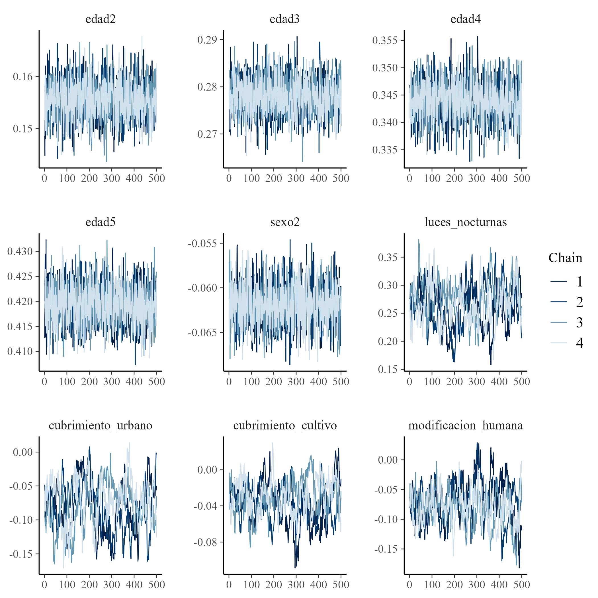

```{r setup, include=FALSE, message=FALSE, error=FALSE, warning=FALSE}
knitr::opts_chunk$set(
  echo = TRUE,
  message = FALSE,
  warning = FALSE,
  cache = FALSE
)

tba <- function(dat, cap = NA){
  kable(dat,
      format = "html", digits =  4,
      caption = cap) %>% 
     kable_styling(bootstrap_options = "striped", full_width = F)%>%
         kable_classic(full_width = F, html_font = "Arial Narrow")
}
library(rstan)
library(knitr)
library(kableExtra)
library(tidyverse)
library(magrittr)
```


## Introducción (I)

* En la inferencia Bayesiana para estimación de áreas pequeñas (SAE), los métodos de Monte Carlo por Cadenas de Markov (MCMC) permiten aproximar distribuciones posteriores complejas.  

* Estos métodos se emplean para modelos con:
  - Estructura jerárquica.  
  - Supuestos de distribución no estándar.  

* La validez de los estimadores depende de la convergencia y eficiencia de las cadenas.


# Modelo de unidad

## Modelo de unidad para la estimación del ingreso medio

Uno de los primeros problemas a los que debemos enfrentarnos es la estimación del *ingreso medio*, la cual en una variable no simétrica que toma valores en los positivos. Sin embargo, empleando los métodos Bayesiano es posible obtener estimaciones de esta sin realizar una transformación 


## Obejtivo

- Estimar el **ingreso medio** de las personas en cada dominio $d$:

$$
\bar{Y}_d = \frac{\sum_{U_d}y_{di}}{N_d}
$$
- Donde $y_{di}$ es el ingreso de cada persona $i$ en el dominio $d$ y $U_d$ es la población del dominio.

## Descomposición muestral

- Separando la población en la **muestra** $s_d$ y el **complemento fuera de muestra** $s_d^c$:


$$
\begin{equation*}
\bar{Y}_d =  \frac{\sum_{s_d}y_{di} + \sum_{s^c_d}y_{di}}{N_d} 
\end{equation*}
$$

- Esto muestra que el ingreso medio del dominio depende tanto de los datos observados como de los no observados.

## Estimador bajo modelo de unidad (I)

- Sustituimos los valores fuera de muestra por predicciones del modelo:

$$
\hat{\bar{Y}}_d = \frac{\sum_{s_d}y_{di} + \sum_{s^c_d}\hat{y}_{di}}{N_d}
$$

- Donde

$$
\hat{y}_{di} = E_{\mathscr{M}}\left(y_{di} \mid \mathbf{x}_d, \boldsymbol{\beta}\right)
$$

y $\mathscr{M}$ es la medida de probabilidad inducida por el modelamiento.

## Estimador bajo modelo de unidad (II)

- De esta forma:

$$
\hat{\bar{Y}}_d = \frac{\sum_{i \in U_d} \hat{y}_{di}}{N_d}
$$

- Es decir, el estimador combina la información muestral con las predicciones del modelo para toda la población.

## Modelo Bayesiano (I)

- Para predecir el ingreso medio en personas no observadas, se asume el siguiente modelo jerárquico:

$$
\begin{eqnarray*}
Y_{di} &\sim & N\left(\mu_{di},\sigma_e^{2}\right)\\
\mu_{di}&=&\boldsymbol{x}_{di}^{T}\boldsymbol{\beta}+u_{d}+e_{di} 
\end{eqnarray*}
$$

- Donde:  
  - $Y_{di}$ = ingreso de la $i$-ésima persona en el dominio $d$  
  - $\mathbf{x}_{di}$ = covariables observadas  
  - $\boldsymbol{\beta}$ = vector de coeficientes fijos  
  - $u_d$ = efecto aleatorio del dominio $d$  
  - $e_{di}$ = error individual


## Modelo Bayesiano (II)

- Supuestos de los componentes aleatorios:

$$
u_d \sim N(0, \sigma_u^2), \quad
e_{di} \sim N(0, \sigma_e^2)
$$

- Los efectos aleatorios permiten capturar la **heterogeneidad entre dominios** y la variabilidad individual dentro de cada dominio.  

- Esto convierte el modelo en un **modelo lineal jerárquico normal** aplicado a unidades.

## Modelo Bayesiano (III)

- Priors **no informativos** usados para la inferencia Bayesiana:

$$
\beta_k \sim N(0, 1000), \quad
\sigma_e^2 \sim IG(0.0001, 0.0001)
$$

- El proceso de predicción del ingreso medio en dominios no observados se realiza mediante **MCMC**, combinando la información muestral y la estructura del modelo jerárquico.  
- Esta aproximación permite:  
  - Propagar la incertidumbre de los parámetros.  
  - Obtener predicciones consistentes a nivel de unidad y dominio.


## Proceso de estimación en `R` (I)

::: {.callout-tip}
### Librerías principales utilizadas:
```{r}
# Interprete de STAN en R
library(rstan)
library(rstanarm)
# Manejo de bases de datos.
library(tidyverse)
# Gráficas de los modelos. 
library(bayesplot)
library(patchwork)
# Organizar la presentación de las tablas
library(kableExtra)
library(printr)
```
:::

## Proceso de estimación en `R` (II) {.scroll-container}

- Funciones desarrolladas para simplificar la metodología (archivo `funciones_mrp.R`):

1. **plot_interaction**:  
   - Crea diagramas de líneas para estudiar la interacción entre variables.
   - Útil para detectar solapamientos y decidir si incluir interacción en el modelo.

2. **Plot_Compare**:  
   - Valida la homologación entre censo y encuesta.
   - Compara proporciones de variables homogéneas entre ambos conjuntos de datos.

3. **Aux_Agregado**:  
   - Genera estimaciones a diferentes niveles de agregación.
   - Especialmente útil en procesos repetitivos o cuando se requiere análisis por dominios.

**Las funciones están diseñada específicamente  para este  proceso**


## Encuesta de hogares

Los datos empleados en esta ocasión corresponden a la ultima encuesta de hogares, la cual ha sido estandarizada por *CEPAL* y se encuentra disponible en *BADEHOG*


```{r, echo = FALSE, eval=FALSE}
encuesta <- readRDS("data/encuesta2017CHL.Rds")

encuesta_mrp <- encuesta %>% 
  transmute(
    dam =  haven::as_factor(dam_ee ,levels = "values"),
    dam2 =  haven::as_factor(comuna,levels = "values"),
    dam = str_pad(dam, width = 2, pad = "0"),
    dam2 = str_pad(dam2, width = 5, pad = "0"), 
    upm = `_upm`,
    estrato = `_estrato`,
  ingreso = ingcorte,lp,li,
    logingreso = log(ingcorte + 1),
  area = case_when(area_ee == 1 ~ "1", TRUE ~ "0"),
  sexo = as.character(sexo),

  anoest = case_when(
    edad < 6 | is.na(anoest)   ~ "98"  , #No aplica
    anoest == 99 ~ "99", #NS/NR
    anoest == 0  ~ "1", # Sin educacion
    anoest %in% c(1:6) ~ "2",       # 1 - 6
    anoest %in% c(7:12) ~ "3",      # 7 - 12
    anoest > 12 ~ "4",      # mas de 12
    TRUE ~ "Error"  ),

  edad = case_when(
    edad < 15 ~ "1",
    edad < 30 ~ "2",
    edad < 45 ~ "3",
    edad < 65 ~ "4",
    TRUE ~ "5"),

  etnia = case_when(
    etnia_ee == 1 ~ "1", # Indigena
    etnia_ee == 2 ~ "2",
     TRUE ~ "3"), # Otro
 fep = `_feh`
) 

saveRDS(encuesta_mrp, "data/encuesta_mrp.rds")
```


```{r, echo=FALSE}
encuesta_mrp <- readRDS("data/encuesta_mrp.rds")
tba(encuesta_mrp %>% head(10)) 
```


## Variables de la encuesta

-   *dam*: Corresponde al código asignado a la división administrativa mayor del país.

-   *dam2*: Corresponde al código asignado a la segunda división administrativa del país.

-   *lp* y *li* lineas de pobreza y pobreza extrema definidas por CEPAL. 

-   *área* división geográfica (Urbano y Rural). 

-   *sexo* Hombre y Mujer. 

-   *etnia* En estas variable se definen tres grupos:  afrodescendientes, indígenas y Otros. 

-   *anoest* Años de escolaridad  

-   *edad* Rangos de edad 

-   *fep* Factor de expansión por persona


## Validación de encuesta frente al censo.

```{r, eval=FALSE, echo=FALSE}
library(survey)
library(srvyr)
library(patchwork)
censo_dam2 <- readRDS("data/censo_dam2.rds")

p1_dam <- Plot_Compare(dat_encuesta = encuesta_mrp,
             dat_censo = censo_dam2,
             by = "dam")
p1_anotes <- Plot_Compare(dat_encuesta = encuesta_mrp,
             dat_censo = censo_dam2,
             by = "anoest")
p1_edad <- Plot_Compare(dat_encuesta = encuesta_mrp,
             dat_censo = censo_dam2,
             by = "edad")
p1 <- (p1_dam$gg_plot )/(p1_anotes$gg_plot + p1_edad$gg_plot)

ggsave(plot = p1 + theme_light(),
       filename = "img/plot_comp.png",
       scale = 3)

```

```{r echo=FALSE, out.width = "1000px", out.height="650px",fig.align='center'}
knitr::include_graphics("img/plot_comp.png")
```

## Información Auxiliar (I)

- La información auxiliar proviene de:
  - **Censo de población**
  - **Imágenes satelitales**

- Variables estandarizadas (ejemplo):
  - Luces nocturnas  
  - Cobertura de cultivos y urbano  
  - Modificación humana  
  - Accesibilidad a hospitales  

## Información Auxiliar (II)

```{r, echo=FALSE}
statelevel_predictors_df <-
  readRDS("data/statelevel_predictors_df_dam2.rds") %>% 
    mutate_at(.vars = c("luces_nocturnas",
                      "cubrimiento_cultivo",
                      "cubrimiento_urbano",
                      "modificacion_humana",
                      "accesibilidad_hospitales",
                      "accesibilidad_hosp_caminado"),
            function(x) as.numeric(scale(x)))
tba(statelevel_predictors_df  %>%  head(5))
```


## Niveles de Agregación

- De la literatura y simulaciones se concluye que:  
  - Las predicciones con muestra sin agregar y agregada convergen a la media del dominio.  
  - Usar muestra agregada reduce el tiempo computacional para la convergencia MCMC.  

- Variables de agregación seleccionadas: dam2 (división administrativa menor),  área, sexo,   anoest (años de estudio), edad y etnia


## Encuesta Agregada

- Construcción de la base de datos agregada:

```{r, echo=FALSE}
byAgrega <- c("dam2",  "area", "sexo",   "anoest", "edad",   "etnia")

encuesta_df_agg <-
  encuesta_mrp %>%                    # Encuesta  
  group_by_at(all_of(byAgrega)) %>%   # Agrupar por el listado de variables
  summarise(n = n(),                  # Número de observaciones
  # Ingreso medio de las personas con características similares.           
             logingreso = mean(logingreso), 
            .groups = "drop") %>%     
  arrange(desc(n))                    # Ordenar la base.

tba(encuesta_df_agg %>% head(8))
```

- Finalmente, se unifica con la información auxiliar:

::: {.callout-tip}
### Código de R
```{r}
encuesta_df_agg <- inner_join(encuesta_df_agg, statelevel_predictors_df)
```
:::


## Definición del Modelo Multinivel

- Se utiliza un **modelo jerárquico bayesiano** para el ingreso medio:
$$
\begin{align*}
\log(Y_{di}) &\sim (1 \mid dam2) + (1 \mid edad) + (1 \mid etnia) \\ 
& + \beta_0 + \beta_1\times edad + \beta_2\times sexo + \beta_3\times tasa\_desocupacion \\
             &+ \beta_4\times luces\_nocturnas + \beta_5\times cubrimiento\_cultivo \\
             &+ \beta_6\times cubrimiento\_urbano + \beta_7\times modificacion\_humana
\end{align*}
$$

- Estimado con `stan_lmer` (`rstanarm`).  
- Efecto aleatorio: $u_d$ por dominio (`dam2`).  
- Covariables: demográficas y satelitales.  


## Proceso de estimación en `R` (I)

::: {.callout-tip}
### Código de R 
```{r, eval = FALSE}
options(MC.cores=parallel::detectCores()) # Permite procesar en paralelo. 
fit <- stan_lmer(
  logingreso ~                               # Ingreso medio (Y)
    (1 | dam2) +                          # Efecto aleatorio (ud)
    (1 | edad) +
    (1 | etnia) +
    sexo  +                               # Efecto fijo (Variables X)
    tasa_desocupacion + luces_nocturnas + cubrimiento_cultivo +
    cubrimiento_urbano +  modificacion_humana  ,
    weights = n,            # Número de observaciones. 
    data = encuesta_df_agg, # Encuesta agregada 
    verbose = TRUE,         # Muestre el avance del proceso
    chains = 4,             # Número de cadenas.
    iter = 2000              # Número de realizaciones de la cadena
                )
saveRDS(fit, file = "data/fit_ingresos.rds")
```
:::


## Proceso de estimación en `R` (II)
::: {.callout-tip}
### Código de R 
```{r, eval=FALSE}
fit <- readRDS("data/fit_ingresos.rds")
```
:::

```{r, echo=FALSE}
#saveRDS(coef(fit)$dam2, "data/01_tab_coef_dam2.rds")
tab_coef_dam2 <- readRDS("data/01_tab_coef_dam2.rds")
tba(tab_coef_dam2 %>% head(5))
```


## Validación del Modelo (I)

- Comparación de densidades observadas vs predichas:

::: {.callout-tip}
### Código de R 
```{r,eval=FALSE}
library(posterior)
library(bayesplot)
encuesta_mrp2 <- inner_join(encuesta_mrp, statelevel_predictors_df)
y_pred_B <- posterior_epred(fit, newdata = encuesta_mrp2)
rowsrandom <- sample(nrow(y_pred_B), 100)
y_pred2 <- y_pred_B[rowsrandom, ]

p1 <-  ppc_dens_overlay(y = as.numeric(encuesta_mrp2$logingreso),
                 y_pred2)/
ppc_dens_overlay(y = exp(as.numeric(encuesta_mrp2$logingreso))-1,
                 (exp(y_pred2)-1)) + xlim(0, 1500000) 

ggsave(filename = "img/Ingreso.PNG", plot = p1)
```
:::


## Validación del Modelo (II)


```{r echo=FALSE, out.width = "900px", fig.align="center"}
knitr::include_graphics("Img/Ingreso.PNG")
```


## Validación del Modelo (III)


```{r, eval=FALSE, echo = FALSE}
p1 <- (mcmc_dens_chains(fit,pars = "sigma") +
    mcmc_areas(fit,pars = "sigma"))/
  mcmc_trace(fit,pars = "sigma")

ggsave(filename = "img/Ingreso1.PNG", plot = p1)
```


- Convergencia de parámetros:  
  - Gráficos de densidad, áreas posteriores y trazas MCMC.  

```{r echo=FALSE, out.width = "900px", fig.align="center"}
knitr::include_graphics("img/Ingreso1.PNG")
```

## Efectos de Covariables

```{r, eval=FALSE, echo = FALSE}
var_names <- c(
  "edad2",
  "edad3",
  "edad4",
  "edad5",
  "sexo2",
  "luces_nocturnas",
  "cubrimiento_urbano",
  "cubrimiento_cultivo",
  "modificacion_humana"
)
p1 <- mcmc_areas(fit, pars = var_names)

ggsave(filename = "img/Ingreso2.PNG", plot = p1)
```
- Distribución posterior de parámetros seleccionados:  
  - Edad, sexo, luces nocturnas, cobertura y modificación humana.  

```{r echo=FALSE, out.width = "900px", out.height="500px",fig.align='center'}
knitr::include_graphics("img/Ingreso2.PNG")
```

## MCMC 

```{r, eval=FALSE, echo=FALSE}
p1 <- mcmc_trace(fit,pars = var_names)

ggsave(filename = "img/Ingreso3.PNG", plot = p1)
```

```{r echo=FALSE, out.width = "900px", out.height="600px",fig.align='center'}

```


# Mercado Laboral

## Indicadores del Mercado Laboral

* Punto de partida: caracterizar la dinámica del mercado laboral.
* Se emplean tres indicadores fundamentales:

  1. Tasa de Ocupación (TO)
  2. Tasa de Participación (TP)
  3. Tasa de Desempleo (TD)


## 1. Tasa de Ocupación (TO)

$$
TO = \frac{\text{Ocupados}}{\text{Población en Edad de Trabajar}} \times 100
$$

* Numerador: personas ocupadas (empleadas o ausentes temporalmente de un empleo).
* Denominador: población en edad de trabajar (PET, usualmente ≥ 15 años).

Interpretación: mide la capacidad de absorción del empleo en la población disponible.


## 2. Tasa de Participación (TP)

$$
TP = \frac{\text{Fuerza de Trabajo}}{\text{Población en Edad de Trabajar}} \times 100
$$

* **Numerador**: fuerza de trabajo = ocupados + desocupados.
* **Denominador**: población en edad de trabajar.


## 3. Tasa de Desempleo (TD)

$$
TD = \frac{\text{Desocupados}}{\text{Fuerza de Trabajo}} \times 100
$$

* **Numerador**: desocupados (personas sin empleo, disponibles y en búsqueda activa).
* **Denominador**: fuerza de trabajo.


## Realción entre las tasas

Note que 

$$
  TP = \frac{TO}{1 - TD},
$$

Sea:

* $PET$ = Población en Edad de Trabajar (denominador común).
* $O$ = Ocupados.
* $D$ = Desocupados.
* Fuerza de Trabajo: $F = O + D$.

## Indicadores:

$$
TO = \frac{O}{PET}, \\
$$

$$
TP = \frac{F}{PET} = \frac{O + D}{PET}, \\
$$

$$
TD = \frac{D}{F} = \frac{D}{O + D}.
$$

**Condiciones**: $PET>0,\; F>0$ (por tanto $0 \le TD < 1$).


## Demostración (I)

1. Partir de definiciones:

$$
TP = \frac{O + D}{PET} = \frac{O}{PET} + \frac{D}{PET} = TO + \frac{D}{PET}.
$$

2. Relacione $\dfrac{D}{PET}$ con $TD$ y $TP$:

$$
\frac{D}{PET} = \frac{D}{O + D}\cdot\frac{O + D}{PET} = TD \cdot TP.
$$

## Demostración (II)

3. Sustituya en la expresión de $TP$:

$$
TP = TO + TD\cdot TP \quad\Rightarrow\quad TP - TD\cdot TP = TO
$$

$$
TP(1 - TD) = TO \quad\Rightarrow\quad TP = \frac{TO}{1 - TD}.
$$


## Observaciones (I)

* Es necesario $TD<1$ (caso trivial: si $TD=1$ entonces $O=0$ y la TO = 0; la fórmula tiene sentido por continuidad).

* En SAE: al usar estimadores para $TO$ y $TD$ (con varianza asociada), la relación implica que la varianza estimada de $TP$ debe considerar la covarianza entre estimadores de $TO$ y $TD$.

* Si $\widehat{TP} = \widehat{TO}/(1-\widehat{TD})$, simulación posterior (MCMC) para obtener varianza/intervalos fiables.
  
* Para benchmarking y consistencia entre niveles, la relación algebraica permite reexpresar totales y verificar coherencia entre estimaciones por dominio y agregadas.

## Definición: variable multinomial

- Sea $K$ el número de categorías de la variable de interés.  
  $$
  Y_d \sim \text{Multinomial}\big(N_d,\; \boldsymbol{p}_d\big),\qquad
  \boldsymbol{p}_d=(p_{d1},\dots,p_{dK}),\quad \sum_{k=1}^K p_{dk}=1.
  $$

- En el dominio $d$: $N_d$ es el total de elementos y $N_{dk}$ los elementos en la categoría $k$.  
  $$
  p_{dk} = \frac{N_{dk}}{N_d},\qquad \hat p_{dk}=\text{estimador directo de }p_{dk}.
  $$

- Notación de varianzas directas:
  $$
  v_{dk} = \operatorname{Var}(\hat p_{dk}),\qquad \widehat v_{dk} = \widehat{\operatorname{Var}}(\hat p_{dk}).
  $$

## Tamaño de muestra efectivo por categoría (design effect)

- Debido al diseño muestral, la varianza observada de $\hat p_{dk}$ contiene efecto de diseño. Se define un **tamaño efectivo** aproximado $\tilde n_{dk}$ como

$$
\tilde n_{dk} \;=\; \frac{\tilde p_{dk}(1-\tilde p_{dk})}{\widehat v_{dk}},
$$

donde $\tilde p_{dk}$ es un estimador estable de la proporción (por ejemplo $\hat p_{dk}$ o una versión suavizada).

- A partir de $\tilde n_{dk}$ definimos el conteo pseudo-observado

$$
\tilde y_{dk} = \tilde n_{dk}\times \hat p_{dk}.
$$

- Luego se define el total efectivo por dominio

$$
\hat n_d = \sum_{k=1}^K \tilde y_{dk},
$$

y la reconstrucción de conteos coherentes:

$$
\hat y_{dk} = \hat n_d \times \hat p_{dk}.
$$


## Modelo multinomial-logit jerárquico (formulación)

- Para cada dominio $d$ trabajamos con los conteos pseudo-observados
  $(\tilde y_{d1},\dots,\tilde y_{dK})$ condicionados a $\hat n_d$:

$$
(\tilde y_{d1},\dots,\tilde y_{dK}) \mid \hat n_d, \boldsymbol{p}_d
\sim \text{Multinomial}(\hat n_d,\; \boldsymbol{p}_d).
$$

- Modelo lineal para los logits (categoría 1 como referencia): para $k=2,\dots,K$,

$$
\log\frac{p_{dk}}{p_{d1}} \;=\; \mathbf{X}_d^\top \boldsymbol{\beta}_k + u_{dk},
$$

donde
- $\mathbf{X}_d\in\mathbb{R}^p$: vector de $p$ covariables del dominio $d$,
- $\boldsymbol{\beta}_k\in\mathbb{R}^p$: coeficientes fijos de la categoría $k$,
- $u_{dk}$: efecto aleatorio del dominio $d$ en la categoría $k$.


## Transformación a probabilidades

- Para $k=2,\dots,K$ los predictores lineales son

$$
\eta_{dk} = \mathbf{X}_d^\top \boldsymbol{\beta}_k + u_{dk}.
$$

- Las probabilidades se obtienen con softmax respecto a la categoría base (1):

$$
p_{d1} = \frac{1}{1 + \sum_{m=2}^K e^{\eta_{dm}}},\qquad
p_{dk} = \frac{e^{\eta_{dk}}}{1 + \sum_{m=2}^K e^{\eta_{dm}}},\; k\ge2.
$$


## Modelo Bayesiano — Verosimilitud y priors

- Verosimilitud (independencia entre dominios):

$$
\tilde{\mathbf{y}}_d \mid \hat n_d, \boldsymbol{p}_d
\sim \text{Multinomial}(\hat n_d,\boldsymbol{p}_d),\quad d=1,\dots,D.
$$

- Distribución previa:

$$
\boldsymbol{\beta}_k \sim \mathcal{N}(0,\,\sigma_\beta^2 I_p),\quad
\sigma_\beta=100.
$$

$$
u_d = (u_{d2},\dots,u_{dK})^\top \text{ con estructura: }
u = \operatorname{diag}(\sigma_u)\,L_u\,z_u,
$$
$$
z_u \sim \mathcal{N}(0,I),\quad L_u\sim \text{LKJ Cholesky}(1),\quad
\sigma_{u,j}\sim \text{Inv-Gamma}(\epsilon,\epsilon).
$$


## Cantidades generadas y tasas (predicción por dominio)

- Para dominios de predicción $d'$ con covariables $X_{d'}',Z_{d'}'$ se calculan

$$
\hat\eta_{d'k} = X_{d'}'^\top \boldsymbol{\beta}_k + Z_{d'}' u_{d'k},\qquad k\ge2,
$$

y las probabilidades $\hat p_{d'k}$.

- Tasas de interés:

$$
\text{TD}_{d'} = \frac{\hat p_{d'1}}{\hat p_{d'1} + \hat p_{d'2}},\quad
\text{TO}_{d'} = \hat p_{d'2},\quad
\text{TP}_{d'} = \frac{\text{TO}_{d'}}{1-\text{TD}_{d'}}.
$$

## Modelo en Stan  multinomia (pred_theta)

::: {.callout-important}
### Función pred_theta
```{r, eval=FALSE}
functions {
  matrix pred_theta(matrix Xp, matrix Zp, int p, matrix beta, matrix u){
  int D1 = rows(Xp);
  real num1[D1, p];
  real den1[D1];
  matrix[D1,p] theta_p;
  matrix[D1,p] tasa_pred;
  
  for(d in 1:D1){
    num1[d, 1] = 1;
    num1[d, 2] = exp(Xp[d, ] * beta[1, ]' + Zp[d, ] * u[1, ]') ;
    num1[d, 3] = exp(Xp[d, ] * beta[2, ]' + Zp[d, ] * u[2, ]') ;
    
    den1[d] = sum(num1[d, ]);
  }
  
  for(d in 1:D1){
    for(i in 2:p){
    theta_p[d, i] = num1[d, i]/den1[d];
    }
    theta_p[d, 1] = 1/den1[d];
   }


for(d in 1:D1){
    tasa_pred[d, 1] = theta_p[d,1]/(theta_p[d,1] + theta_p[d,2]);// TD
    tasa_pred[d, 2] = theta_p[d,2];                              // TO
    tasa_pred[d, 3] = tasa_pred[d, 2]/(1- tasa_pred[d, 1]);               // TP
    }

  return tasa_pred  ;
  }
  
}
```
:::

## Modelo en Stan  multinomia (data)

::: {.callout-important}
### data

```{r, eval=FALSE}
data {
  int<lower=1> D;    // número de postestrto 
  int<lower=1> D1;   // número de dominios por predesir 
  int<lower=1> P;    // categorías
  int<lower=1> K;  // cantidad de regresores
  int<lower=1> Kz; // cantidad de regresores en Z
  int y[D, P];       // matriz de datos
  matrix[D, K] X; // matriz de covariables
  matrix[D, Kz] Z; // matriz de covariables
  matrix[D1, K] Xp; // matriz de covariables
  matrix[D1, Kz] Zp; // matriz de covariables
}
  
```
:::

## Modelo en Stan  multinomia (parameters)

::: {.callout-important}
### parameters

```{r, eval=FALSE}
parameters {
  matrix[P-1, K] beta;// matriz de parámetros 
  vector<lower=0>[P-1] sigma_u;       // random effects standard deviations
  // declare L_u to be the Choleski factor of a 2x2 correlation matrix
  cholesky_factor_corr[P-1] L_u;
  matrix[P-1, Kz] z_u;                  
}
```
:::

## Modelo en Stan  multinomia (transformed parameters)

::: {.callout-important}
### transformed parameters

```{r, eval=FALSE}
transformed parameters {
  simplex[P] theta[D];// vector de parámetros;
  real num[D, P];
  real den[D];
  // this transform random effects so that they have the correlation
  // matrix specified by the correlation matrix above
  matrix[P-1, Kz] u; // random effect matrix
  u = diag_pre_multiply(sigma_u, L_u) * z_u;
  
  for(d in 1:D){
    num[d, 1] = 1;
    num[d, 2] = exp(X[d, ] * beta[1, ]' + Z[d, ] * u[1, ]') ;
    num[d, 3] = exp(X[d, ] * beta[2, ]' + Z[d, ] * u[2, ]') ;
    
    den[d] = sum(num[d, ]);

  }
  for(d in 1:D){
    for(p in 2:P){
    theta[d, p] = num[d, p]/den[d];
    }
    theta[d, 1] = 1/den[d];
  }
}
```

:::

## Modelo en Stan  multinomia (model)

::: {.callout-important}
### model

```{r, eval=FALSE}
model {
  L_u ~ lkj_corr_cholesky(1); // LKJ prior for the correlation matrix
  to_vector(z_u) ~ normal(0, 1);
  sigma_u ~ inv_gamma(0.0001, 0.0001);
  to_vector(beta) ~ normal(0, 100);
 
  for(d in 1:D){
    target += multinomial_lpmf(y[d, ] | theta[d, ]); 
  }
}
```
:::

## Modelo en Stan  multinomia (generated quantities)

::: {.callout-important}
### generated quantities

```{r, eval=FALSE}
generated quantities {
  // predict 
  matrix[D1,P] tasa_pred;// vector de parámetros;
  matrix[2, 2] Omega;
  Omega = L_u * L_u'; // so that it return the correlation matrix
// predicción 

tasa_pred = pred_theta(Xp,Zp,P, beta, u) ; 

}

```
:::


## Lectura bases de datos (Censo).   

::: {.callout-tip}
### Código de R
```{r, eval=FALSE, echo=TRUE}
censo_mrp <- readRDS("data/censo_dam.rds")
tba(censo_mrp %>% head(5))

```
:::

```{r, eval=TRUE, echo=FALSE}
censo_mrp <- readRDS("data/censo_dam.rds")
tba(censo_mrp %>% head(8))

```

## Lectura bases de datos (Encuesta).   

::: {.callout-tip}
### Código de R
```{r, eval=FALSE, echo=TRUE}
encuesta_sta_MT <- readRDS('data/encuesta_sta_MT.rds')
encuesta_sta_MT <- encuesta_sta_MT %>% 
  filter(edad>1, anoest %in% c("1","2","3","4"))

tba(encuesta_sta_MT %>% head(8))

```
:::

```{r, eval=TRUE, echo=FALSE}
encuesta_sta_MT <- readRDS('data/encuesta_sta_MT.rds')
encuesta_sta_MT <- encuesta_sta_MT %>% 
  filter(edad>1, anoest %in% c("1","2","3","4"))

tba(encuesta_sta_MT %>% head(8))
```


## Lectura de datos (Covariables)

::: {.callout-tip}
### Código de R
```{r, eval=FALSE, echo=TRUE}
statelevel_predictors <- 
  readRDS("data/statelevel_predictors_df.rds") %>% 
  mutate_if(is.numeric, ~{as.numeric(scale(.x))})
tba(statelevel_predictors %>% head(8))

```
:::


```{r, echo=FALSE}
statelevel_predictors <- readRDS("data/statelevel_predictors_df.rds") %>% 
  mutate_if(is.numeric, ~{as.numeric(scale(.x))})
tba(statelevel_predictors %>% head(5))
```

## Compilar modelo de `Stan` en `R`

::: {.callout-tip}
### Código de R
```{r, eval=FALSE}
source("data/modelo_empleo.R")
library(magrittr)
library(fastDummies)
encuesta_sta_MT %<>% dummy_cols(select_columns = "empleo")
multi_fit <- modelo_empleo(encuesta_sta = encuesta_sta_MT,
              censo_sta = censo_mrp,
              predictors = statelevel_predictors, 
              X_fijo = "luces_nocturnas + cubrimiento_rural + cubrimiento_urbano + modificacion_humana + material_paredes + material_techo + rezago_escolar + alfabeta +tasa_desocupacion",
              Z_aleatorio = "dam + etnia + edad + area + anoest + sexo", 
              fit_STAN = "data/Multinivel_multinomial_no_cor.stan",
              path_model = "data/Multinivel_multinomial_model_no_cor.rds")
```
:::


## Compilar modelo de `Stan` en `R`

::: {.callout-tip}
### Código de R
```{r, eval=FALSE}
source("data/validar_modelo_bayes.R")
source("img/Plot_dens_draws.R")
multi_fit <- readRDS("data/Multinivel_multinomial_model_no_cor.rds")
resul_validar_modelo <-
  validar_modelo_bayes(model_bayes = multi_fit$model_bayes, 
                       encuesta_sta = encuesta_sta_MT)

saveRDS(resul_validar_modelo, file = "data/resul_validar_modelo_no_cor2.rds")
```
:::

## Resultados del modelo, r-hat

::: {.callout-tip}
### Código de R
```{r, echo=FALSE, eval=FALSE}
resul_validar_modelo <- readRDS("data/resul_validar_modelo_no_cor.rds")
saveRDS(resul_validar_modelo$tbla_rhat, file = "data/tbla_rhat.rds")
```
:::

```{r, echo=FALSE}

tbla_rhat <- readRDS("data/tbla_rhat.rds")
tbla_rhat %>% tba()
```

## Resultados del modelo, efectos fijos. 

```{r, echo=FALSE, eval=FALSE}
ggsave(plot = resul_validar_modelo$plot_E_fijo, filename = "img/plot_E_fijo.png", scale = 3)
```


```{r echo=FALSE, out.width = "900px", out.height="600px",fig.align='center'}
knitr::include_graphics("img/plot_E_fijo.png")
```


## Resultados del modelo, efectos aleatorios 

```{r, echo=FALSE, eval=FALSE}
ggsave(plot = resul_validar_modelo$plot_E_Aleatorio, filename = "img/plot_E_Aleatorio.png", scale = 3)
```


```{r echo=FALSE, out.width = "1000px", out.height="800px",fig.align='center'}
knitr::include_graphics("img/plot_E_Aleatorio.png")
```


## Resultados del modelo, PPC  

```{r, echo=FALSE, eval=FALSE}
ggsave(plot = resul_validar_modelo$plot_ppc, filename = "img/plot_ppc_empelo.png", scale = 3)
```


```{r echo=FALSE, out.width = "1000px", out.height="800px",fig.align='center'}
knitr::include_graphics("img/plot_ppc_empelo.png")
```


# ¡Gracias! 