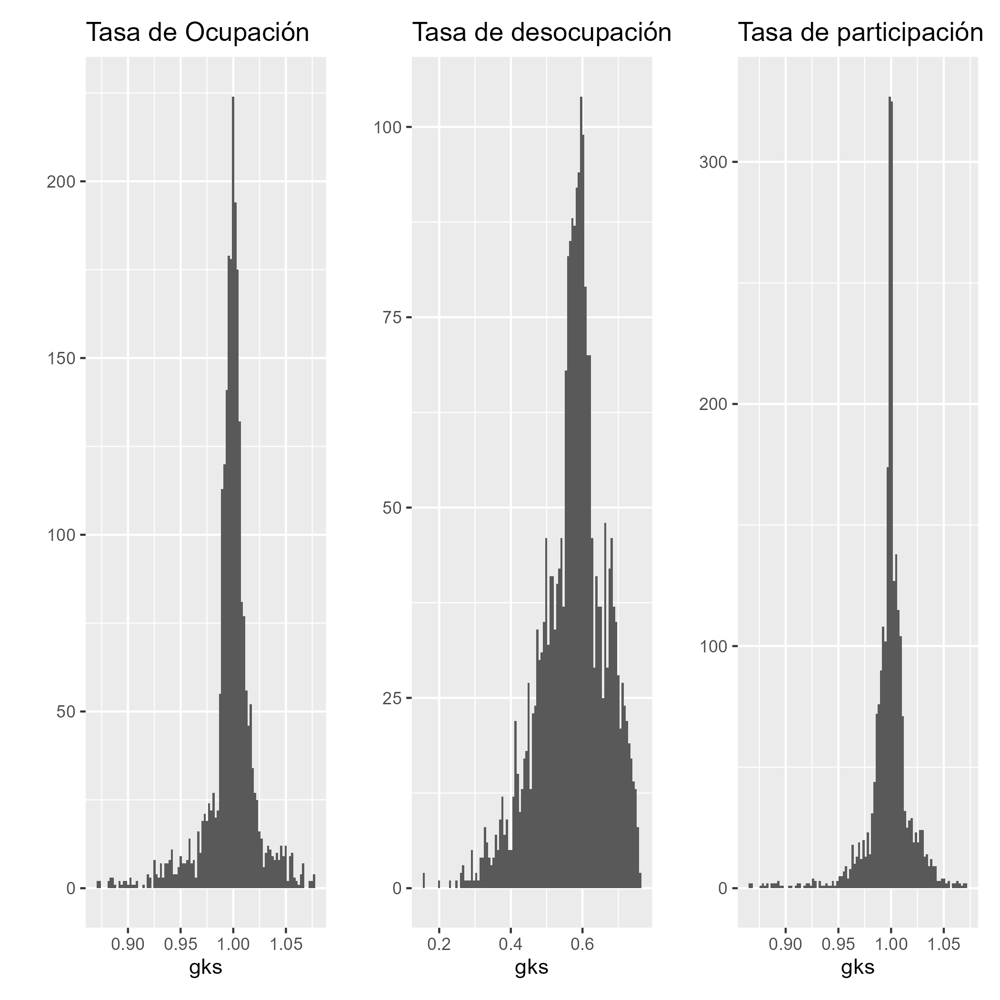
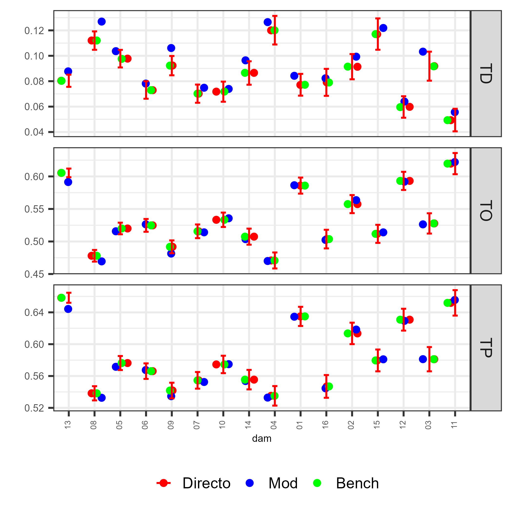
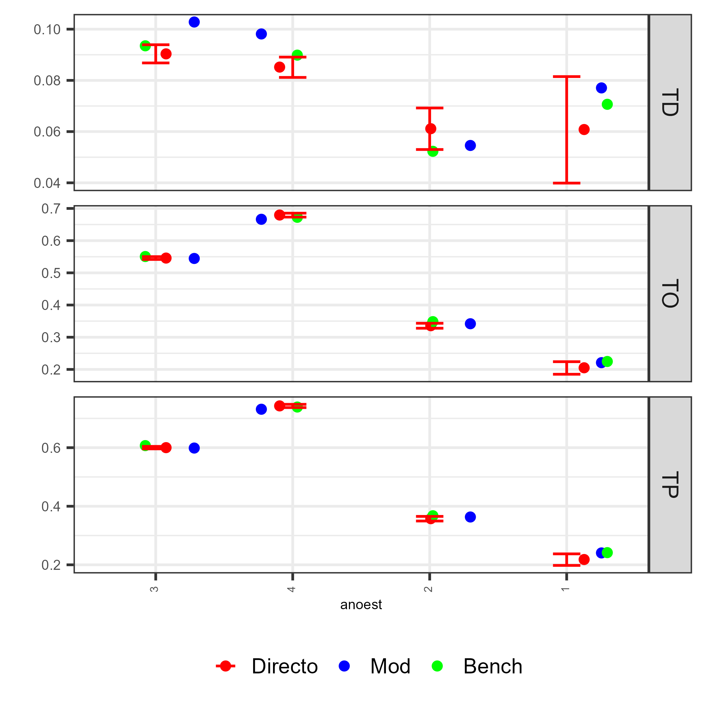
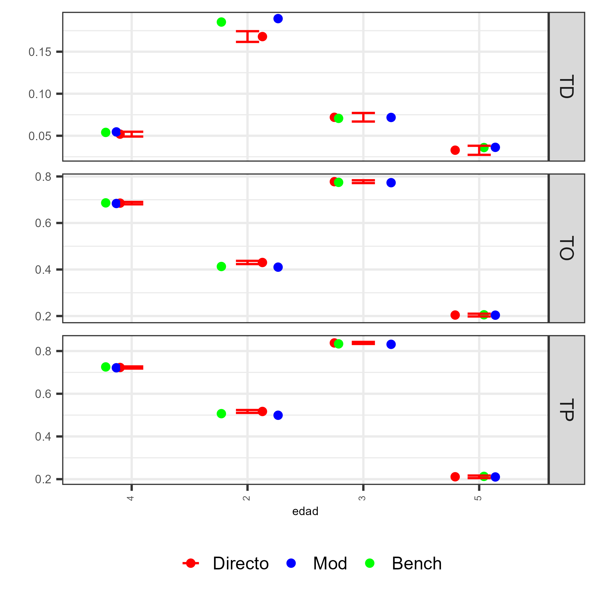

```{r setup, include=FALSE, message=FALSE, error=FALSE, warning=FALSE}
knitr::opts_chunk$set(
  echo = TRUE,
  message = FALSE,
  warning = FALSE,
  cache = TRUE
)

tba <- function(dat, cap = NA){
  kable(dat,
      format = "html", digits =  4,
      caption = cap) %>% 
     kable_styling(bootstrap_options = "striped", full_width = F)%>%
         kable_classic(full_width = F, html_font = "Arial Narrow")
}
library(rstan)
library(knitr)
library(kableExtra)
library(tidyverse)
library(magrittr)
```


## Introducción

* El proceso de benchmarking de cadenas MCMC es crucial en SAE, porque:

  - Garantiza que las estimaciones desagregadas (ej. tasas de ocupación, participación o desempleo por área pequeña) sean coherentes con los niveles de agregación donde la encuesta es representativa, por ejemplo, divisiones administrativas mayores o nivel nacional.  

  - Debe tenerse presente que el benchmarking es un procedimiento de ajuste estético: no mejora la calidad intrínseca del estimador, pero sí asegura consistencia y comparabilidad.  

* Como ejemplo, se usarán:  
  - El ingreso medio 
  - Los indicadores del mercado laboral (TO, TP y TD).  

Donde la calidad de las cadenas impacta directamente la precisión y coherencia de los estimadores por dominio.


# Modelo de unidad

## Definición de la variable dependiente

Sea la variable indicadora:

$$
y_{ji}=\begin{cases}
1 & \text{si } ingreso_{ji}\le lp,\\
0 & \text{en caso contrario.}
\end{cases}
$$

* $ingreso_{ji}$: ingreso de la persona (i) en el post-estrato (j).
* $lp$: línea de pobreza (umbral).

## Modelo: logit con efecto aleatorio de área

Se modela la relación entre la probabilidad esperada $\theta_{ji}=E[y_{ji}]$ y las covariables a nivel de unidad $\mathbf{x}_{ji}$ más un efecto aleatorio de área $u_d$:

$$
\operatorname{logit}(\theta_{ji})=\mathbf{x}_{ji}^{T}\boldsymbol{\beta}+u_d
$$

* $\boldsymbol{\beta}$: efectos fijos de las covariables.
* $u_d\sim N(0,\sigma_u^2)$: efecto aleatorio para el área/dominio.


## Prioriad descriptas (no informativas)

* Para los coeficientes fijos:

$$\beta_k\sim N(0,1000)$$

* Para la varianza del efecto aleatorio:

$$\sigma^2_u\sim IG(0.0001,0.0001)$$

## Estimación bajo MCMC 

- El proceso de predicción de la pobreza en dominios no observados se realiza mediante **MCMC**, combinando la información muestral y la estructura del modelo de unidad.  

- Esta aproximación permite:  
  - Propagar la incertidumbre de los parámetros.  
  - Obtener predicciones consistentes a nivel de unidad y dominio.


## Proceso de estimación en `R` (I)

::: {.callout-tip}
### Librerías principales utilizadas:
```{r}
# Interprete de STAN en R
library(rstan)
library(rstanarm)
# Manejo de bases de datos.
library(tidyverse)
# Gráficas de los modelos. 
library(ggplot2)
library(bayesplot)
library(patchwork)
# Organizar la presentación de las tablas
library(kableExtra)
library(printr)
```
:::


## Encuesta de hogares

Los datos empleados en esta ocasión corresponden a la ultima encuesta de hogares, la cual ha sido estandarizada por *CEPAL* y se encuentra disponible en *BADEHOG*


```{r, echo=FALSE}
encuesta_mrp <- readRDS("data/pobreza/encuesta_mrp.rds") %>% 
  mutate(yk = pobreza)
tba(encuesta_mrp %>% head(5)) 
```

## Lectura de covariables 

```{r, echo=FALSE, eval=TRUE}
statelevel_predictors_df <-
  readRDS("data/statelevel_predictors_df_dam2.rds") %>% 
    mutate_at(.vars = c("luces_nocturnas",
                      "cubrimiento_cultivo",
                      "cubrimiento_urbano",
                      "modificacion_humana",
                      "accesibilidad_hospitales",
                      "accesibilidad_hosp_caminado"),
            function(x) as.numeric(scale(x)))
tba(statelevel_predictors_df  %>%  head(5))
```


## Benchmarking por iteración de la cadena MCMC

Para estimar correctamente la incertidumbre posterior y garantizar coherencia con los totales observados, el cálculo de los factores de calibración se repite para **cada realización** $l$ de la cadena MCMC. Así obtenemos una familia de factores $\{g_k^{(l)}\}_{l=1}^L$ y, a partir de ellos, una familia de estimadores calibrados $\{\widehat{\bar{Y}}_d^{(l),\text{cal}}\}_{l=1}^L$.


## Notación

- $l = 1,\ldots,L$: índice de la iteración de la cadena MCMC.  

- $\boldsymbol{\theta}^{(l)}$: vector de parámetros muestreados en la iteración $l$ 

- $\hat{y}_k^{(l)}$: predicción del modelo para el post-estrato $k$ usando $\boldsymbol{\theta}^{(l)}$.

- $n_k$: tamaño del post-estrato $k$.  

- $\mathbf{x}_k$: vector de calibración (dummies) del post-estrato $k$.  

- $\mathbf{t}_X$: totales de encuesta conocidos (objetivo de calibración).


## Proceso para cada iteración $l$ (I)

1. **Predicción condicional (con parámetros de la iteración):**
$$
\hat{y}_k^{(l)} \;=\; E\big(y_k \mid \boldsymbol{\theta}^{(l)}, \mathbf{x}_k\big).
$$

2. **Totales del modelo en la iteración $l$:**
$$
\widehat{\mathbf{t}}_X^{(l)} \;=\; \sum_{k} n_k\,\hat{y}_k^{(l)}\,\mathbf{x}_k .
$$

## Proceso para cada iteración $l$ (II)

3. **Calibración — resolver para $g_k^{(l)}$:**  

Encontrar $g_k^{(l)}>0$ tales que

$$
\sum_{k} g_k^{(l)} \, n_k \, \mathbf{x}_k \;=\; \mathbf{t}_X .
$$
En la práctica se obtiene $g_k^{(l)} = h(\lambda^{(l)\top}\mathbf{x}_k)$, donde $\lambda^{(l)}$ es el vector de Lagrange o parámetros de calibración de la iteración y $h(\cdot)$ depende del método (`linear`, `logit`).

## Proceso para cada iteración $l$ (III)

4. **Estimador calibrado del ingreso medio por dominio $d$ en la iteración $l$:**
$$
\widehat{\bar{Y}}_d^{(l),\text{cal}} \;=\; \frac{1}{N_d}\sum_{k\in d} g_k^{(l)}\, n_k\, \hat{y}_k^{(l)}
$$

## Proceso para cada iteración $l$ (IV)

5. **Repetir para $l=1,\dots,L$.**  
Obtener la muestra posterior calibrada:
$$
\{\widehat{\bar{Y}}_d^{(l),\text{cal}}\}_{l=1}^L .
$$

6. **Resumen posterior calibrado (estimador final y credibilidad):**
$$
\widehat{\bar{Y}}_d^{\text{cal}} \;=\; \frac{1}{L}\sum_{l=1}^L \widehat{\bar{Y}}_d^{(l),\text{cal}}, \qquad
\text{IC}_{1-\alpha}:\ \text{quantiles}\big(\{\widehat{\bar{Y}}_d^{(l),\text{cal}}\}\big).
$$


## Observaciones prácticas y requisitos (I)

- **Positividad:** exigir $g_k^{(l)}>0$. Si el método produce valores no positivos, rechazarlos o cambiar el enlace (p.ej. usar `logit`).  

- **Propagación de incertidumbre:** este esquema incorpora la variabilidad debida tanto al modelo (a través de $\boldsymbol{\theta}^{(l)}$) como al proceso de calibración (a través de $\lambda^{(l)}$ y $g_k^{(l)}$).  

## Observaciones prácticas y requisitos (II)

- **Costo computacional:** la calibración por iteración incrementa el tiempo; por eso es habitual usar post-estratos agregados (reducir número de $k$) 

- **Diagnósticos:** revisar la distribución de $\{g_k^{(l)}\}$ (por ejemplo histogramas y percentiles) y comprobar que las sumas calibradas coincidan con $\mathbf{t}_X$ dentro de tolerancia numérica en cada $l$.


## Proceso de estimación y predicción

Obtener el modelo es solo un paso más, ahora se debe realizar la predicción en el censo, el cual a sido previamente estandarizado y homologado con la encuesta. 

::: {.callout-tip}
### Código en R
```{r, }
poststrat_df <- readRDS("data/pobreza/censo_dam2.rds") %>% 
     inner_join(statelevel_predictors_df)
```
:::

```{r, echo=FALSE}
tba( poststrat_df %>% arrange(desc(n)) %>% head(5))
```
Note que la información del censo esta agregada.

## Distribución posterior.

Para obtener una distribución posterior de cada observación se hace uso de la función *posterior_epred* de la siguiente forma.

::: {.callout-tip}
### Código en R
```{r, eval=FALSE}
fit <- readRDS("data/pobreza/fit_pobreza.rds")
epred_mat <- posterior_epred(fit, newdata = poststrat_df,  type = "response")
saveRDS(epred_mat, "data/pobreza/epred_mat.rds")
```
:::

## Proceso de estimación en `R` (I)

En cada iteración $l$ de la cadena MCMC:

1. Sustituir $\hat{y}_k^{(l)}$ en la tabla de post-estratificación.  
2. Construir la matriz de calibración $\mathbf{X}_k$.  

::: {.callout-tip}
### Código en R

```{r, eval=TRUE}
library(sampling)
epred_mat <- readRDS("data/pobreza/epred_mat.rds")

iter <- 1 
names_cov <- "dam"
metodo <- "logit"

# 1. Predicciones en el post-estrato
temp_post <- poststrat_df %>%
  mutate(yk = epred_mat[iter,]) %>% 
  select(dam:n, yk)
```
:::

## Proceso de estimación en `R` (II)

::: {.callout-tip}
### Código en R

```{r, eval=TRUE}
# 2. Matriz de calibración
  Xk_num <- temp_post %>% select(all_of(names_cov)) %>% 
    fastDummies::dummy_cols(select_columns = names_cov,
                            remove_selected_columns = TRUE) %>% 
    mutate_at(vars(matches("\\d$")) ,~.*temp_post$yk) %>%
    as.matrix()
 
  Xk_den <- temp_post %>% select(all_of(names_cov)) %>% 
    fastDummies::dummy_cols(select_columns = names_cov,
                            remove_selected_columns = TRUE) %>%
    as.matrix()
  
  colnames(Xk_num) <- paste0("num_", colnames(Xk_num))
  colnames(Xk_den) <- paste0("den_", colnames(Xk_den))
  
  Xk <- cbind(Xk_num, Xk_den)

```
:::

## Proceso de estimación en `R` (III)

3. Calcular los totales de la encuesta $\mathbf{t}_X$.  

::: {.callout-tip}
### Código en R

```{r, eval=TRUE}
# 3. Totales de la encuesta
 encuesta_temp <- encuesta_mrp %>% select(all_of(names_cov)) %>% 
    fastDummies::dummy_cols(select_columns = names_cov,
                            remove_selected_columns = TRUE)

  num_total <- encuesta_temp %>% 
    mutate_at(vars(matches("\\d$"))
              ,~.*encuesta_mrp$yk*encuesta_mrp$fep) %>% 
    colSums()
  
  den_total <- encuesta_temp %>% 
    mutate_at(vars(matches("\\d$")) ,~.*encuesta_mrp$fep) %>% 
    colSums()
  
  names(num_total) <- paste0("num_", names(num_total))  
  names(den_total) <- paste0("den_", names(den_total))
  
  Total_Xk <- c(num_total, den_total)
  Xk <- Xk[,names(Total_Xk)]
Total_Xk
```
:::

## Proceso de estimación en `R` (IV)

4. Resolver el sistema de calibración para obtener $g_k^{(l)}$.  

::: {.callout-tip}
### Código en R

```{r, eval=TRUE}
# 4. Resolver calibración
gk_calib <- calib(
  Xs = Xk,
  d = temp_post$n,
  total = Total_Xk,
  method = metodo
)
summary(gk_calib)

# Diagnóstico
check_calib <- checkcalibration(
  Xs = Xk, d = temp_post$n,
  total = Total_Xk, g = gk_calib
)
```
:::

## Proceso de estimación en `R` (V)

::: {.callout-tip}
### Código en R

```{r, eval=TRUE}
# Totales ajustados
hat_tx <- Xk %>% data.frame() %>% 
  mutate_at(vars(matches("\\d$")), ~ . * temp_post$n * gk_calib) %>% 
  colSums()

round(Total_Xk - hat_tx, 4)
```
:::

## Proceso de estimación en `R` (Función benchmarking)

::: {.callout-tip}
### Código en R

```{r}
source("data/pobreza/benchmarking_ingreso.r")

poststrat_df_iter <- benchmarking_pobreza(
  poststrat_df = temp_post %>% data.frame(),
  encuesta_sta = encuesta_mrp %>% mutate(yk = pobreza),
  names_cov = "dam",
  metodo = "logit", 
  show_plot = FALSE
)

tba(poststrat_df_iter %>% head(5))
```
:::


## Proceso de estimación en `R` para la MCMC

::: {.callout-tip}
### Código en R

```{r, eval=FALSE}
poststrat_df_iter2 <- map(1:nrow(epred_mat),
  ~{
temp_post <- poststrat_df %>%
  mutate(yk = epred_mat[.x,]) %>% 
  select(dam:n, yk)

poststrat_df_iter <- benchmarking_pobreza(
  poststrat_df = temp_post %>% data.frame(),
  encuesta_sta = encuesta_mrp %>% mutate(yk = pobreza),
  names_cov = "dam",
  metodo = "logit", 
  show_plot = FALSE
)
poststrat_df_iter
  }
)
saveRDS(poststrat_df_iter2, "data/pobreza/poststrat_df_iter_pobreza.rds")

```
:::


## Proceso de estimación en `R` para la MCMC **sin benchmarking**

::: {.callout-tip}
### Código en R

```{r, eval=FALSE}
theta_iter <-  map(poststrat_df_iter2, ~{
    .x %>% 
    group_by(dam) %>% 
    summarise(theta = weighted.mean(yk, n))  }, .progress = TRUE)

theta_modelo <-  theta_iter %>% bind_rows() %>%
  group_by(dam) %>%
  summarise(estimate = mean(theta),
        sd = sd(theta),
        lci = quantile(theta, probs = (1 - 0.95)/2),
        uci = quantile(theta, probs = 1 - (1 - 0.95)/2))

saveRDS(theta_modelo, "data/pobreza/02.theta_modelo_pobreza.rds")
```
:::

## Proceso de estimación en `R` para la MCMC **con benchmarking**

::: {.callout-tip}
### Código en R

```{r, eval=FALSE}
theta_iter2 <-  map(poststrat_df_iter2, ~ {
  .x %>%
    group_by(dam) %>%
    summarise(theta = weighted.mean(yk, n2))}, .progress = TRUE)

theta_bench <- theta_iter2 %>% bind_rows() %>%
  group_by(dam) %>%
  summarise( estimate = mean(theta),
    sd = sd(theta),
    lci = quantile(theta, probs = (1 - 0.95) / 2),
    uci = quantile(theta, probs = 1 - (1 - 0.95) / 2)
  )
saveRDS(theta_bench, "data/pobreza/03.theta_bench_pobreza.rds")
```
:::

## Comparando estimaciones muestra, modelo y modelo con benchmarking

```{r, echo=FALSE}
theta_bench <- readRDS("data/pobreza/03.theta_bench_pobreza.rds") %>% select(dam, bench = estimate)
theta_modelo <- readRDS("data/pobreza/02.theta_modelo_pobreza.rds") %>%
  select(dam, modelo = estimate)

theta_muestra <-
  data.frame(muestra = num_total/den_total) %>% tibble::rownames_to_column("dam") %>% 
  mutate(dam = str_remove(string = dam, pattern = "^num_"))

inner_join(theta_modelo, theta_bench, by = "dam") %>%
  mutate(dam = paste0("dam_", dam)) %>%
  inner_join(theta_muestra, ,  by = "dam") %>%
  mutate(diff_bench = round(bench - muestra, 5)) %>% head(10) %>% tba()
```


## Estimaciones desagregadas por Nacional

::: {.callout-tip}
### Código en R

```{r}
source("data/pobreza/calc_theta.R")
poststrat_df_iter2  <- 
  readRDS("data/pobreza/poststrat_df_iter_pobreza.rds")[1:10]
paso <- calc_theta(result_list = poststrat_df_iter2, 
           levels = NULL, ci_level = 0.95)
```
:::

```{r, echo=FALSE}
paso$estimates %>% tba()
```


## Estimaciones desagregadas por DAM - área 

::: {.callout-tip}
### Código en R

```{r}
paso <- calc_theta(
  result_list = poststrat_df_iter2,
  levels = c("dam", "area"),
  ci_level = 0.95
)$estimates
```
:::


```{r, echo=FALSE}
paso %>%
  head(8) %>% tba()
```

## Estimaciones desagregadas por DAM - área - sexo 

::: {.callout-tip}
### Código en R

```{r}
paso <- calc_theta(result_list = poststrat_df_iter2[1:10], 
           levels = c("dam", "area", "sexo"), 
           ci_level = 0.95)$estimates 
```
:::

```{r, echo=FALSE}
paso %>%
  head(8) %>% tba()
```


## Estimaciones desagregadas por DAM - área - etnia 

::: {.callout-tip}
### Código en R

```{r}
paso <- calc_theta(
  result_list = poststrat_df_iter2[1:10],
  levels = c("dam", "area", "etnia"),
  ci_level = 0.95
)$estimates 
```
:::

```{r, echo=FALSE}
paso %>%
  head(8) %>% tba()
```


# Mercado Laboral

## Indicadores del Mercado Laboral

* Punto de partida: caracterizar la dinámica del mercado laboral.
* Se emplean tres indicadores fundamentales:

  1. Tasa de Ocupación (TO)
  2. Tasa de Participación (TP)
  3. Tasa de Desempleo (TD)


## Modelo multinomial-logit jerárquico (formulación)

- Para cada dominio $d$ trabajamos con los conteos pseudo-observados
  $(\tilde y_{d1},\dots,\tilde y_{dK})$ condicionados a $\hat n_d$:

$$
(\tilde y_{d1},\dots,\tilde y_{dK}) \mid \hat n_d, \boldsymbol{p}_d
\sim \text{Multinomial}(\hat n_d,\; \boldsymbol{p}_d).
$$

- Modelo lineal para los logits (categoría 1 como referencia): para $k=2,\dots,K$,

$$
\log\frac{p_{dk}}{p_{d1}} \;=\; \mathbf{X}_d^\top \boldsymbol{\beta}_k + u_{dk},
$$

donde
- $\mathbf{X}_d\in\mathbb{R}^p$: vector de $p$ covariables del dominio $d$,
- $\boldsymbol{\beta}_k\in\mathbb{R}^p$: coeficientes fijos de la categoría $k$,
- $u_{dk}$: efecto aleatorio del dominio $d$ en la categoría $k$.


## Modelo Bayesiano — Verosimilitud y priors

- Verosimilitud (independencia entre dominios):

$$
\tilde{\mathbf{y}}_d \mid \hat n_d, \boldsymbol{p}_d
\sim \text{Multinomial}(\hat n_d,\boldsymbol{p}_d),\quad d=1,\dots,D.
$$

- Distribución previa:

$$
\boldsymbol{\beta}_k \sim \mathcal{N}(0,\,\sigma_\beta^2 I_p),\quad
\sigma_\beta=100.
$$

$$
u_d = (u_{d2},\dots,u_{dK})^\top \text{ con estructura: }
u = \operatorname{diag}(\sigma_u)\,L_u\,z_u,
$$
$$
z_u \sim \mathcal{N}(0,I),\quad L_u\sim \text{LKJ Cholesky}(1),\quad
\sigma_{u,j}\sim \text{Inv-Gamma}(\epsilon,\epsilon).
$$


# Benchmarking

## Planteamiento general

Sea $U = \{1, \dots, N\}$ la población y $S \subset U$ la muestra.

* $d_i$: peso de diseño asociado a la unidad $i \in S$.  

* $x_i$: vector de covariables de calibración.  

* $y_i$: variable de interés (ocupación, desocupación, participación).  

El objetivo es ajustar los pesos mediante factores de calibración $g_i$.  

$$
w_i = d_i g_i
$$

## Restricciones de calibración

Los pesos calibrados deben respetar los totales poblacionales:

$$
\sum_{i \in S} w_i x_i = X,
$$

donde $X$ proviene de **totales estimados en la encuesta**.  


## Estimadores calibrados

- **Tasa de Ocupación (TO):**

$$
\widehat{TO} = 
\frac{\sum_{i \in S} w_i \cdot \mathbb{1}(empleo_i = \text{Ocupado})}
     {\sum_{i \in S} w_i}
$$

- **Tasa de Participación (TP):**

$$
\widehat{TP} = 
\frac{\sum_{i \in S} w_i \cdot \mathbb{1}(empleo_i \in \{\text{Ocupado}, \text{Desocupado}\})}
     {\sum_{i \in S} w_i}
$$

- **Tasa de Desocupación (TD):**

$$
\widehat{TD} =
\frac{\sum_{i \in S} w_i \cdot \mathbb{1}(empleo_i = \text{Desocupado})}
     {\sum_{i \in S} w_i \cdot \mathbb{1}(empleo_i \in \{\text{Ocupado}, \text{Desocupado}\})}
$$


## Métodos de calibración

El algoritmo `calib()` resuelve:

$$
\min_{g} \sum_{i \in S} d_i G(g_i) \quad \text{s.a.} \quad \sum_{i \in S} d_i g_i x_i = X.
$$

- **Lineal:**

$$
g_i = 1 + \lambda^\top x_i
$$

- **Logit:**

$$
g_i = \frac{\exp(\lambda^\top x_i)}{1 + \exp(\lambda^\top x_i)}.
$$


## Validación de la calibración

- Comparar **totales estimados vs. totales conocidos**:  
$$
\sum_{i \in S} w_i x_i \approx X
$$

- Analizar la distribución de $g_i$:  
  - Todos $g_i > 0$.  
  - Evitar valores extremos.  
  - Revisar proporción de $g_i$ cercanos a 0.  


## Benchmarking 

::: {.callout-tip}
### Código de R
```{r, eval=FALSE}
source("data/benchmarking_empleo.R")
multi_fit <- readRDS("data/Multinivel_multinomial_model_no_cor.rds")

encuesta_sta_MT <- readRDS('data/encuesta_sta_MT.rds')

encuesta_sta_MT <- encuesta_sta_MT %>% 
  filter(edad>1, anoest %in% c("1","2","3","4"))

encuesta_sta_MT %<>% dummy_cols(select_columns = "empleo")

list_bench <-
  benchmarking_empleo(
    encuesta_sta = encuesta_sta_MT,
    poststrat_df = multi_fit$censo_pred,
    names_cov =  "dam",
    metodo = "linear"
  )

saveRDS(list_bench, file = "data/list_bench_empleo.rds")

```
:::

## Validacion del Benchmarking 


```{r, echo=FALSE, eval=FALSE}
list_bench <-  readRDS("data/list_bench_empleo.rds")
ggsave(plot = list_bench$plot_bench, 
       filename = "img/plot_bench_empleo.png", scale = 3)
```


```{r echo=FALSE, out.width = "1000px", out.height="800px",fig.align='center'}

```

## Plot de validación de estimaciones (I)

::: {.callout-tip}
### Código de R
```{r, eval=FALSE}
source("data/Funciones_empleo.R")
subgrupo <- c("dam","sexo", "area", "etnia", "edad", "anoest")

poststrat_df <- multi_fit$censo_pred %>% data.frame() %>%  
  mutate( gk_TO =list_bench$gk_bench$TO,
          gk_TP = list_bench$gk_bench$TP,
          gk_TD = list_bench$gk_bench$TD )

plot_subgrupo <- map(.x = setNames(subgrupo, subgrupo),
  ~ plot_compare_Ind( sample = encuesta_sta_MT, 
                      poststrat = poststrat_df, by1 = .x
  )
)
```
:::

## Plot de validación de estimaciones (II)

::: {.callout-tip}
### Código de R
```{r, eval=FALSE}
temp_dir_plot_uni <- map(
  names(plot_subgrupo),
  ~ ggsave(
    plot = plot_subgrupo[[.x]]$Plot,
    filename =    paste0("img/empleo_plot_uni_",  .x, ".png"),
    scale = 2
  )
)

```
:::

## Plot de validación por dam

```{r echo=FALSE, out.width = "1000px", out.height="800px",fig.align='center'}

```


## Plot de validación por años de estudio

```{r echo=FALSE, out.width = "1000px", out.height="800px",fig.align='center'}

```


## Plot de validación por edad

```{r echo=FALSE, out.width = "1000px", out.height="800px",fig.align='center'}

```


## Benchmarking para la iteración $i$ 

::: {.callout-tip}
### Código de R
```{r, eval=FALSE}
ii = 19 
paramtros_chain <- as.array(multi_fit$model_bayes,
                            pars = "tasa_pred") %>%
  as_draws_matrix()

censo_pred_temp <-
  multi_fit$censo_pred %>% select(-c("TD", "TO", "TP"))

dat_tasa <- matrix(
  paramtros_chain[ii,], nrow = nrow(censo_pred_temp),
  ncol = 3, byrow = TRUE,
  dimnames = list(1:nrow(censo_pred_temp), c("TD", "TO", "TP"))
) %>% data.frame()
```
:::

## Benchmarking para la iteración $i$ 

::: {.callout-tip}
### Código de R
```{r, eval=FALSE}
censo_pred_temp <- cbind(censo_pred_temp, dat_tasa)

benchmarking_empleo_iter(
  poststrat_df = censo_pred_temp,
  Total_Xk = list_bench$Total,
  names_cov = list_bench$var_bench,
  metodo_calib = list_bench$metodo_bench
)
```
:::

## Benchmarking para todas las iteraciones 

::: {.callout-tip}
### Código de R
```{r, eval=FALSE}
result_iter_calib <- benchmarking_empleo_all(
  multi_fit = multi_fit,
  list_bench = list_bench,
  pars = "tasa_pred",
  n_iter = 100
)

saveRDS(result_iter_calib, "data/result_iter_calib.rds")  
```
:::


# Estimaciones 

## Estimación nacional usando las cadenas 

::: {.callout-tip}
### Código de R
```{r, eval=TRUE}
source("data/Funciones_empleo.R")
result_iter_calib <- readRDS("data/result_iter_calib.rds") 
map_df(
  result_iter_calib,
  ~ Indicadores_censo(.x) %>%
    mutate(value = value * 100) %>%
    pivot_wider(names_from = Metodo ,
                values_from = value)
) %>% group_by(variable) %>%
  summarise(estimado = mean(Bench),
            estimado_se = sd(Bench))


```
:::

## Estimación dam usando las cadenas 

::: {.callout-tip}
### Código de R

```{r, eval=TRUE}
tab_dam <-  map_df(
  result_iter_calib,
  ~ Indicadores_censo(.x, var_by = "dam") %>%
    mutate(value = value * 100) %>%
    pivot_wider(names_from = Metodo ,
                values_from = value)
) %>% group_by(variable, dam) %>%
  summarise(estimado = mean(Bench),
            estimado_se = sd(Bench))
```
:::

```{r, eval=TRUE, echo=FALSE}
tba(tab_dam %>% head(5))

```


## Estimación sexo usando las cadenas 

::: {.callout-tip}
### Código de R
```{r, eval=TRUE}
tab_sexo <-  map_df(
  result_iter_calib,
  ~ Indicadores_censo(.x, var_by = c("sexo")) %>%
    mutate(value = value * 100) %>%
    pivot_wider(names_from = Metodo ,
                values_from = value)
) %>% group_by(variable, sexo) %>%
  summarise(estimado = mean(Bench),
            estimado_se = sd(Bench))
```
:::

```{r, eval=TRUE, echo=FALSE}
tba(tab_sexo %>% head(5))

```


# ¡Gracias! 